# stm32f407zgt6-pcb设计

## 参考

 [PCB设计参考原理图](./stm32f407zgt6_PCB_localdata/PCB设计参考原理图) 

## 基本知识

stm32F407ZGT6,LQPF144封装，有114个IO口，17个定时器

datasheet：[datasheet.pdf](..\..\..\DS_diansai\STM32f407vgt6\datasheet.pdf) 

中文数据手册： [STM32F407中文手册(完全版) 高清完整.pdf版.pdf](..\..\..\DS_diansai\STM32f407zgt6\STM32F407中文手册(完全版) 高清完整.pdf版.pdf) 

### 特殊引脚

VDD,Vcap,VDDA,Vbat，PDR_ON,BOOT0/BOOT1

| 引脚       | 设计                                                         |
| ---------- | ------------------------------------------------------------ |
| VDD        | 工作电压介于1.8-3.6V之间，输入电压不能超过3.6V,这影响到后面的电源芯片选型 P86 |
| VDDA、VSSA | 给单片机内部的ADC提供电源，需要做好滤波处理                  |
| VREF       | 给内部AD提供外部参考电压，VREF决定了AD的精度，输入电源需要做好滤波处理（VREF是ADC用来将模拟信号转换为数字信号时的参考电压，它设置了ADC转换的"满量程"）。VREF 电压介于 1.8 V 到 VDDA 之间。P87 |
| Vcap       | 引脚主要给内部调压器输出连接，需要外接2.2uf的电容稳压滤波。  |
| Vbat       | 主要是提供电源的备用电压，保证RTC和备份SRAM在主电源（VDD）断开后还能保证正常工作 |

## 组成电路

### BOOT引脚

#### 介绍

BOOT引脚用于设置启动模式

> 主Flash: 通常用于存储应用程序代码，启动时从主Flash加载程序。
> 系统存储器: 通常用于存储固件或特定的启动代码，启动时从系统存储器加载程序。
> SRAM: 通常用于存储临时数据或调试代码，启动时从SRAM加载程序。

#### BOOT的PCB设计

BOOT0要连接到MCU-108，BOOT1连接到MCU-48（与PB2复用）

##### 方式1——使用跳帽

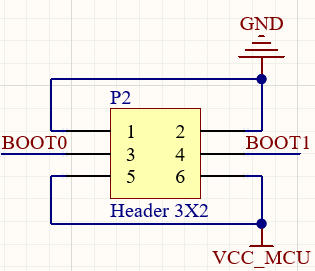

##### 方式2——使用拨动开关

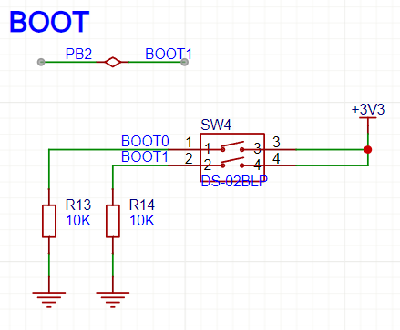

### 电源电路PWR

手册P86

核心板主要是围绕F407ZGT6做的最小系统板，启动电压在1.8-3.6V之间

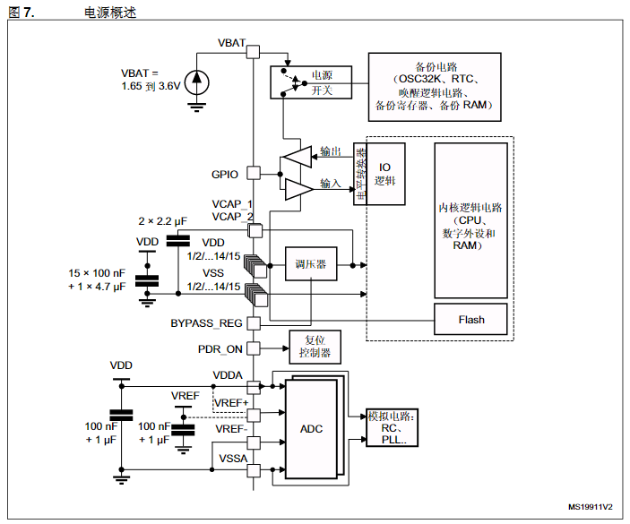

> 每个电源对都必须使用滤波陶瓷电容器去耦。这些电容器必须尽可能靠近或低于 PCB 下侧的适当引脚，以确保器件的良好功能
>
> 当主电源 VDD断电时,可通过Vbat电压为实时时钟 (RTC)、RTC 备份寄存器和备份 SRAM (BKP SRAM) 供电。

#### 电源的PCB设计

+5V在边界上取40mil，其他取27mil

##### 方式1——LDO采用RT9193-33GB

> 3.3V输出
>
> 0电阻串联
>
> D1、D2（TVS管）

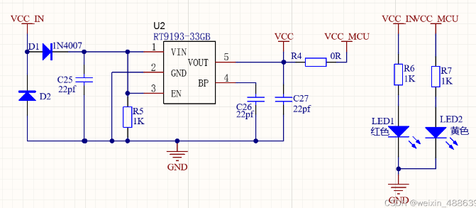

输入电压经过LDO芯片输出3.3V电压

输出电压与单片机的输入电压使用0R电阻串联起来：

二极管D1主要是起防反接作用，二极管D2为TVS管，主要起稳压作用，旁边LED电路主要是用来做电源提示的，当电源正常供电时会同时亮

##### 方式2——LDO采用CJA1117B-3.3

#### 3V3电源滤波电路

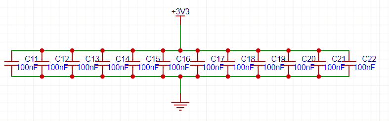

### 电源变换电路

#### 参考

- [LM2596/LM2596S多路降压稳压DC-DC开关电源芯片详解（第二部分：电路设计）（12V转5V、12V转3.3V、任意电压转任意电压）-CSDN博客](https://blog.csdn.net/knightsinghua/article/details/128438215?ops_request_misc=%7B%22request%5Fid%22%3A%2265eda615db3bffe3c56a648ee0b084e9%22%2C%22scm%22%3A%2220140713.130102334..%22%7D&request_id=65eda615db3bffe3c56a648ee0b084e9&biz_id=0&utm_medium=distribute.pc_search_result.none-task-blog-2~all~sobaiduend~default-2-128438215-null-null.142^v101^pc_search_result_base3&utm_term=12v转5v稳压电源电路图&spm=1018.2226.3001.4187)

Ti-DC-DC设计网站：https://webench.ti.com/power-designer/switching-regulator?powerSupply=0

#### 12V转

#### +5V转-5V电路

### 晶振电路

晶振越大，运行速度也就越快，但速度增加也会有干扰电路的风险，通常晶振有无源和有源两种，无源晶振需要内部有振荡器。

在芯片中，有两组晶振的输入端口，分别为OSC_IN/OSC_OUT和OSC32_IN/OSC32_OUT

> OSC32主要提供RTC时钟，OSC用于提供单片机主频

| 晶振               | 引脚   |
| ------------------ | ------ |
| OSC32_IN-RTC时钟   | PC14-8 |
| OSC32_OUT-RTC时钟  | PC15-9 |
| OSC_IN-单片机主频  | PH0-23 |
| OSC_OUT-单片机主频 | PH1-24 |

#### 晶振设计P98

##### 方式1——OSC_IN/OSC_OUT-25M；OSC32_IN/OSC32_OUT-32K

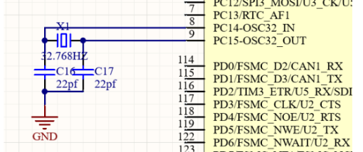

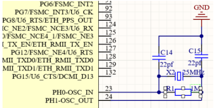

##### 方式2——OSC_IN/OSC_OUT-8M；OSC32_IN/OSC32_OUT-32K

##### 禁止铺铜设计

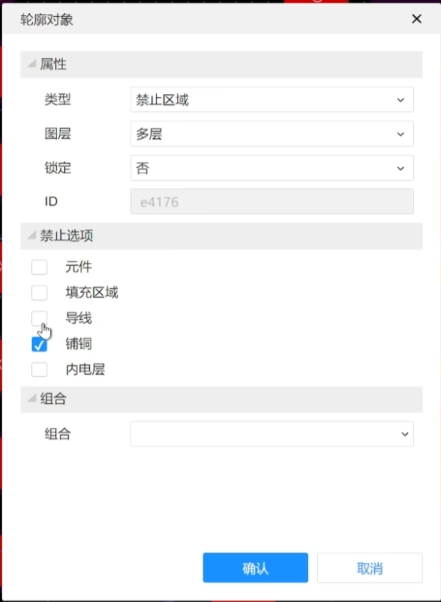

### 复位电路

复位引脚呈现低电平，单片机复位

P105

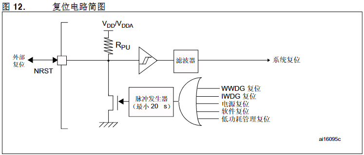

| 复位  | 引脚    |
| ----- | ------- |
| RESET | NRST-25 |

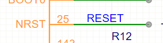

#### 复位电路PCB设计

### Wake-up电路

 

### 下载电路

#### SWD下载电路

SWD接口简单，最少只需要4根线就可以完成下载，而且STLINK烧录器便宜

| SWD-STlink | 接线     |
| ---------- | -------- |
| VCC        | VCC      |
| SWCLK      | PA14-109 |
| SWDIO      | PA13-105 |
| GND        | GND      |

##### SWD下载电路设计

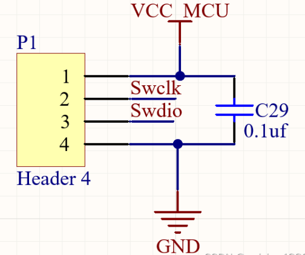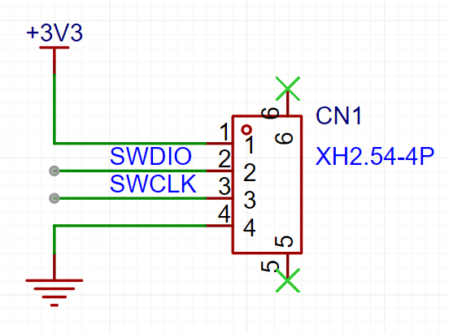

#### ISP下载电路

### UART串口电路设计

| 串口 | 引脚 |
| ---- | ---- |
| TXD1 | PA9  |
| RXD1 | PA10 |

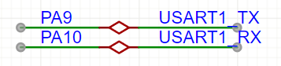

### UART串口TTL电平转RS232

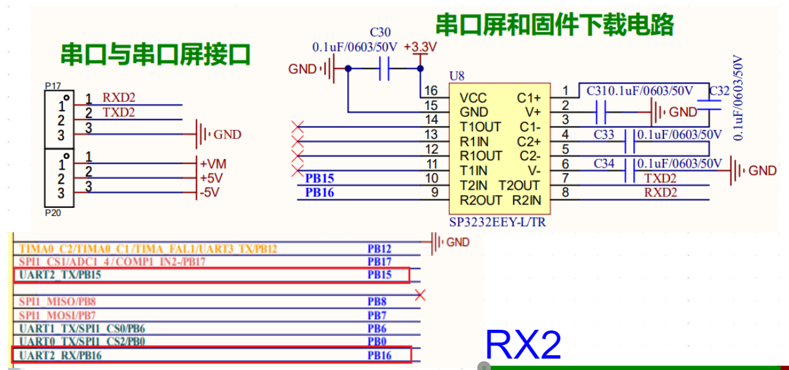

### USB-USART

#### USB-USART的PCB设计

##### 方案1

##### 方案2

CH340C，usb与串口通信

### USB-OTG

以STM32H723ZGT6为例

参考：[STM32+USB串口通信+printf函数功能HAL库函数+cubemax配置+部分解释_stm32 usb通信-CSDN博客](https://blog.csdn.net/m0_66709017/article/details/136891157?ops_request_misc=%7B%22request%5Fid%22%3A%22544ac4410febf2abaa72e5cd823b2a3d%22%2C%22scm%22%3A%2220140713.130102334..%22%7D&request_id=544ac4410febf2abaa72e5cd823b2a3d&biz_id=0&utm_medium=distribute.pc_search_result.none-task-blog-2~all~sobaiduend~default-1-136891157-null-null.142^v101^pc_search_result_base3&utm_term=stm32h723zgt6 usb otg&spm=1018.2226.3001.4187)

### 迪文串口屏UART的电路

先参考UART串口TTL电平转RS232

[迪文串口屏的串口通信问题处理（详细）_迪文屏串口下载失败-CSDN博客](https://blog.csdn.net/weixin_42846972/article/details/81905318?ops_request_misc=%7B%22request%5Fid%22%3A%224cfec6726b9b01aa7e4ac35fce698aa2%22%2C%22scm%22%3A%2220140713.130102334..%22%7D&request_id=4cfec6726b9b01aa7e4ac35fce698aa2&biz_id=0&utm_medium=distribute.pc_search_result.none-task-blog-2~all~sobaiduend~default-4-81905318-null-null.142^v101^pc_search_result_base3&utm_term=迪文串口屏串口通信&spm=1018.2226.3001.4187)

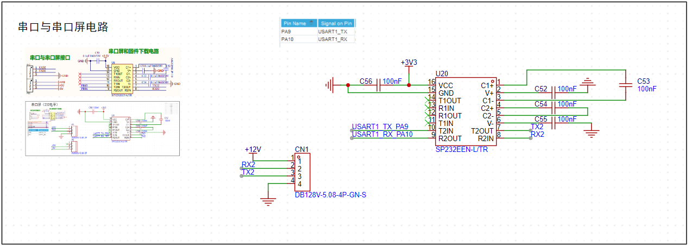

### VBAT电路

使用纽扣电池

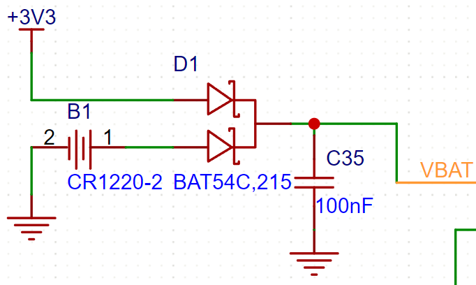

不使用纽扣电池

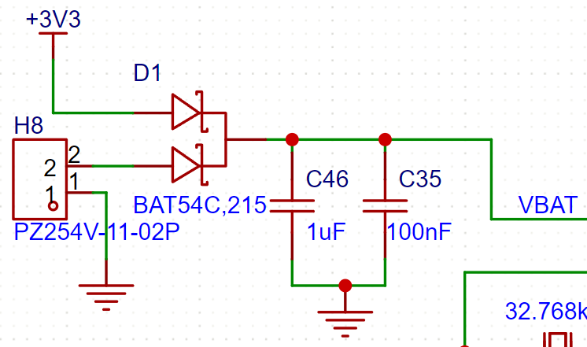

### TF卡电路

### I2C小屏电路

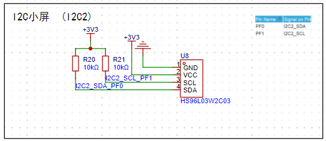

### 测量电路

#### 电流测量电路

##### INA219AIDR

参考：【ESP8266+INA219+OLED高精度电压电流表】https://www.bilibili.com/video/BV1Kxs7ejEWk?vd_source=b7ec3648f866bae76c4b07907d1dae5e

最大电压设置（<50mV）

带滤波电容的

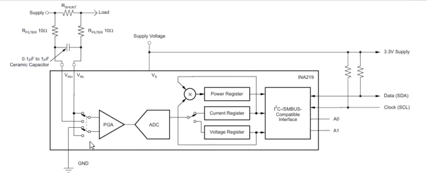

使用教程与校准

[INA219例程，可校准电流值误差（基于stm32）-CSDN博客](https://blog.csdn.net/m0_46175164/article/details/127013014)

### TB6612电机驱动

参考：[TB6612电机驱动模块（STM32）_tb6612电机驱动原理图-CSDN博客](https://blog.csdn.net/qq_44016222/article/details/142700739?ops_request_misc=%7B%22request%5Fid%22%3A%22dd40329cdf4842844fb3d84a1ece533b%22%2C%22scm%22%3A%2220140713.130102334..%22%7D&request_id=dd40329cdf4842844fb3d84a1ece533b&biz_id=0&utm_medium=distribute.pc_search_result.none-task-blog-2~all~top_positive~default-1-142700739-null-null.142^v102^pc_search_result_base3&utm_term=tb6612电机驱动原理图&spm=1018.2226.3001.4187)

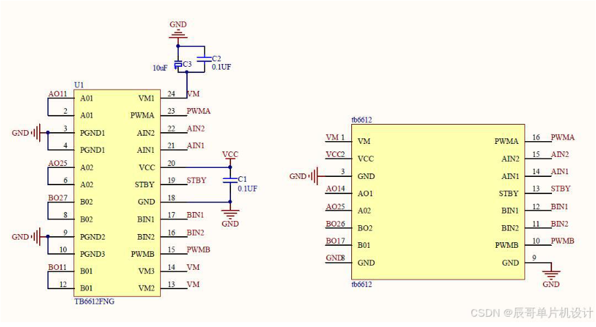

- 模块版本

- 贴片版本

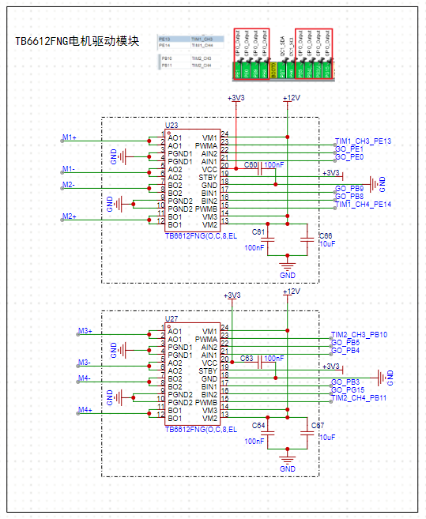

## 布线规则

### 基础设置

#### 系统-通用

### 晶振屏蔽过孔

## 立创打印相关规则

### 字体

参考：[技术指导：字符设计规范](https://www.jlc.com/portal/server_guide_10417.html)

## 参考素材

1、[blog.csdn.net/weixin_48863980/article/details/135214097?ops_request_misc=%257B%2522request%255Fid%2522%253A%2522d2c954349866a23b9b9055bf4ee32cfe%2522%252C%2522scm%2522%253A%252220140713.130102334..%2522%257D&request_id=d2c954349866a23b9b9055bf4ee32cfe&biz_id=0&utm_medium=distribute.pc_search_result.none-task-blog-2~all~sobaiduend~default-1-135214097-null-null.142^v100^pc_search_result_base3&utm_term=stm32f407最小系统设计&spm=1018.2226.3001.4187](https://blog.csdn.net/weixin_48863980/article/details/135214097?ops_request_misc=%7B%22request%5Fid%22%3A%22d2c954349866a23b9b9055bf4ee32cfe%22%2C%22scm%22%3A%2220140713.130102334..%22%7D&request_id=d2c954349866a23b9b9055bf4ee32cfe&biz_id=0&utm_medium=distribute.pc_search_result.none-task-blog-2~all~sobaiduend~default-1-135214097-null-null.142^v100^pc_search_result_base3&utm_term=stm32f407最小系统设计&spm=1018.2226.3001.4187)
