#  TI **MSPM0G3507**

## 基础阐述

### 资料

【文件夹：D:\DS_diansai\LP-MSPM0G3507资料\md】

【TI MSPM0快速入门课 - 开发环境部署】https://www.bilibili.com/video/BV1Bm421773M?vd_source=369d383c90729d8c8b513367020c1468

TI硬件官网

官网：[模拟 | 嵌入式处理 | 半导体公司 | 德州仪器 TI.com.cn](https://www.ti.com.cn/)

LP-MSPM0G3507:[LP-MSPM0G3507 评估板 | TI.com.cn](https://www.ti.com.cn/tool/cn/LP-MSPM0G3507?keyMatch=lp-mspm0g3507&tisearch=universal_search)

LP-MSPM0G3507外设教学：[dev.ti.com/tirex/global?id=CCSTUDIO-ACADEMY](https://dev.ti.com/tirex/global?id=CCSTUDIO-ACADEMY)

LP‑MSPM0G3507用户指南（原理图）： [LP‑MSPM0G3507用户指南.pdf](./TI_MSPM0_localdata/LP‑MSPM0G3507用户指南.pdf) (原理图)

MSPM0 驱动程序库：[Driverlib_Overview_CN.html](file:///D:/Apps/Mspm0SDK/mspm0_sdk_2_02_00_05/docs/chinese/driverlib/Driverlib_Overview_CN.html)

技术手册： [mspm0g3507技术手册.pdf](./TI_MSPM0_localdata/mspm0g3507技术手册.pdf) 

参考模板： [driverlib](./TI_MSPM0_localdata/driverlib) 

案例路径：D:\Apps\Mspm0SDK\mspm0_sdk_2_02_00_05\examples\nortos\LP_MSPM0G3507\driverlib\

fitten code关闭：[VS Code中Fitten Code的自动补全功能如何关闭_vscode关闭自动补全-CSDN博客](https://blog.csdn.net/2403_88869654/article/details/144400161?ops_request_misc=%7B%22request%5Fid%22%3A%22f877ff4fb2be02a10e389995d5138ea5%22%2C%22scm%22%3A%2220140713.130102334.pc%5Fall.%22%7D&request_id=f877ff4fb2be02a10e389995d5138ea5&biz_id=0&utm_medium=distribute.pc_search_result.none-task-blog-2~all~first_rank_ecpm_v1~rank_v31_ecpm-4-144400161-null-null.142^v102^pc_search_result_base3&utm_term=fittencode关闭&spm=1018.2226.3001.4187)

> 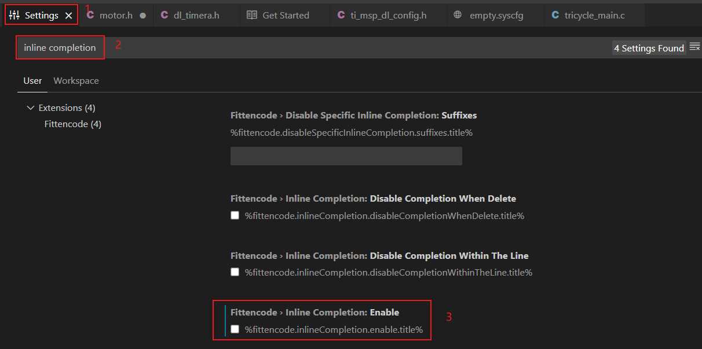

### 信息

支持sysconfig图形化初始化配置


G系列和L系列对比


硬件资源

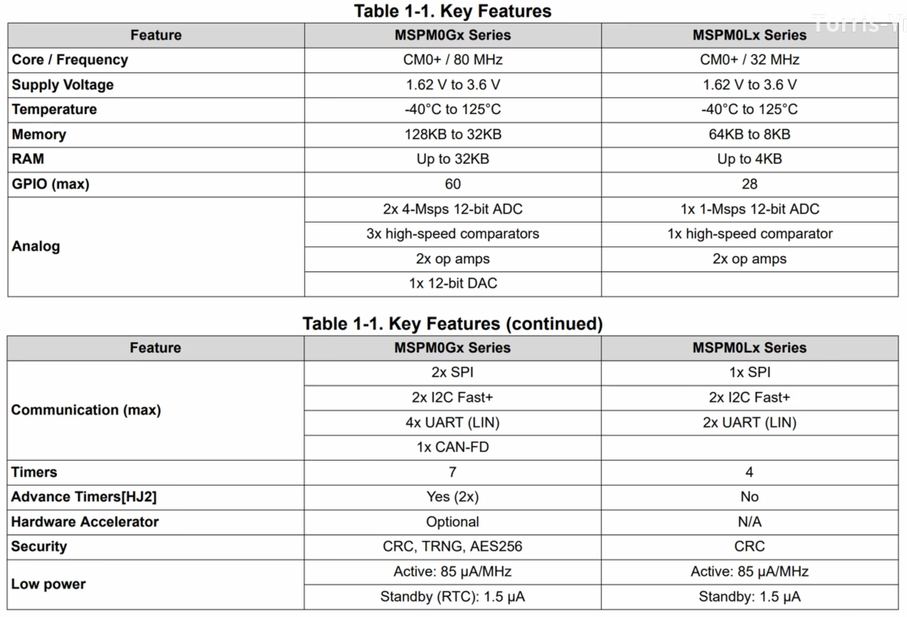

### 功能引脚图


## 开发环境部署

### SDK部署

网站：[LP-MSPM0G3507 评估板 | TI.com.cn](https://www.ti.com.cn/tool/cn/LP-MSPM0G3507?keyMatch=lp-mspm0g3507&tisearch=universal_search)

下载包： [mspm0_sdk_2_02_00_05.exe](./TI_MSPM0_localdata/mspm0_sdk_2_02_00_05.exe) 


本机安装路径：D:\Apps\Mspm0SDK

驱动示例代码路径：D:\Apps\Mspm0SDK\mspm0_sdk_2_02_00_05\examples\nortos\LP_MSPM0G3507\driverlib

### CCSTUDIO配置

下载包： [CCSTheia1.5.1.00003_win64.zip](./TI_MSPM0_localdata/CCSTheia1.5.1.00003_win64.zip) 


### 快捷键

```
Ctrl+B  执行Build
F5    调试
```

### Keil配置

arm下载：[Arm Keil | Devices](https://www.keil.arm.com/devices/)

Sysconfig包下载：[SYSCONFIG IDE、配置、编译器或调试器 | 德州仪器 TI.com.cn](https://www.ti.com.cn/tool/cn/SYSCONFIG#downloads)

参考网站：[从0用keil开发MSPM0G3507开发板_driverlib.a-CSDN博客](https://blog.csdn.net/L3101383697/article/details/140364643?ops_request_misc=%7B%22request%5Fid%22%3A%2230ef45775e72597c4ef905cda12677f1%22%2C%22scm%22%3A%2220140713.130102334..%22%7D&request_id=30ef45775e72597c4ef905cda12677f1&biz_id=0&utm_medium=distribute.pc_search_result.none-task-blog-2~all~sobaiduend~default-2-140364643-null-null.142^v100^pc_search_result_base3&utm_term=mspm0g3507在keil的包&spm=1018.2226.3001.4187)

## 项目

### 新建项目

import projects  ，导入空白工程模板（empty）

初始代码

```C
#include "ti_msp_dl_config.h"S
int main(void)
{
    SYSCFG_DL_init();
    while (1) {
    }
}
```

## GPIO

### 函数

#### 引脚查看

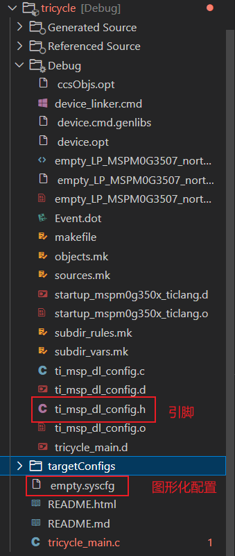

#### 输入模式

读取当前GPIO的输入电平（PB21）

```C
//宏定义
/* Port definition for Pin Group GPIO_SWITCHES */
#define GPIO_SWITCHES_PORT                  (GPIOB)
/* Defines for USER_SWITCH_1: GPIOB.21 with pinCMx 49 on package pin 20 */
#define GPIO_SWITCHES_USER_SWITCH_1_PIN     (DL_GPIO_PIN_21)
//读取代码
DL_GPIO_readPins(GPIO_SWITCHES_PORT,GPIO_SWITCHES_USER_SWITCH_1_PIN)
```

判断高低的电平

```c
car.grayvalue[0] = DL_GPIO_readPins(GraySensor_GPIO_GS1_PORT, GraySensor_GPIO_GS1_PIN)==GraySensor_GPIO_GS1_PIN?1:0;
```


#### 输出模式

设置输出高电平

```C
//DL_GPIO_setPins(XX_PORT, XX_XX_PIN);
DL_GPIO_setPins(GPIO_LEDS_PORT, GPIO_LEDS_USER_LED_1_PIN);
```

反转当前GPIO的输出

```
DL_GPIO_togglePins(GPIO_LEDS_PORT,GPIO_LEDS_USER_LED_1_PIN);
```

### 功能

#### 将PA0对应的LED1点亮


- 引脚配置

将PA0设置为初始状态为0，运行即可点亮。


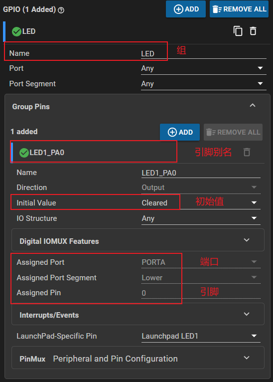

## EXTI

### 按键中断


## 蓝牙BT

### JDY-31蓝牙模块

参考：【JDY-31蓝牙模块使用方法】https://www.bilibili.com/video/BV1X44y1V7MC?vd_source=b7ec3648f866bae76c4b07907d1dae5e


- 连接

一般使用只需要连接VCC，GND，RX，TX

#### JDY-31的AT指令集


- 波特率设置（如设置成8：115200）

  ```
  AT+BAUD8
  ```

  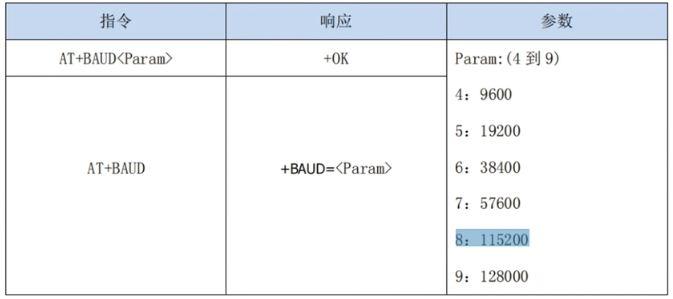

  

## UART

串口调试助手： [串口调试工具.exe](./TI_MSPM0_localdata/串口调试工具.exe) 

在线串口调试助手：[波特律动 串口助手](https://serial.keysking.com/)

### 使用过程

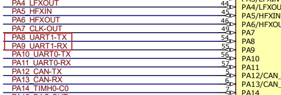

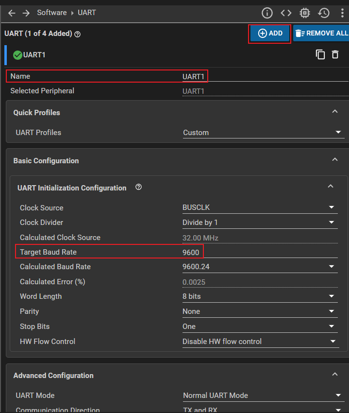


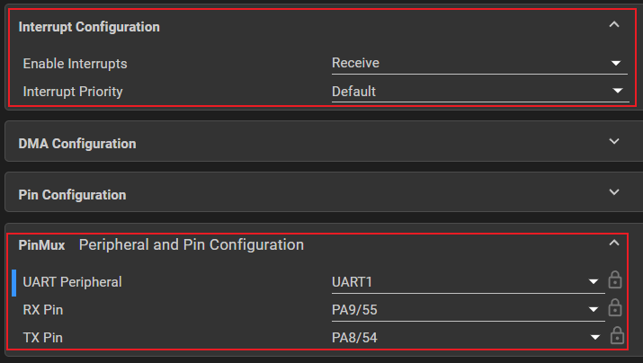

- 使能相关函数

  ```
  //使能串口和串口接收中断
      NVIC_ClearPendingIRQ(UART1_INST_INT_IRQN);
      NVIC_EnableIRQ(UART1_INST_INT_IRQN);
  ```

- 串口中断服务程序

  ```
  //串口中断-数据传输
  void UART1_INST_IRQHandler(void){
      switch(DL_UART_Main_getPendingInterrupt(UART1_INST)){
          case DL_UART_MAIN_IIDX_RX:
              signal++;
              //反转LED表示接收中断触发
              DL_GPIO_togglePins(LED_PORT, LED_LED1_PA0_PIN);
              //接收数据
              uart1_message_rx=DL_UART_Main_receiveData(UART1_INST);
              //将接收到的数据返回发送
              DL_UART_Main_transmitData(UART1_INST,uart1_message_rx);
              break;
          default:
              break;
      }
  }
  ```

  

## Timer

使用时要设置的参数

```
Name
Timer Clock Source
Timer Clock Divider
Timer Clock Prescaler
Timer Mode
Desired Timer Period
Interrupts Configuration-Enable Interrupts
```

时钟中断表与中断服务函数

| 序号 | 嵌套中断使能名称  NVIC_EnableIRQ(?)                | 中断服务程序名称 void ?(void)                               | 备注   |
| ---- | -------------------------------------------------- | ----------------------------------------------------------- | ------ |
| 1    | XX_INT_IRQN，如Timer0_makesLEDtoggle_INST_INT_IRQN | XX_INT_IRQHandler ，如Timer0_makesLEDtoggle_INST_IRQHandler | Timer0 |
|      |                                                    |                                                             |        |

时钟中断服务程序的格式

- XX_INST_IRQHandler

```C
// 中断服务程序XX_INST_IRQHandler
void TIMER_0_INST_IRQHandler(void)
{
    // 选择中断 switch (DL_TimerG_getPendingInterrupt(XXX_INST))
    switch (DL_TimerG_getPendingInterrupt(TIMER_0_INST)) {
        //选择中断的类型
        case DL_TIMER_IIDX_ZERO:
           ...
            break;
        default:
            break;
    }
}
```

TimeG、TimeA、TimeX

### 代码解析

#### Examples

##### timx_timer_mode_periodic_sleep

```C
#include "ti_msp_dl_config.h"
int main(void)
{
    SYSCFG_DL_init();
    //中断嵌套向量使能
    NVIC_EnableIRQ(TIMER_0_INST_INT_IRQN);
    DL_SYSCTL_enableSleepOnExit();//节能（一般和下面的while一起删掉）
    DL_TimerG_startCounter(TIMER_0_INST);
    while (1) { //尽量不要用，要跑在run状态
        __WFI(); //等待中断
    }
}
// 中断服务程序
void TIMER_0_INST_IRQHandler(void)
{
    // 选择中断
    switch (DL_TimerG_getPendingInterrupt(TIMER_0_INST)) {
        case DL_TIMER_IIDX_ZERO:
            DL_GPIO_togglePins(GPIO_LEDS_PORT,
                GPIO_LEDS_USER_LED_1_PIN);
            break;
        default:
            break;
    }
}
```

简化

```C
#include "ti/driverlib/dl_timera.h"
#include "ti_msp_dl_config.h"
void Timer0_makesLEDtoggle_INST_IRQHandler(void){
    switch (DL_TimerG_getPendingInterrupt(Timer0_makesLEDtoggle_INST)) {
        //选择中断的类型
        case DL_TIMER_IIDX_ZERO:
            DL_GPIO_togglePins(GPIO_LED_PORT,GPIO_LED_PIN_0_PIN);
            break;
        default:
            break;
    }
}
int main(void)
{
    SYSCFG_DL_init();
    //中断嵌套向量使能
    NVIC_EnableIRQ(Timer0_makesLEDtoggle_INST_INT_IRQN );
    //启动定时器
    DL_TimerA_startCounter(Timer0_makesLEDtoggle_INST);
    while (1) {
    }
}
```

### 参数

> Timer Clock Source

选择BUSCLK

> 设置时间

Timer Clock Divider增大或者Timer Clock Prescaler增大，可设置时间增长


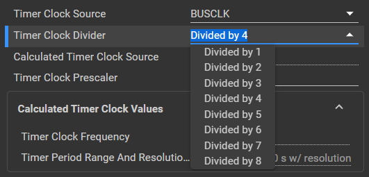

> Timer Mode

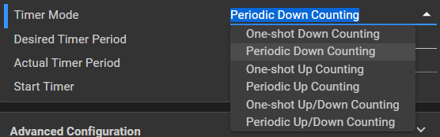

```
One-shot Down Counting (单次递减计数)：
计数器从预设值开始向下计数，直到达到零或指定的终止条件为止。一旦完成一次计数周期后，计数器将停止工作，除非重新启动。
Periodic Down Counting (周期性递减计数)：
计数器从预设值开始向下计数，当到达零或指定的终止条件时，会自动重置为初始值并继续计数。这种模式下，计数器将持续不断地重复这个过程。
One-shot Up Counting (单次递增计数)：
与 One-shot Down Counting 类似，但方向相反。计数器从预设值开始向上计数，直到达到最大值或指定的终止条件为止。完成后，计数器将停止工作，除非重新启动。
Periodic Up Counting (周期性递增计数)：
同样是与 Periodic Down Counting 相对的方向。计数器从预设值开始向上计数，当达到最大值或指定的终止条件时，会自动重置为初始值并继续计数。这种模式下，计数器也将持续不断地重复这个过程。
One-shot Up/Down Counting (单次双向计数)：
在此模式下，计数器可以先进行递增计数，然后切换到递减排列，或者反之亦然。具体行为取决于设计者如何配置。一旦完成整个计数周期，计数器将停止工作，除非重新启动。
Periodic Up/Down Counting (周期性双向计数)：
此模式允许计数器在递增和递减之间来回切换，并且在每次达到极限值之后都会自动重置并继续下一个周期。这使得计数器能够连续地执行递增-递减循环。
```

> Start Timer

初始化完成后就立刻开始计时


> 中断类型设置
>
> 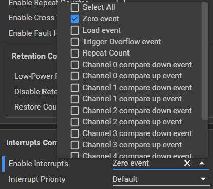

## 定时延时

### 滴答时钟延时

参考：

[MSPM0G3507（二十九）——滴答定时器和普通定时_mspm0g3507延时函数-CSDN博客](https://blog.csdn.net/2302_80529671/article/details/140253126?ops_request_misc=%7B%22request%5Fid%22%3A%22a8a3d04d46ee7e82c9da031963e8a63b%22%2C%22scm%22%3A%2220140713.130102334..%22%7D&request_id=a8a3d04d46ee7e82c9da031963e8a63b&biz_id=0&utm_medium=distribute.pc_search_result.none-task-blog-2~all~top_positive~default-1-140253126-null-null.142^v101^pc_search_result_base3&utm_term=MSPM0G3507延时函数&spm=1018.2226.3001.4187)

#### SYSCFG配置


#### 代码配置

放在主函数即可

- 声明

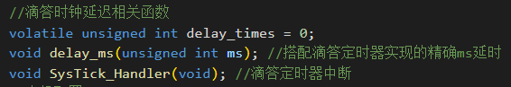

```
//滴答时钟延迟相关函数
volatile unsigned int delay_times = 0;
void delay_ms(unsigned int ms); //搭配滴答定时器实现的精确ms延时
void SysTick_Handler(void); //滴答定时器中断
```

- 实现


```
//搭配滴答定时器实现的精确ms延时
void delay_ms(unsigned int ms) 
{
    delay_times = ms;
    while( delay_times != 0 );
}      
//滴答定时器中断
void SysTick_Handler(void)
{
    if( delay_times != 0 )
    {
        delay_times--;
    }
}
```


## PWM


## ADC

```
volatile bool m; //禁用空间youhua
```

## DAC

## UART


## OLED

###  OLED 模块0.96寸

> 库参考：中景园oled代码：[项目首页 - 中景园电子0.96OLED显示屏资料:本仓库提供了中景园电子0.96英寸OLED显示屏的详细资料，包括取模教程和相关资源文件。通过这些资料，用户可以轻松地使显示屏显示自己想要的中文字符。 - GitCode](https://gitcode.com/open-source-toolkit/18214/overview)
>
> 本机下载： 

#### SPI/IIC接口模块

模块接口定义

```
GND 电源地
VCC 电源正（3～5.5V）
D0 OLED 的 D0 脚，在 SPI 和 IIC 通信中为时钟管脚
D1 OLED 的 D1 脚，在 SPI 和 IIC 通信中为数据管脚
RES OLED 的 RES#脚，用来复位（低电平复位）
DC OLED 的 D/C#E 脚，数据和命令控制管脚
CS OLED 的 CS#脚，也就是片选管脚
```


关闭编译优化


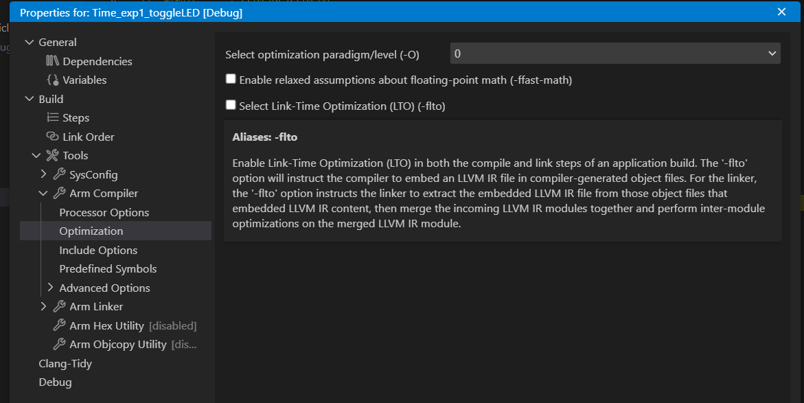

#### IIC 接口模块

模块接口定义

```
GND 电源地
VCC 电源正（3～5.5V）
SCL OLED 的 D0 脚，在 IIC 通信中为时钟管脚
SDA OLED 的 D1 脚，在 IIC 通信中为数据管脚
```

## 双电机三轮车

### 按键中断模式选择

### 双PWM

#### PWM配置

默认的时钟频率32MHz，设置PWM的输出频率为32kHz，这样电机基本不会产生噪声。再设置PWM的通道0和通道1为输出通道，对应开发板上的PB12（PWMA）,PB13(PWMB)两个引脚。


- 电机PWM给1KHZ

（时钟预分配系数中请给32，原始频率太高，电机无法运动）

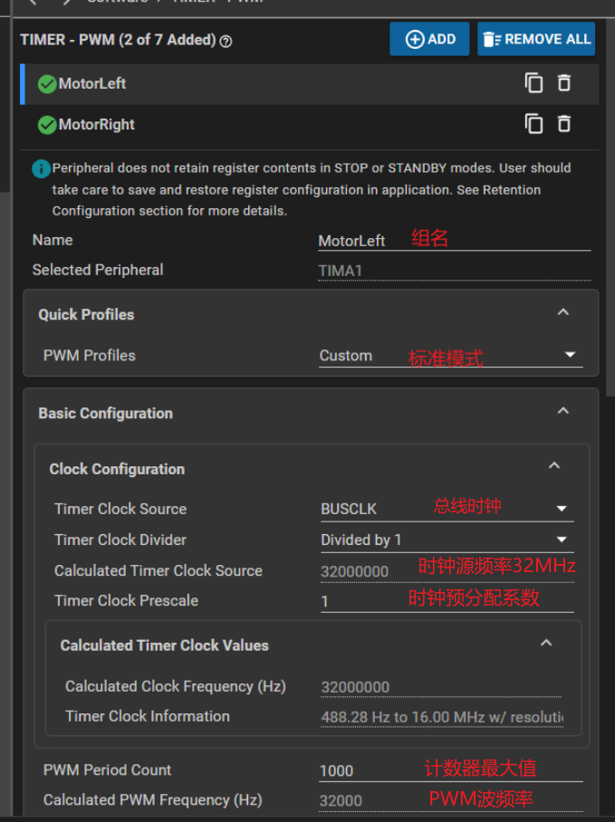

- pwm mode的选择

PWM Mode那一栏，如果选择了Edge-aligned Up-Counting（向上计数）那么当你设置的输出比较值越大，PWM的占空比就越大，反之，如果选择Edge-aligned Down-Counting（向下计数），设置的输出比较值越大占空比越小


此处选择向上计数

- 多路输出

输出的通道个数增多，信号一样

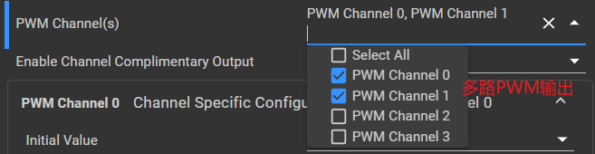

- 功能对应引脚

要使用PB12和PB13的PWM分别对应TIMA0-C2，TIMA0-C3

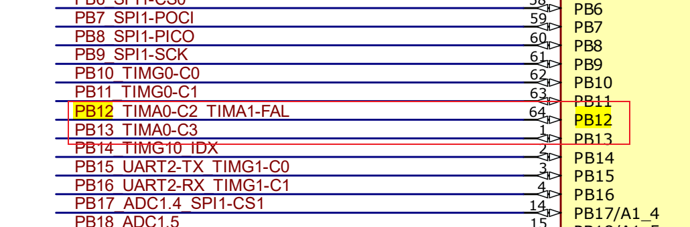

在PinMux中可以查看输出引脚

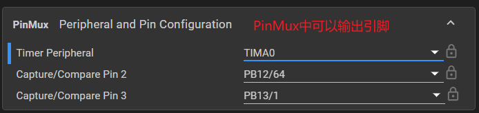

因此，我们要设置PWMA的C2，C3

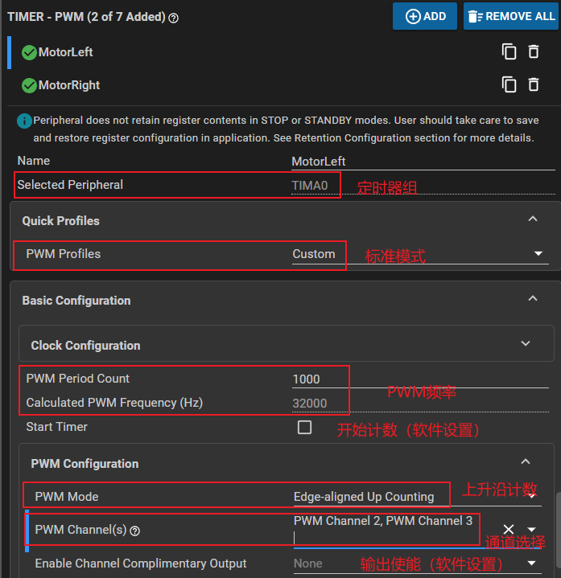


#### 软件控制PWM

- 启动PWM输出

  ```
  DL_TimerA_startCounter(MotorLeft_INST);
  ```

  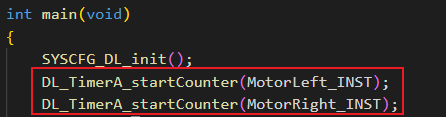

- 呼吸轮测试（配合下面的方向引脚）

  ```
  int main(void)
  {
      SYSCFG_DL_init();
      DL_TimerA_startCounter(Motor_INST);
      //使能编码器清空定时器
      while (1) {
          // //呼吸轮
          for(int i=-1000;i<1000;i++){
              ControlLeft_byrho((float)i/1000);
              ControlRight_byrho((float)i/1000);
              delay_ms(10);
  	    }for(int i=1000;i>=-1000;i--){
             ControlLeft_byrho((float)i/1000);
             ControlRight_byrho((float)i/1000);
             delay_ms(10);
  	    }
      }
  }
  ```

  函数：ControlLeft_byrho、ControlRight_byrho

  ```
  // rho控制左侧舵机
  void ControlLeft_byrho(float rho){
      int temp=rho*MotorPeriodCount;
      if (temp>=0){  //大于0时AIN=1,AIN=0
          DL_GPIO_setPins(DirControl_PORT,DirControl_AIN1_PIN);
          DL_GPIO_clearPins(DirControl_PORT,DirControl_AIN2_PIN);
      }else{
          temp=-temp;
          DL_GPIO_clearPins(DirControl_PORT,DirControl_AIN1_PIN);
          DL_GPIO_setPins(DirControl_PORT,DirControl_AIN2_PIN);
      }
      DL_TimerA_setCaptureCompareValue(Motor_INST, temp, DL_TIMER_CC_2_INDEX); 
  }
  // rho控制右侧舵机
  void ControlRight_byrho(float rho){
      int temp=rho*MotorPeriodCount;
      if (temp>=0){ //大于0时BIN=1,BIN=0
          DL_GPIO_setPins(DirControl_PORT,DirControl_BIN1_PIN);
          DL_GPIO_clearPins(DirControl_PORT,DirControl_BIN2_PIN);
      }else{
          temp=-temp;
          DL_GPIO_clearPins(DirControl_PORT,DirControl_BIN1_PIN);
          DL_GPIO_setPins(DirControl_PORT,DirControl_BIN2_PIN);
      }
      DL_TimerA_setCaptureCompareValue(Motor_INST, temp, DL_TIMER_CC_3_INDEX);
  }
  ```

  

- 设置PWM的占空比（设置ARR）

### 方向控制引脚(AIN1,AIN2)、(BIN1,BIN2)

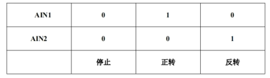


#### 方向引脚配置


- AIN1、AIN2、BIN1、BIN2配置一致，以AIN1为例。


- 参数


### 编码器（输入捕获模拟）

由于ti的MSPM0G3507开发板上只有一个编码器输入端口（QEI），而我们需要驱动的电机有两个，因此我们需要使用定时器的输入捕获中断来模拟编码器。

主要思想：捕获A相的上升沿（计数），在中断中判断B相的电平，即可实现编码器测速（定时清空编码器）

#### 定时器定时更新速度与清空编码器

#### 定时器定时发送串口数据

- CCS配置

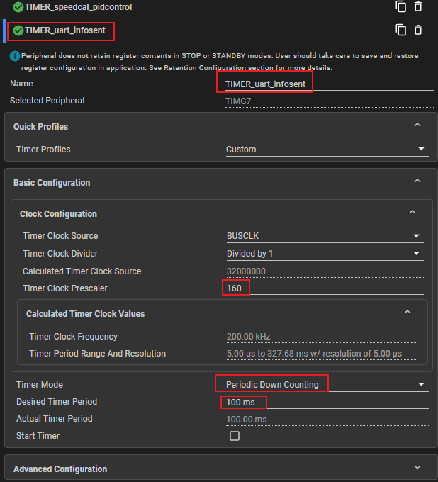


- 使能函数

```
//使能信息定时发送定时器
    NVIC_EnableIRQ(TIMER_uart_infosent_INST_INT_IRQN);
    DL_TimerG_startCounter(TIMER_uart_infosent_INST);
```

- 定时器中断服务程序

```

```


### 灰度传感器

感为8路校准视频：【感为八路模块的校准教程】https://www.bilibili.com/video/BV1vM4m197uT?vd_source=b7ec3648f866bae76c4b07907d1dae5e

```
1-8PIN
PB19,PA22,PB18,PB24,PB9,PA27,PB2,PB3
```

### 差速模型

【机器人底盘两轮差速模型详解】https://www.bilibili.com/video/BV1Wk4y1w7rg?vd_source=b7ec3648f866bae76c4b07907d1dae5e

### MPU6050

#### 硬件I2C

代码地址：[下载仓库 · Torris Yin/MSPM0G_Drivers - Gitee.com](https://gitee.com/torris-yin/MSPM0G_Drivers/repository/archive/main.zip)

参考资料：【TI MSPM0快速入门课 - MPU6050】https://www.bilibili.com/video/BV1uw4m1Y7U9?vd_source=b7ec3648f866bae76c4b07907d1dae5e

- 添加MPU6050函数至路径

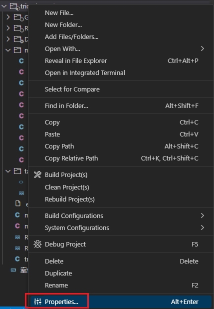


- 使用如下引脚

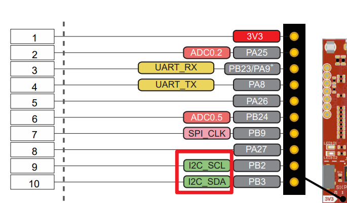

- CCS配置

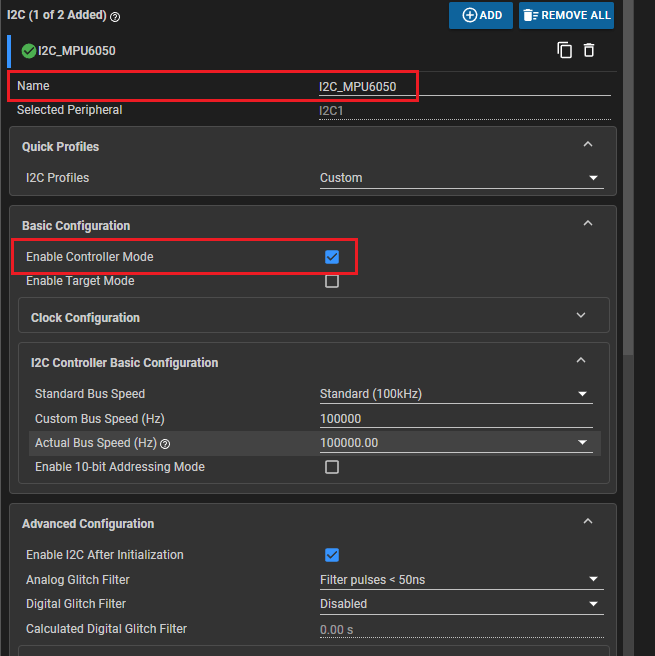


### JY61P

参考：[stm32通过串口读取JY61 JY62数据（HAL库）-CSDN博客](https://blog.csdn.net/2301_79779075/article/details/143065030?ops_request_misc=&request_id=&biz_id=102&utm_term=stm32读取jy61p&utm_medium=distribute.pc_search_result.none-task-blog-2~all~sobaiduweb~default-7-143065030.142^v102^pc_search_result_base3&spm=1018.2226.3001.4187)

jy61p.h

```

```

jy61p.c

```

```


### 主函数


