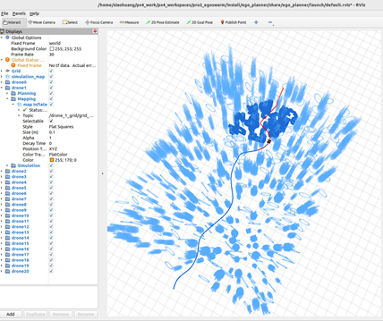
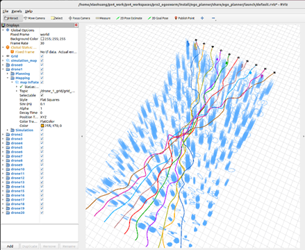

# PX4_egoplanner_ROS2教程

参考（ROS2版本）：[ZJU-FAST-Lab/ego-planner-swarm at ros2_version](https://github.com/ZJU-FAST-Lab/ego-planner-swarm/tree/ros2_version)

视频：[EGO-Swarm开源项目的仿真复现及问题解决经验分享_哔哩哔哩_bilibili](https://www.bilibili.com/video/BV1ku6mYCE4k/?spm_id_from=333.337.search-card.all.click&vd_source=7c2e8d193f6e7e6e1641077021d0803a)

## DDS修改

将DDS从FastDDS修改为cyclonedds

```
sudo apt install ros-humble-rmw-cyclonedds-cpp
```

更改默认DDS

```
echo "export RMW_IMPLEMENTATION=rmw_cyclonedds_cpp" >> ~/.bashrc
source ~/.bashrc
```

验证是否生效，查看环境变量（确认当前终端已生效），应该输出：RMW_IMPLEMENTATION=rmw_cyclonedds_cpp

```
env | grep RMW_IMPLEMENTATION
```

## 配置ego-planner-swarm环境并运行

克隆程序（使用ssh克隆更稳定，参考github ssh配置博客）

```
cd ~/px4_work/px4_workspaces/pro2_egoswarm/src
git clone git@github.com:ZJU-FAST-Lab/ego-planner-swarm.git
```

切换完后转到ros2版本

```
cd ~/px4_work/px4_workspaces/pro2_egoswarm/src/ego-planner-swarm
git checkout ros2_version
```

**`mockamap` 包找不到 `pcl_ros`** 的 CMake 配置

```
sudo apt update
sudo apt install ros-humble-pcl-ros
```

编译

```
colcon build
```

启动Rviz

```
ros2 launch ego_planner rviz.launch.py 
```

**运行规划程序**

打开一个新终端并执行：

- 单无人机

```
ros2 launch ego_planner single_run_in_sim.launch.py 
```

- 群体

```
ros2 launch ego_planner swarm.launch.py 
```

- 大型群体

```
ros2 launch ego_planner swarm_large.launch.py  
```

- 附加参数（可选）：
  - use_mockamap：地图生成方法。默认：False（使用随机森林），True使用mockamap。
  - use_dynamic：是否考虑动力学。默认：False（禁用），True启用动态。

```
ros2 launch ego_planner single_run_in_sim.launch.py use_mockamap:=True use_dynamic:=False
```

运行结果


