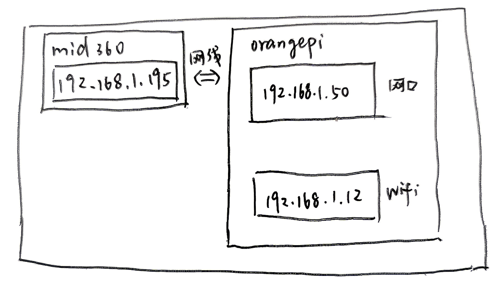

# PX4 Ubuntu教程

Ubuntu版本22.04、ROS2、PX4版本1.15.4

## Ubuntu安装QGC教程

参考：https://docs.qgroundcontrol.com/Stable_V5.0/en/qgc-user-guide/getting_started/download_and_install.html

## Ubuntu Linux

支持版本：Ubuntu 22.04、24.04：

Ubuntu自带串口调制解调器管理器，会干扰机器人相关串口（或USB串口）的使用。安装*QGroundControl*之前，你应该卸下调制解调器管理器，并授权自己访问串口。你还需要安装*GStreamer*，才能支持视频流。

在首次安装*QGroundControl*之前：

1. 在命令提示符中输入：

   ```cmd
   sudo usermod -a -G dialout $USER
   sudo apt-get remove modemmanager -y
   sudo apt install gstreamer1.0-plugins-bad gstreamer1.0-libav gstreamer1.0-gl -y
   sudo apt install libfuse2 -y
   sudo apt install libxcb-xinerama0 libxkbcommon-x11-0 libxcb-cursor-dev -y
   ```

2. 登出后再次登录以启用用户权限的更改。

安装*QGroundControl*：

1. 下载[QGroundControl-x86_64.AppImage](https://d176tv9ibo4jno.cloudfront.net/latest/QGroundControl-x86_64.AppImage)。

2. 使用终端命令安装（并运行）：

   ```cmd
   chmod +x ./QGroundControl-x86_64.AppImage
   ./QGroundControl-x86_64.AppImage  (or double click)
   ```

## Ubuntu安装PX4相关环境教程

参考教程：[Ubuntu搭建PX4无人机仿真环境(5) —— 仿真环境搭建(以Ubuntu 22.04,ROS2 Humble,Micro XRCE-DDS Agent为例)_px4仿真环境搭建-CSDN博客](https://blog.csdn.net/weixin_55944949/article/details/140627640?spm=1001.2014.3001.5502)

### 安装PX4源码与版本指定

```
git clone https://github.com/PX4/PX4-Autopilot.git
mv PX4-Autopilot PX4_Firmware  # 更改目录名
cd PX4_Firmware
git checkout v1.15.4
git submodule update --init --recursive --force
make px4_sitl_default  #编译 SITL 仿真固件
make px4_fmu-v5_default  #编译pixhawk4固件

```

### ROS2安装教程

参考：[小鱼的一键安装系列 | 鱼香ROS](https://fishros.org.cn/forum/topic/20/小鱼的一键安装系列)

```
wget http://fishros.com/install -O fishros && . fishros
```

### Gazebo教程

测试

```
gz sim
```

> [!Tip]
>
> **gazebo渲染失败的问题**
>
> 参考：[Vmware虚拟机ROS2中的gazebo界面不显示或者闪退_gazebo harmonic闪退-CSDN博客](https://blog.csdn.net/m0_73822937/article/details/149115237?ops_request_misc=elastic_search_misc&request_id=14a54929136cd484287dee39c1f371ac&biz_id=0&utm_medium=distribute.pc_search_result.none-task-blog-2~all~sobaiduend~default-1-149115237-null-null.142^v102^pc_search_result_base7&utm_term=虚拟机gazebo闪退&spm=1018.2226.3001.4187)
>
> 使用下面的命令强制使用ogre渲染：
>
> ```sql
> gz sim --render-engine ogre
> ```
>
> **对于运行`make px4_sitl gz_x500`带来的闪退：**
>
> ```cmd
> PX4_GZ_SIM_RENDER_ENGINE=ogre make px4_sitl gz_x500
> ```

### MAVROS安装

下载两个源码

```
cd ~/ros2_ws/src
git clone https://github.com/PX4/px4_msgs.git
git clone https://github.com/PX4/px4_ros_com.git
```

安装MAVROS

```
sudo apt update
sudo apt install --fix-missing
sudo apt install -y ros-humble-mavros ros-humble-mavros-extras
wget https://raw.githubusercontent.com/mavlink/mavros/master/mavros/scripts/install_geographiclib_datasets.sh
sudo bash ./install_geographiclib_datasets.sh
```

### Offboard示例

在解决了 MAVROS 的安装后，创建工作空间并生成节点

```cmd
# 创建工作空间（如果已存在可以跳过）
mkdir -p ~/px4_ros2_ws/src
cd ~/px4_ros2_ws/src

# 创建 Python 包（注意是 ament_python）
ros2 pkg create --build-type ament_python px4_offboard \
    --dependencies rclpy geometry_msgs std_msgs mavros_msgs
```

进入包目录，修改 `px4_offboard/px4_offboard/offboard_control.py`（你需要创建该文件）：

```
cd ~/px4_ros2_ws/src/px4_offboard/px4_offboard
touch offboard_control.py
chmod +x offboard_control.py
```

把以下代码粘贴进去：

```python
#!/usr/bin/env python3

import rclpy
from rclpy.node import Node
from geometry_msgs.msg import PoseStamped
from mavros_msgs.msg import State
from mavros_msgs.srv import CommandBool, SetMode

class OffboardControl(Node):
    def __init__(self):
        super().__init__('offboard_control')
        
        # 发布位置设定点
        self.pub_pos = self.create_publisher(PoseStamped, '/mavros/setpoint_position/local', 10)
        
        # 订阅当前状态（用于判断是否已进入 offboard 模式）
        self.sub_state = self.create_subscription(State, '/mavros/state', self.state_callback, 10)
        
        # 服务客户端：解锁/加锁
        self.arm_srv = self.create_client(CommandBool, '/mavros/cmd/arming')
        # 服务客户端：切换模式
        self.mode_srv = self.create_client(SetMode, '/mavros/set_mode')
        
        # 等待服务可用
        while not self.arm_srv.wait_for_service(timeout_sec=1.0):
            self.get_logger().info('等待 arming 服务...')
        while not self.mode_srv.wait_for_service(timeout_sec=1.0):
            self.get_logger().info('等待 set_mode 服务...')
        
        # 定时发布位置指令（20Hz）
        self.timer = self.create_timer(0.05, self.timer_callback)
        
        # 状态变量
        self.current_state = None
        self.offboard_set = False
        self.armed = False
        
        # 目标位置（悬停于起飞点上方 5 米）
        self.target_pose = PoseStamped()
        self.target_pose.header.frame_id = 'map'
        self.target_pose.pose.position.x = 0.0
        self.target_pose.pose.position.y = 0.0
        self.target_pose.pose.position.z = 5.0
        self.target_pose.pose.orientation.w = 1.0  # 无旋转

    def state_callback(self, msg):
        self.current_state = msg

    def timer_callback(self):
        # 1. 不断发布位置设定点（必须持续发送，否则 offboard 模式会超时终止）
        self.target_pose.header.stamp = self.get_clock().now().to_msg()
        self.pub_pos.publish(self.target_pose)

        # 2. 如果还没进入 offboard 模式，尝试切换
        if self.current_state is not None:
            if not self.offboard_set and self.current_state.mode != 'OFFBOARD':
                mode_req = SetMode.Request()
                mode_req.custom_mode = 'OFFBOARD'
                future = self.mode_srv.call_async(mode_req)
                future.add_done_callback(self.mode_callback)
                
            # 3. 如果已经进入 offboard 但还未解锁，尝试解锁
            if self.current_state.mode == 'OFFBOARD' and not self.armed:
                arm_req = CommandBool.Request()
                arm_req.value = True
                future = self.arm_srv.call_async(arm_req)
                future.add_done_callback(self.arm_callback)

    def mode_callback(self, future):
        try:
            response = future.result()
            if response.mode_sent:
                self.offboard_set = True
                self.get_logger().info('模式切换成功：OFFBOARD')
            else:
                self.get_logger().warn('模式切换失败')
        except Exception as e:
            self.get_logger().error(f'模式切换异常: {e}')

    def arm_callback(self, future):
        try:
            response = future.result()
            if response.success:
                self.armed = True
                self.get_logger().info('解锁成功！')
            else:
                self.get_logger().warn('解锁失败')
        except Exception as e:
            self.get_logger().error(f'解锁异常: {e}')

def main(args=None):
    rclpy.init(args=args)
    node = OffboardControl()
    rclpy.spin(node)
    node.destroy_node()
    rclpy.shutdown()

if __name__ == '__main__':
    main()
```

修改 setup.py 添加入口点：编辑 `~/px4_ros2_ws/src/px4_offboard/setup.py`，在 `entry_points` 中增加：

```python
entry_points={
    'console_scripts': [
        'offboard_control = px4_offboard.offboard_control:main',
    ],
},
```

编译并运行

```cmd
cd ~/px4_ros2_ws
colcon build --symlink-install
source install/setup.bash
```

完成上述步骤后，分别开三个终端

- 终端1：启动 PX4 SITL + Gazebo

  ```cmd
  cd ~/PX4-Autopilot   # 你存放 PX4 源码的位置
  PX4_GZ_SIM_RENDER_ENGINE=ogre make px4_sitl gz_x500
  ```

- 终端2：启动 MAVROS

  ```cmd
  source /opt/ros/humble/setup.bash
  ros2 launch mavros px4.launch.py fcu_url:="udp://:14540@127.0.0.1:14557"
  ```

- 终端3：运行 offboard 控制节点

  ```cmd
  source ~/px4_ros2_ws/install/setup.bash
  ros2 run px4_offboard offboard_control
  ```

  

## mid360教程

mid360快速使用指南： [Livox_Mid-360_Quick_Start_Guide_multi.pdf](PX4_Ubuntu教程.assets\Livox_Mid-360_Quick_Start_Guide_multi.pdf) 

mid360上位机使用指南： [Livox_Viewer_2_User_Manual_chs_v1.2.pdf](PX4_Ubuntu教程.assets\Livox_Viewer_2_User_Manual_chs_v1.2.pdf) 

### 设置静态IP驱动上位机

1. **打开“网络连接”窗口**

   - 按下键盘快捷键 `Win + R`，输入 `ncpa.cpl`，然后点击“确定”。
   - 或者：右键点击任务栏右下角的网络图标 → 选择“打开网络和 Internet 设置” → 点击“更改适配器选项”。

2. **找到您正在使用的网卡**

   - 通常名为“以太网”或“本地连接”。如果使用的是 USB 转网口，可能会显示为“Realtek USB GbE Family”等。
   - 确认网线已连接 Livox 设备。

3. **打开网卡属性**

   - 右键点击该网卡 → 选择 **“属性”**。

4. **选择 Internet 协议版本 4 (TCP/IPv4)**

   - 在列表中双击 **“Internet 协议版本 4 (TCP/IPv4)”** 或选中后点击“属性”。

5. **填写静态 IP 地址**

   - 选择 **“使用下面的 IP 地址”**。

   - 在对应框中输入：

     text

     ```
     IP 地址：192.168.1.2
     子网掩码：255.255.255.0
     默认网关：192.168.1.1
     ```

   - **首选 DNS 服务器** 可以留空，或填 `8.8.8.8`（不影响设备通信）。

6. **确认并保存**

   - 依次点击“确定” → “关闭”。
   - 设置立即生效，无需重启电脑。

7. **验证（可选）**

   - 打开命令提示符（`Win + R` → 输入 `cmd` → 回车）。
   - 输入 `ipconfig`，查看对应网卡是否显示上述 IP 地址。


### 驱动配置

教程：[Ubuntu 20.04使用Livox Mid-360](http://www.lryc.cn/news/266645.html?action=onClick)

教程：[使用ros2跑mid360的fastlio2算法详细教程_mid360 ros2-CSDN博客](https://blog.csdn.net/2301_79618994/article/details/150475756)

**完整流程**

#### linux硬件驱动安装

安装CMAKE库`$ sudo apt install cmake`

 然后用下面的代码，确认一下gcc版本大于4.8.1

```cmd
gcc -v
```

执行如下命令克隆、编译、安装库。

```
git clone https://github.com/Livox-SDK/Livox-SDK2.git
cd ./Livox-SDK2/
mkdir build
cd build
cmake .. && make -j
sudo make install
```

#### ros2驱动安装

在linux硬件安装的基础上安装ros2的驱动

新建ros_ws文件夹作为ROS2的工作目录，并在目录下新建src文件存放套件源码

```
mkdir -p ros_ws/src/
cd ros_ws/src/
```

克隆livox_ros_driver2 到src目录

```
git clone https://github.com/Livox-SDK/livox_ros_driver2.git
```

编译驱动

```
source /opt/ros/humble/setup.sh
./build.sh humble
```

~/mid360/ros_ws/src/livox_ros_driver2一般在这个目录下可以找到build.sh

**修改，ros_ws/install/livox_ros_driver2/share/livox_ros_driver2/config/MID360_config.json**中的本机ip 和设备ip

- **`host_net_info` 下所有 IP**：填 Orange Pi **有线网卡**的 IP（`192.168.1.50`）
- **`lidar_configs` 下的 `"ip"`**：填雷达实际 IP（`192.168.1.195`）
- **注意检查**`src` 和 `install` 两个目录下的配置文件需同步修改，修改后需重新编译。

```
{
  "lidar_summary_info" : {
    "lidar_type": 8
  },
  "MID360": {
    "lidar_net_info" : {
      "cmd_data_port": 56100,
      "push_msg_port": 56200,
      "point_data_port": 56300,
      "imu_data_port": 56400,
      "log_data_port": 56500
    },
    "host_net_info" : {
      "cmd_data_ip" : "192.168.1.50",//网口ip
      "cmd_data_port": 56101,
      "push_msg_ip": "192.168.1.50",
      "push_msg_port": 56201,
      "point_data_ip": "192.168.1.50",
      "point_data_port": 56301,
      "imu_data_ip" : "192.168.1.50",
      "imu_data_port": 56401,
      "log_data_ip" : "",
      "log_data_port": 56501
    }
  },
  "lidar_configs" : [
    {
      "ip" : "192.168.1.195",//雷达ip,最后俩位查看雷达的sn码来修改
      "pcl_data_type" : 1,
      "pattern_mode" : 0,
      "extrinsic_parameter" : {
        "roll": 0.0,
        "pitch": 0.0,
        "yaw": 0.0,
        "x": 0,
        "y": 0,
        "z": 0
      }
    }
  ]
}
```

驱动代码

```
source ../../install/setup.sh
ros2 launch livox_ros_driver2 rviz_MID360_launch.py
```

运行之后就可以得到点云图。


> [!WARNING]
>
> **编译 Livox-SDK2 时进程被 Killed**
>
> > [!Tip]
> >
> > 增大交换空间（参考ROS2博客）

### fastlio2算法包

```
cd ros_ws/src # cd into a ros2 workspace folder
git clone https://github.com/Ericsii/FAST_LIO.git --recursive
cd ..
rosdep install --from-paths src --ignore-src -y
colcon build --symlink-install     //务必使用这个来编译，其他指令很容易报错
```

**编译 FAST-LIO2**

```
cd ~/px4_mid360_project/mid360_fastlio_ws
colcon build --packages-select fast_lio
source install/setup.bash
```

> [!Warning]
>
> **Fastlio2不支持PointCloud2格式数据**
>
> > [!Tip]
> >  **修改 `mid360.yaml` 配置文件中的 `lidar_type`**
> >
> > 将 `lidar_type` 从 `1`（Livox CustomMsg）改为 `2`（Velodyne/通用 PointCloud2 格式）

**启动命令与 RViz2 设置**

- **启动雷达驱动**（需指定 `xfer_format:=0` 以输出标准 PointCloud2）：

  ```bash
  ros2 launch livox_ros_driver2 rviz_MID360.launch.py xfer_format:=0
  ```

- **启动 FAST-LIO 算法**（另开终端）：

  ```
  ros2 launch fast_lio mapping.launch.py
  ```

- `ros2 topic hz /livox/lidar` 显示非零频率（如 10Hz）

### 网络配置

重要工具：**wireshake**

**网络分工**：

- **WiFi (wlan0)**：连接外网，用于 SSH 远程调试，IP：`192.168.1.12`
- **有线网卡 (eth0)**：直连雷达，专用于接收点云数据，IP：`192.168.1.50`
- **雷达 IP**：`192.168.1.195`（通过 Windows 上位机 Livox Viewer 2 修改）



> [!Tip]
>
> **注意使用mid360上位机修改mid360ip后，不要再次用上位机连接，ip会被重置的**

网络先后顺序配置

```
sudo nmcli connection modify "Wired connection 1" ipv4.route-metric 200
sudo nmcli connection modify "FeatureDynamic" ipv4.route-metric 100
sudo nmcli connection modify "Wired connection 1" +ipv4.routes "192.168.1.195/32 0.0.0.0"
sudo nmcli connection up "Wired connection 1"
sudo nmcli connection up "FeatureDynamic"
```

> [!WARNING]
>
> **插上网线后 WiFi 无法上网 / SSH 断开**
>
> > [!Tip]
> >
> > **降低有线网卡优先级**，**提高 WiFi 优先级**，**删除有线网卡的默认网关**（防止抢网），**添加专属路由**（强制 `192.168.1.195` 只走有线网卡），**重启连接**
> >
> > ```
> > sudo nmcli connection modify "Wired connection 1" ipv4.route-metric 200
> > ```
> >
> > ```
> > sudo nmcli connection modify "FeatureDynamic" ipv4.route-metric 100
> > ```
> >
> > ```
> > sudo nmcli connection modify "Wired connection 1" ipv4.gateway ""
> > ```
> >
> > ```
> > sudo nmcli connection modify "Wired connection 1" +ipv4.routes "192.168.1.195/32 0.0.0.0"
> > ```
> >
> > ```
> > sudo nmcli connection up "Wired connection 1"
> > sudo nmcli connection up "FeatureDynamic"
> > ```
