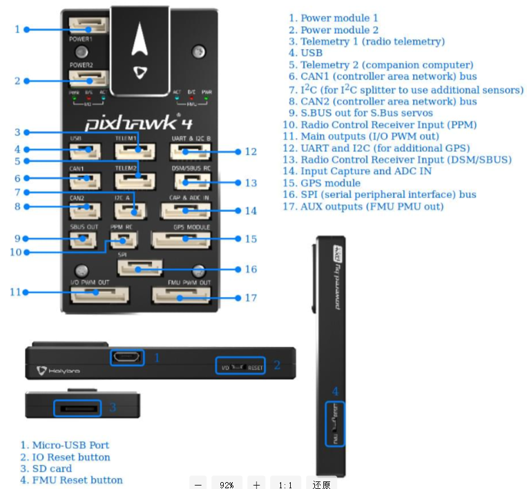
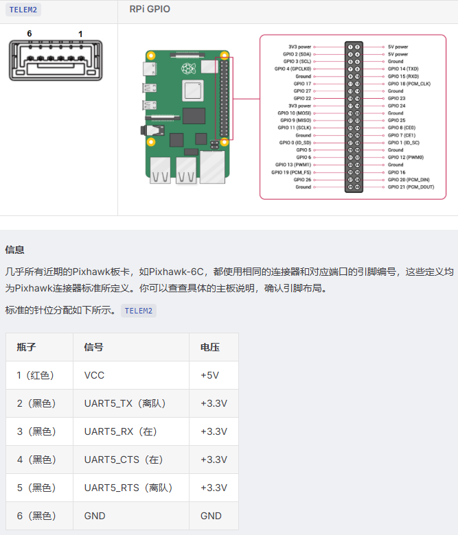
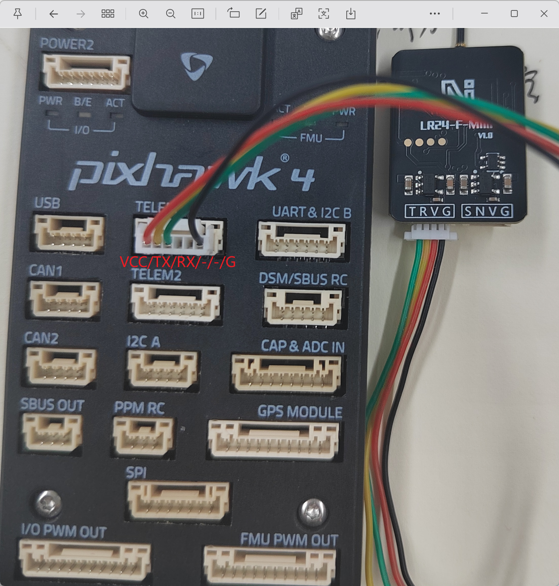
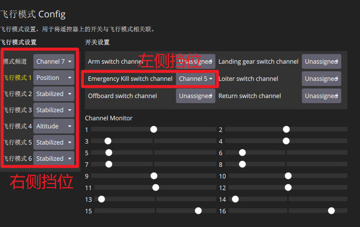
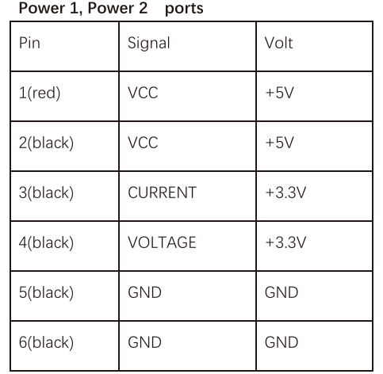
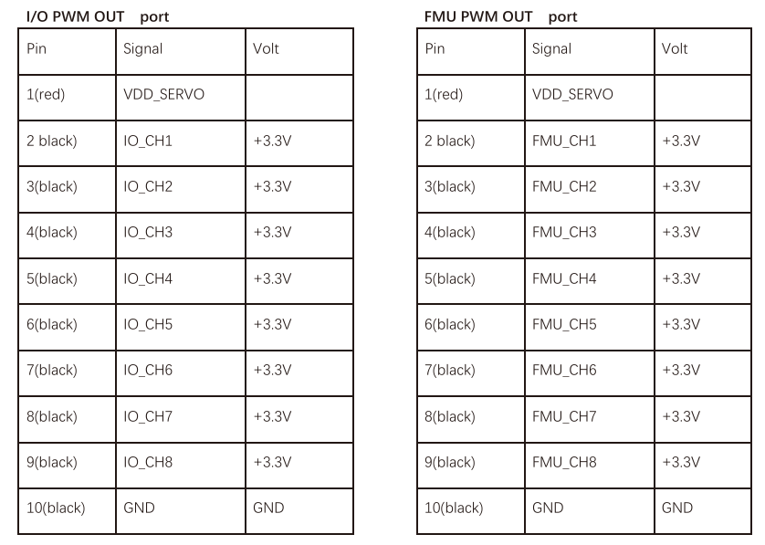
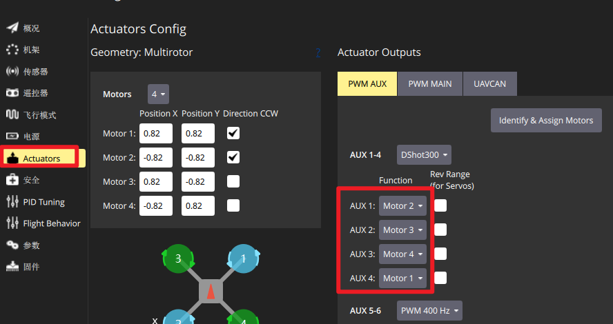
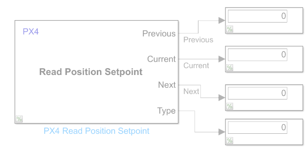
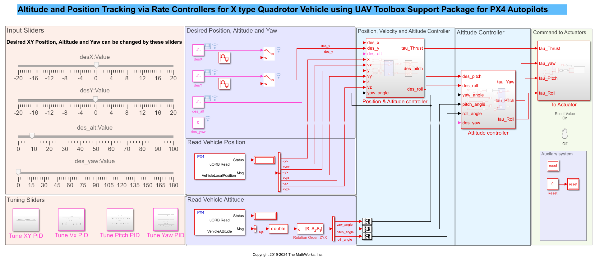

# PX4 Simulink教程

官方教程链接：[UAV Toolbox Support Package for PX4 Autopilots - MATLAB & Simulink](https://ww2.mathworks.cn/help/uav/px4-spkg.html)
官方视频链接：[自主系统 | 基于 SIL 和 HIL 工作流仿真并部署无人机应用_哔哩哔哩_bilibili](https://www.bilibili.com/video/BV1P94y1D7cu/?vd_source=369d383c90729d8c8b513367020c1468)

matlab online:[MATLAB](https://matlab.mathworks.com/)

硬件在环教程：[在Simulink - MATLAB和Simulink中，利用无人机动力学在硬件环路（HITL）模拟中运行PX4自动驾驶仪](https://ww2.mathworks.cn/help/uav/px4/ref/hitl-simulink-plant-example.html)

> [!Tip]
>
> **问题1：**我是px4和simulink联合开发控制器的，但是通过simulink烧录固件后就无法通过usb使用QGC了，我想先用usb通过QGC进行机体校准，校准完后再用usb链接simulink开发控制器，应该怎么操作怎么设置参数？
>
> **方案1：**开启两个slx，一个存放控制器，通过Run on board的监控并调节运行（pc通过usb口连接到px4，运行控制器），另一个slx存放被控对象，通过仿真-运行运行simulink中的由solidworks+urdf导出的无人机模型，然后通过MAVLink Bridge Source获取四个电机的actuator数据，然后通过MAVLink Bridge Sink下发传感器数据（pc通过如GPS的串口连接到px4），其中，**QGC 已经占用了 TELEM1 端口（通过数传电台），而你的 Simulink “Monitor & Tune” 专用通道会使用另外一个串口（例如 GPS 串口或其他空闲串口）**

> [!Tip]
>
> 注意点
>
> 1、不要轻易重烧固件
>
> 2、每次重烧固件后都要做电调校准
>
> 3、使用simulink连接的时候一定要先插usb，再插电池，否则就会要求重新烧录（禁止）

## 固件下载

```
git clone https://github.com/PX4/PX4-Autopilot.git
mv PX4-Autopilot PX4_Firmware  # 更改目录名
cd PX4_Firmware
git checkout v1.15.4
git submodule update --init --recursive --force
make px4_sitl_default  #编译 SITL 仿真固件

```

## Pixhawk4板载资源

官方中文：[Pixhawk 4 接线快速入门 | PX4 Guide (main)](https://docs.ncnynl.com/en/px4/zh/assembly/quick_start_pixhawk4.html)

[如何系统上手 Pixhawk 4：基于Holybro官方资料的接线与入门教学_holybro官网-CSDN博客](https://blog.csdn.net/2402_87963769/article/details/160418650?ops_request_misc=&request_id=&biz_id=102&utm_term=pixhawk4 原理图&utm_medium=distribute.pc_search_result.none-task-blog-2~all~sobaiduweb~default-0-160418650.142^v102^pc_search_result_base7&spm=1018.2226.3001.4187)

引脚图，FMUv5参考设计引脚： [Pixhawk4-Pinouts.pdf](PX4_Simulink教程.assets\Pixhawk4-Pinouts.pdf) 

串口映射：[霍利布罗小鹰4 |PX4 指南（主）](https://docs.px4.io/main/zh/flight_controller/pixhawk4#串口映射)



Telem1、Telem2



### 串口



### ELRS遥控教程

修改以适配ELRS接收机教程：[# PX4ELRS接收机的设置 - vokaol - 博客园](https://www.cnblogs.com/vokaol/p/20141454)

官方教程：[CRSF Telemetry (TBS Crossfire Telemetry) | PX4 Guide (main)](https://docs.px4.io/main/zh/telemetry/crsf_telemetry)



> [!Tip]
>
> 配置方法：由于PX4固件**默认不包含**对ELRS所用CRSF协议的支持，必须手动编译一个定制的固件。
>
> 1. **启动配置工具**：进入PX4源码目录，执行 `make px4_fmu-v5_multicopter boardconfig` （或者`make px4_fmu-v5_default boardconfig`）进入图形化配置界面。
> 2. **禁用通用RC输入**：找到路径 `drivers` → `rc_input`，按`N`或`Enter`键取消其前方的 `[*]` 标记，变为 `[ ]`。
> 3. **启用CRSF驱动**：找到路径 `drivers` → `RC` → `crsf_rc`，按`Y`或`Enter`键**选中它**，使其前方出现星号 `[*]`。
> 4. **保存并编译**：按`S`保存配置，退出后执行 `make px4_fmu-v5_multicopter`（或者`make px4_fmu-v5_default`） 开始编译。
>
> **QGC参数配置**
>
> 将生成的固件通过QGC烧录进飞控，重启后在 **参数 (Parameters)** 界面搜索并修改：
>
> - **`RC_CRSF_PRT_CFG`**：设置为 `TELEM4` (或你实际连接ELRS接收机的串口号)。
>
> > [!Caution]
> >
> > 禁止设置**MAV_0_CONFIG**不使用
> >
> > 一不小心修改后的解决方法：使用低版本固件烧录修改该参数再重新烧录当前版本
> >
> > pix4v1143: [px4_fmu-v5_default.px4](PX4_Simulink教程.assets\固件\soft1143\px4_fmu-v5_default.px4) 
> >
> > pix4v1140: [px4_fmu-v5_default.px4](PX4_Simulink教程.assets\固件\soft1140\px4_fmu-v5_default.px4) 

### 电源



### **电机**

电压安全输入：

POWER1和POWER2输入（工作范围4.1V至5.7V，0V至10V无损）

USB输入（工作范围4.1V至5.7V，0V至6V无损） 

伺服输入：VDD_SERVO脚的FMU PWM输出和I/O PWM输出（0V到42V未损坏）

I/O PWM OUT：由独立的I/O协处理器（STM32F100）管理

FMU PWM OUT：由直接由主FMU处理器（STM32F765）控制



电机顺序与方向调整



### 光流计

参考：[MTF-01光流测距一体传感器-用户手册-微空科技](https://micoair.cn/docs/MTF01-guang-liu-ce-ju-yi-ti-chuan-gan-qi-yong-hu-shou-ce)


### 报错解决

> [!CAUTION]
>
> **The value of the 'MaxStackSize' parameter is forcing a local variable to be global in the generated code. Since 'EnableMultiTasking' is on, this global variable may be unpredictably read from and written to on more than one task. To fix this error, either specify a higher 'MaxStackSize' or turn off 'EnableMultiTasking'.    组件:Simulink | 类别:Model 错误**
>
> > [!Tip]
> >
> > 1. 在 Simulink 模型界面，按 `Ctrl+E` 打开 **模型配置参数 (Model Configuration Parameters)**。
> > 2. 左侧导航栏选择 **代码生成 (Code Generation)** → **优化 (Optimization)**。
> > 3. 找到 **最大堆栈大小(字节) (Maximum stack size (bytes))** 参数。
> >    - 默认可能是 `Inherit from target` 或一个较小的数值（如 `200000`）。
> >    - **将其改为**：`Specify a value`，然后在输入框中填入 **`2000000`** （两百万字节，约 2 MB）。
> >    - Pixhawk 4 的总 RAM 为 2 MB，但你的模型通常不会独占全部内存。这个数值给栈分配了足够空间，且仍在安全范围内。
> > 4. 点击 **应用 (Apply)** → **确定 (OK)**。
> > 5. 重新启动编译（点击 Monitor & Tune 或按 `Ctrl+B`）。

> [!Caution]
>
> **错误:第一个输入必须为字符串数组或字符向量元胞数组。**
>
> > [!Tip]
> >
> > **MATLAB 项目或生成代码的路径中包含了中文字符（例如 `H:\大学期间各项资料...`）**
> >
> > 并删除先前的构建残留文件后重新构建
> >
> > ```
> > rm -rf /home/xiaohuang_tongxue/px4simulink_1154/PX4-Autopilot/src/modules/px4_simulink_app
> > ```
> >
> > **注意在simulink中px4配置的时候，路径要设置为**
> >
> > ```
> > /home/xiaohuang_tongxue/px4simulink_1154/PX4-Autopilot
> > ```
> >
> > **不允许使用以下内容**
> >
> > 


## Matlab例程介绍

```matlab
openExample("px4/PositionTrackingControllerTypeQuadrotorVehicleExample")
```



先看这个：[使用 PX4 主机目标和 jMAVSim/Simulink 的部署与验证 - MATLAB 和 Simulink](https://ww2.mathworks.cn/help/uav/px4/ug/deployment-using-px4hosttarget-jmavsim.html)

主要参考（软件在环教程）：[在Simulink - MATLAB和Simulink中运行PX4软件环路仿真，配合四旋翼机设备](https://ww2.mathworks.cn/help/uav/px4/ref/simulator-plant-model-example.html)

软件在环的工程路径：

```
C:\Users\86153\Documents\MATLAB\Examples\R2026a\px4\RunPX4SITLWithQuadcopterPlantExample\Px4DemoHostTargetWithSimulinkPlant
```

