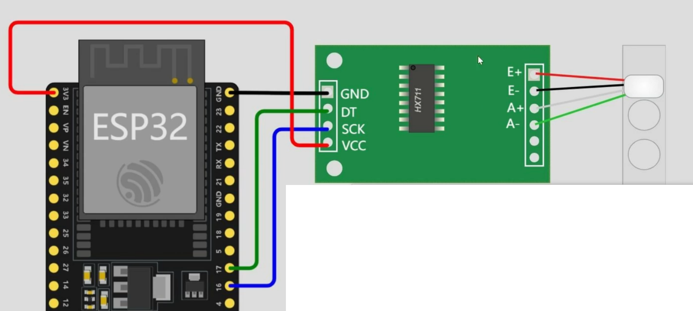

# S型拉压传感器与HX711

## HX711与S型拉压传感器的连接方式



## HX711的代码

### **HX711的放缩系数校准代码（Micropython）**

```python
from machine import Pin
import time

class SimpleHX711:
    def __init__(self, clk_pin=16, data_pin=17):
        self.clk = Pin(clk_pin, Pin.OUT, Pin.PULL_DOWN)
        self.data = Pin(data_pin, Pin.IN, Pin.PULL_UP)
        self.offset = 0
        self.scale = 1.0
        self.clk.value(0)
        time.sleep_ms(100)

    def read(self):
        # 等待数据准备好
        while self.data.value() == 1:
            pass

        # 读取24位数据
        value = 0
        for i in range(24):
            self.clk.value(1)
            value = (value << 1) | self.data.value()
            self.clk.value(0)

        # 设置增益128
        for i in range(1):
            self.clk.value(1)
            self.clk.value(0)

        # 处理符号位
        if value & 0x800000:
            value |= 0xFF000000

        return value

    def get_weight(self, samples=5):
        total = 0
        for i in range(samples):
            total += self.read()
            time.sleep_ms(10)
        avg = total // samples

        # 应用校准
        calibrated = (avg - self.offset) / self.scale

        # 转换为千克（根据7.3mV对应5KG）
        # 假设已校准：1个数字单位 = X克
        weight_kg = calibrated / 1000.0  # 如果校准单位是克

        return weight_kg

    def tare(self, samples=10):
        total = 0
        for i in range(samples):
            total += self.read()
        self.offset = total // samples

    def calibrate(self, known_weight_kg, samples=20):
        total = 0
        for i in range(samples):
            total += self.read()
        raw_value = total // samples

        if known_weight_kg > 0:
            self.scale = (raw_value - self.offset) / (known_weight_kg * 1000)
            print(self.scale)

# 快速使用
hx = SimpleHX711()
hx.tare()  # 去皮

# 假设你放置了1KG的重量进行校准
# hx.calibrate(1.0)  # 1KG
m=float(input("please input calibrate weight\n"))
hx.calibrate(m)

input("please takeoff the object")

while True:
    weight_kg = hx.get_weight()
    voltage_mv = (weight_kg / 5.0) * 7.3
    print(f"{weight_kg:.6f} KG——{voltage_mv:.3f} mV——scale:{hx.scale:.5f}")

    time.sleep(0.01)


```

### **利用校准数据的HX代码**

```python
from machine import Pin
import time

class SimpleHX711:
    def __init__(self, clk_pin=16, data_pin=17):
        self.clk = Pin(clk_pin, Pin.OUT, Pin.PULL_DOWN)
        self.data = Pin(data_pin, Pin.IN, Pin.PULL_UP)
        self.offset = 0
        self.scale = 637.70732
        self.clk.value(0)
        time.sleep_ms(100)

    def read(self):
        # 等待数据准备好
        while self.data.value() == 1:
            pass

        # 读取24位数据
        value = 0
        for i in range(24):
            self.clk.value(1)
            value = (value << 1) | self.data.value()
            self.clk.value(0)

        # 设置增益128
        for i in range(1):
            self.clk.value(1)
            self.clk.value(0)

        # 处理符号位
        if value & 0x800000:
            value |= 0xFF000000

        return value

    def get_weight(self, samples=5):
        total = 0
        for i in range(samples):
            total += self.read()
            time.sleep_ms(10)
        avg = total // samples

        # 应用校准
        calibrated = (avg - self.offset) / self.scale

        # 转换为千克（根据7.3mV对应5KG）
        # 假设已校准：1个数字单位 = X克
        weight_kg = calibrated / 1000.0  # 如果校准单位是克

        return weight_kg

    def tare(self, samples=10):
        total = 0
        for i in range(samples):
            total += self.read()
        self.offset = total // samples

    def calibrate(self, known_weight_kg, samples=20):
        total = 0
        for i in range(samples):
            total += self.read()
        raw_value = total // samples

        if known_weight_kg > 0:
            self.scale = (raw_value - self.offset) / (known_weight_kg * 1000)
            print(self.scale)

# 快速使用
hx = SimpleHX711()
hx.tare()  # 去皮
while True:
    weight_kg = hx.get_weight()
    voltage_mv = (weight_kg / 5.0) * 7.3
    print(f"{weight_kg:.6f} KG——{voltage_mv:.3f} mV")

    time.sleep(0.01)

```

### **高速的HX711读取代码**

```python
from machine import Pin, Timer
import time

class FastHX711:
    def __init__(self, clk_pin=16, data_pin=17):
        self.clk = Pin(clk_pin, Pin.OUT, Pin.PULL_DOWN)
        self.data = Pin(data_pin, Pin.IN, Pin.PULL_UP)
        self.offset = 0
        self.scale = 637.70732
        self.clk.value(0)

        # 缓冲区用于快速读取
        self.buffer = []
        self.max_buffer_size = 10
        self.is_ready = False

        # 初始化时钟
        time.sleep_us(10)

    def read_raw_fast(self):
        """快速读取原始值（不等待数据就绪）"""
        # 检查数据是否就绪
        if self.data.value() == 1:
            return None  # 数据未就绪，返回None

        value = 0
        # 快速读取24位数据
        for i in range(24):
            self.clk.value(1)
            self.clk.value(1)  # 微小延迟
            value = (value << 1) | self.data.value()
            self.clk.value(0)
            self.clk.value(0)  # 微小延迟

        # 设置增益128（1个脉冲）
        self.clk.value(1)
        self.clk.value(0)

        # 处理符号位
        if value & 0x800000:
            value |= 0xFF000000

        return value

    def read_fast(self):
        """带超时的快速读取"""
        timeout = time.ticks_us() + 1000  # 1ms超时
        while self.data.value() == 1:
            if time.ticks_us() > timeout:
                return None
            time.sleep_us(1)  # 微小延迟

        return self.read_raw_fast()

    def update_buffer(self):
        """更新缓冲区"""
        val = self.read_fast()
        if val is not None:
            self.buffer.append(val)
            if len(self.buffer) > self.max_buffer_size:
                self.buffer.pop(0)
            self.is_ready = True

    def get_filtered_weight(self, filter_type='median'):
        """获取滤波后的重量"""
        if not self.buffer:
            return 0.0

        if filter_type == 'median':
            # 中值滤波
            sorted_buf = sorted(self.buffer)
            median_idx = len(sorted_buf) // 2
            filtered = sorted_buf[median_idx]
        elif filter_type == 'average':
            # 平均值滤波
            filtered = sum(self.buffer) // len(self.buffer)
        elif filter_type == 'ema':
            # 指数移动平均（快速响应）
            filtered = self.buffer[-1]  # 使用最新值
            if len(self.buffer) > 1:
                # 加权平均，最近值权重更高
                for i, val in enumerate(reversed(self.buffer)):
                    weight = 0.5 ** (i + 1)
                    filtered = int(filtered * (1 - weight) + val * weight)
        else:
            filtered = self.buffer[-1]  # 最新值

        # 应用校准并转换为kg
        calibrated = (filtered - self.offset) / self.scale
        weight_kg = calibrated / 1000.0

        return weight_kg

    def get_instant_weight(self):
        """获取瞬时重量（最快响应）"""
        val = self.read_fast()
        if val is None:
            return 0.0

        calibrated = (val - self.offset) / self.scale
        weight_kg = calibrated / 1000.0
        return weight_kg

    def get_weight_optimized(self, samples=3, delay_us=100):
        """优化版重量读取"""
        total = 0
        count = 0

        for i in range(samples):
            val = self.read_fast()
            if val is not None:
                total += val
                count += 1
            if i < samples - 1:  # 最后一次不需要延迟
                time.sleep_us(delay_us)

        if count == 0:
            return 0.0

        avg = total // count
        calibrated = (avg - self.offset) / self.scale
        weight_kg = calibrated / 1000.0
        return weight_kg

    def tare_fast(self, samples=5):
        """快速去皮"""
        total = 0
        count = 0

        for i in range(samples):
            val = self.read_fast()
            if val is not None:
                total += val
                count += 1
            time.sleep_us(50)  # 微小延迟

        if count > 0:
            self.offset = total // count

    def calibrate_fast(self, known_weight_kg, samples=10):
        """快速校准"""
        total = 0
        count = 0

        for i in range(samples):
            val = self.read_fast()
            if val is not None:
                total += val
                count += 1
            time.sleep_us(50)

        if count == 0 or known_weight_kg <= 0:
            return

        raw_value = total // count
        self.scale = (raw_value - self.offset) / (known_weight_kg * 1000)
        print(f"New scale: {self.scale}")

# 示例使用
hx = FastHX711()
hx.tare_fast()  # 快速去皮

# # 方法1：瞬时读取（最快响应）
# print("=== 瞬时读取 ===")
# while(1):
#     weight = hx.get_instant_weight()
#     voltage = (weight / 5.0) * 7.3
#     print(f"{weight:.6f} KG - {voltage:.3f} mV")
#     time.sleep(0.005)  # 5ms延迟，约200Hz

# print("\n=== 优化读取 ===")
# # 方法2：优化读取（平衡速度和稳定性）
# while(1):
#     weight = hx.get_weight_optimized(samples=2, delay_us=50)
#     voltage = (weight / 5.0) * 7.3
#     print(f"{weight:.6f} KG - {voltage:.3f} mV")
#     time.sleep(0.01)

print("\n=== 带滤波的读取 ===")
# 方法3：使用缓冲区进行滤波
while(1):
    hx.update_buffer()  # 更新缓冲区
    weight = hx.get_filtered_weight(filter_type='ema')
    voltage = (weight / 5.0) * 7.3
    print(f"{weight:.6f} KG - {voltage:.3f} mV")
    time.sleep(0.01)

```

### **可通过WIFI可实现数据联网传输的HX711代码**

需要修改为所需的WIFI名称与端口，PC端需要修改为对应的IP

```python
from machine import Pin, Timer
import time
import network
import socket
import json
import ustruct
from micropython import const

class RobustHX711:
    def __init__(self, clk_pin=16, data_pin=17):
        self.clk = Pin(clk_pin, Pin.OUT, Pin.PULL_DOWN)
        self.data = Pin(data_pin, Pin.IN, Pin.PULL_UP)
        self.offset = 0
        self.scale = 637.70732
        self.clk.value(0)

        # 改进的数据缓冲区
        self.raw_buffer = []  # 原始数据缓冲区
        self.filtered_buffer = []  # 滤波后数据缓冲区
        self.max_buffer_size = 20

        # 状态跟踪
        self.last_valid_value = None
        self.consecutive_errors = 0
        self.max_consecutive_errors = 3

        # 统计信息
        self.read_count = 0
        self.error_count = 0

        # 初始化
        time.sleep_us(10)
        self.tare_fast()  # 自动去皮

    def read_with_retry(self, max_retries=3):
        """带重试机制的读取"""
        for attempt in range(max_retries):
            try:
                # 检查数据是否就绪
                start_time = time.ticks_us()
                while self.data.value() == 1:
                    if time.ticks_diff(time.ticks_us(), start_time) > 1000:  # 1ms超时
                        pass
                    time.sleep_us(1)

                # 读取24位数据
                value = 0
                for i in range(24):
                    self.clk.value(1)
                    self.clk.value(1)  # 微小延迟
                    value = (value << 1) | self.data.value()
                    self.clk.value(0)
                    self.clk.value(0)

                # 设置增益128
                self.clk.value(1)
                self.clk.value(0)

                # 处理符号位
                if value & 0x800000:
                    value |= 0xFF000000

                # 验证数据有效性
                if self._is_valid_value(value):
                    self.consecutive_errors = 0
                    self.last_valid_value = value
                    self.read_count += 1
                    return value
                else:
                    self.error_count += 1

            except Exception as e:
                self.error_count += 1
                if attempt == max_retries - 1:
                    self.consecutive_errors += 1
                    print(f"Read failed after {max_retries} attempts: {e}")

        # 所有重试都失败，返回上一次的有效值
        return self.last_valid_value if self.last_valid_value is not None else 0

    def _is_valid_value(self, value):
        """验证读取的值是否合理"""
        if value is None:
            return False

        # 检查值是否在合理范围内（假设传感器量程）
        min_val = -8388608  # 24位有符号最小值
        max_val = 8388607   # 24位有符号最大值

        if value < min_val or value > max_val:
            return False

        # 如果之前有有效值，检查变化是否过大
        if self.last_valid_value is not None:
            delta = abs(value - self.last_valid_value)
            # 如果变化超过最大范围，可能是错误读数
            if delta > 1000000:  # 经验阈值
                return False

        return True

    def read_filtered(self, filter_type='kalman'):
        """获取滤波后的重量"""
        raw_val = self.read_with_retry()

        if raw_val is None:
            # 使用最后一次有效值
            if self.last_valid_value is not None:
                raw_val = self.last_valid_value
            else:
                return 0.0

        # 添加到缓冲区
        self.raw_buffer.append(raw_val)
        if len(self.raw_buffer) > self.max_buffer_size:
            self.raw_buffer.pop(0)

        # 应用滤波算法
        if filter_type == 'median':
            filtered = self._median_filter()
        elif filter_type == 'moving_average':
            filtered = self._moving_average()
        elif filter_type == 'kalman':
            filtered = self._simple_kalman_filter(raw_val)
        else:
            filtered = raw_val

        # 应用校准
        calibrated = (filtered - self.offset) / self.scale
        weight_kg = calibrated / 1000.0

        return weight_kg

    def _median_filter(self):
        """中值滤波"""
        if not self.raw_buffer:
            return 0
        sorted_buf = sorted(self.raw_buffer)
        return sorted_buf[len(sorted_buf) // 2]

    def _moving_average(self):
        """移动平均滤波"""
        if not self.raw_buffer:
            return 0
        return sum(self.raw_buffer) // len(self.raw_buffer)

    def _simple_kalman_filter(self, measurement):
        """简化的卡尔曼滤波"""
        if not hasattr(self, 'kalman_state'):
            self.kalman_state = measurement
            self.kalman_uncertainty = 1000.0  # 初始不确定性

        # 预测
        predicted_state = self.kalman_state
        predicted_uncertainty = self.kalman_uncertainty + 0.1  # 过程噪声

        # 更新
        kalman_gain = predicted_uncertainty / (predicted_uncertainty + 0.1)  # 测量噪声
        self.kalman_state = predicted_state + kalman_gain * (measurement - predicted_state)
        self.kalman_uncertainty = (1 - kalman_gain) * predicted_uncertainty

        return int(self.kalman_state)

    def tare_fast(self, samples=10):
        """快速去皮"""
        values = []
        for i in range(samples):
            val = self.read_with_retry()
            if val is not None and self._is_valid_value(val):
                values.append(val)
            time.sleep_us(50)

        if values:
            self.offset = sum(values) // len(values)
            print(f"Tare completed. Offset: {self.offset}")

    def get_stats(self):
        """获取统计信息"""
        return {
            "read_count": self.read_count,
            "error_count": self.error_count,
            "error_rate": self.error_count / max(self.read_count, 1),
            "buffer_size": len(self.raw_buffer),
            "last_value": self.last_valid_value
        }

# WiFi配置
WIFI_SSID = "FeatureDynamic"
WIFI_PASSWORD = "TZYD0805"
SERVER_PORT = 8080

def connect_wifi():
    """连接WiFi"""
    wlan = network.WLAN(network.STA_IF)
    wlan.active(True)

    if not wlan.isconnected():
        print(f"Connecting to WiFi: {WIFI_SSID}")
        wlan.connect(WIFI_SSID, WIFI_PASSWORD)

        max_wait = 20
        while max_wait > 0:
            if wlan.isconnected():
                break
            max_wait -= 1
            print('.', end='')
            time.sleep(1)

    if wlan.isconnected():
        print(f"\nConnected! IP: {wlan.ifconfig()[0]}")
        return wlan.ifconfig()[0]
    else:
        print("\nFailed to connect")
        return None

class DataPacket:
    """数据包结构"""
    def __init__(self, seq_num, weight, voltage, timestamp):
        self.seq_num = seq_num
        self.weight = weight
        self.voltage = voltage
        self.timestamp = timestamp

    def to_dict(self):
        return {
            "seq": self.seq_num,
            "weight_kg": self.weight,
            "voltage_mv": self.voltage,
            "timestamp": self.timestamp,
            "checksum": self._calculate_checksum()
        }

    def _calculate_checksum(self):
        # 简单的校验和
        data_str = f"{self.seq_num}{self.weight:.6f}{self.voltage:.3f}"
        checksum = sum(ord(c) for c in data_str) % 256
        return checksum

def start_server():
    """启动TCP服务器"""
    ip_address = connect_wifi()
    if ip_address is None:
        print("Failed to get IP address")
        return

    # 创建TCP套接字
    server_socket = socket.socket(socket.AF_INET, socket.SOCK_STREAM)
    server_socket.setsockopt(socket.SOL_SOCKET, socket.SO_REUSEADDR, 1)

    try:
        server_socket.bind((ip_address, SERVER_PORT))
        server_socket.listen(1)
        print(f"Server started on {ip_address}:{SERVER_PORT}")
    except Exception as e:
        print(f"Failed to bind port: {e}")
        server_socket.close()
        return

    # 初始化传感器
    sensor = RobustHX711()

    client_socket = None
    seq_num = 0
    last_valid_weight = None

    try:
        while True:
            try:
                # 等待客户端连接
                if client_socket is None:
                    print("Waiting for client connection...")
                    client_socket, client_address = server_socket.accept()
                    client_socket.settimeout(5.0)
                    print(f"Client connected: {client_address}")

                # 读取传感器数据
                weight = sensor.read_filtered(filter_type='kalman')
                voltage = (weight / 5.0) * 7.3

                # 数据验证和异常值过滤
                if weight == 0.0:
                    # 如果是0值，使用上一次的有效值
                    if last_valid_weight is not None:
                        weight = last_valid_weight
                        voltage = (weight / 5.0) * 7.3
                    else:
                        # 如果还没有有效值，尝试重新读取
                        weight = sensor.read_filtered(filter_type='kalman')
                        voltage = (weight / 5.0) * 7.3

                # 更新最后一次有效值
                if abs(weight) > 0.000001:  # 忽略极小的值
                    last_valid_weight = weight

                # 创建数据包
                packet = DataPacket(seq_num, weight, voltage, time.ticks_ms())
                data_dict = packet.to_dict()

                # 发送数据
                try:
                    data_str = json.dumps(data_dict) + "\n"
                    client_socket.sendall(data_str.encode('utf-8'))
                    seq_num += 1

                    # 可选：打印调试信息
                    if seq_num % 100 == 0:
                        stats = sensor.get_stats()
                        print(f"Sent {seq_num} packets, Error rate: {stats['error_rate']:.2%}")

                except Exception as e:
                    print(f"Send error: {e}")
                    client_socket.close()
                    client_socket = None
                    continue

                # 控制发送频率
                time.sleep(0.02)  # 50Hz

            except socket.timeout:
                print("Client timeout")
                if client_socket:
                    client_socket.close()
                client_socket = None
                continue
            except OSError as e:
                print(f"Socket error: {e}")
                if client_socket:
                    client_socket.close()
                client_socket = None
                time.sleep(1)
                continue
            except KeyboardInterrupt:
                print("Server stopped by user")
                break
            except Exception as e:
                print(f"Unexpected error: {e}")
                time.sleep(1)

    finally:
        if client_socket:
            client_socket.close()
        server_socket.close()
        print("Server closed")

if __name__ == "__main__":
    start_server()

```

## 使用WIFI功能时的PC代码

### 不含数据保存的PC代码

```python
import socket
import json
import threading
import time
from collections import deque
from datetime import datetime
import matplotlib.pyplot as plt
import matplotlib.animation as animation
from matplotlib.font_manager import FontProperties
import numpy as np

# 设置中文字体（解决中文显示问题）
def setup_chinese_font():
    try:
        # Windows系统
        plt.rcParams['font.sans-serif'] = ['SimHei', 'Microsoft YaHei', 'DejaVu Sans']
        # Mac系统
        # plt.rcParams['font.sans-serif'] = ['Arial Unicode MS', 'Heiti TC', 'Hiragino Sans GB']
        plt.rcParams['axes.unicode_minus'] = False
    except:
        print("注意：中文字体设置可能失败，请确保系统已安装中文字体")

# ESP32服务器配置
ESP32_IP = "192.168.1.15"  # 替换为ESP32的实际IP地址
ESP32_PORT = 8080
BUFFER_SIZE = 1024

# 数据存储
class SensorData:
    def __init__(self, max_points=500):
        self.max_points = max_points
        self.timestamps = deque(maxlen=max_points)
        self.weights = deque(maxlen=max_points)  # 重量 (kg)
        self.voltages = deque(maxlen=max_points)  # 电压 (mV)
        self.lock = threading.Lock()
        self.is_connected = False
        self.latest_data = None

    def add_data(self, data):
        with self.lock:
            timestamp = datetime.now()
            self.timestamps.append(timestamp)
            self.weights.append(data.get("weight_kg", 0))
            self.voltages.append(data.get("voltage_mv", 0))
            self.latest_data = data

    def get_recent_data(self, n_points=None):
        with self.lock:
            if n_points is None or n_points > len(self.timestamps):
                n_points = len(self.timestamps)

            if n_points == 0:
                return [], [], []

            # 返回最近的数据
            start_idx = len(self.timestamps) - n_points
            timestamps = list(self.timestamps)[start_idx:]
            weights = list(self.weights)[start_idx:]
            voltages = list(self.voltages)[start_idx:]

            return timestamps, weights, voltages

    def get_statistics(self):
        with self.lock:
            if len(self.weights) == 0:
                return {
                    "min_weight": 0,
                    "max_weight": 0,
                    "avg_weight": 0,
                    "min_voltage": 0,
                    "max_voltage": 0,
                    "avg_voltage": 0,
                    "data_count": 0
                }

            weights = list(self.weights)
            voltages = list(self.voltages)

            return {
                "min_weight": min(weights),
                "max_weight": max(weights),
                "avg_weight": sum(weights) / len(weights),
                "min_voltage": min(voltages),
                "max_voltage": max(voltages),
                "avg_voltage": sum(voltages) / len(voltages),
                "data_count": len(weights)
            }

# ESP32数据接收线程
class ESP32Client(threading.Thread):
    def __init__(self, sensor_data):
        super().__init__()
        self.sensor_data = sensor_data
        self.running = True
        self.sock = None
        self.daemon = True

    def connect(self):
        """连接到ESP32服务器"""
        try:
            self.sock = socket.socket(socket.AF_INET, socket.SOCK_STREAM)
            self.sock.settimeout(5)
            self.sock.connect((ESP32_IP, ESP32_PORT))
            self.sensor_data.is_connected = True
            print(f"成功连接到ESP32: {ESP32_IP}:{ESP32_PORT}")
            return True
        except Exception as e:
            print(f"连接失败: {e}")
            self.sensor_data.is_connected = False
            return False

    def run(self):
        """接收数据线程"""
        buffer = ""

        while self.running:
            try:
                # 如果未连接，尝试重新连接
                if not self.sensor_data.is_connected:
                    time.sleep(2)
                    if not self.connect():
                        continue

                # 接收数据
                data = self.sock.recv(BUFFER_SIZE)
                if not data:
                    print("连接断开")
                    self.sensor_data.is_connected = False
                    self.sock.close()
                    continue

                # 处理数据
                buffer += data.decode('utf-8')

                # 按行分割JSON数据
                while '\n' in buffer:
                    line, buffer = buffer.split('\n', 1)
                    if line.strip():
                        try:
                            json_data = json.loads(line)
                            self.sensor_data.add_data(json_data)
                        except json.JSONDecodeError as e:
                            print(f"JSON解析错误: {e}")

            except socket.timeout:
                continue
            except socket.error as e:
                print(f"Socket错误: {e}")
                self.sensor_data.is_connected = False
                if self.sock:
                    self.sock.close()
                time.sleep(1)
            except Exception as e:
                print(f"其他错误: {e}")
                time.sleep(1)

    def stop(self):
        self.running = False
        if self.sock:
            self.sock.close()

# 实时图表类
class RealTimePlot:
    def __init__(self, sensor_data):
        self.sensor_data = sensor_data
        self.fig, self.axes = plt.subplots(2, 1, figsize=(12, 8))
        self.setup_plots()

    def setup_plots(self):
        """设置图表"""
        # 重量图表
        self.ax1 = self.axes[0]
        self.weight_line, = self.ax1.plot([], [], 'b-', linewidth=2, label='重量')
        self.ax1.set_xlabel('时间', fontsize=12)
        self.ax1.set_ylabel('重量 (kg)', fontsize=12)
        self.ax1.set_title('实时重量监测', fontsize=14, fontweight='bold')
        self.ax1.grid(True, alpha=0.3)
        self.ax1.legend(loc='upper right')
        self.ax1.tick_params(axis='x', rotation=45)

        # 电压图表
        self.ax2 = self.axes[1]
        self.voltage_line, = self.ax2.plot([], [], 'r-', linewidth=2, label='电压')
        self.ax2.set_xlabel('时间', fontsize=12)
        self.ax2.set_ylabel('电压 (mV)', fontsize=12)
        self.ax2.set_title('实时电压监测', fontsize=14, fontweight='bold')
        self.ax2.grid(True, alpha=0.3)
        self.ax2.legend(loc='upper right')
        self.ax2.tick_params(axis='x', rotation=45)

        plt.tight_layout()

        # 文本信息区域
        self.info_text = self.fig.text(0.02, 0.02, '', fontsize=10,
                                       bbox=dict(boxstyle="round,pad=0.3",
                                                facecolor="lightyellow",
                                                edgecolor="gray"))

    def update(self, frame):
        """更新图表数据"""
        # 获取最近100个数据点
        timestamps, weights, voltages = self.sensor_data.get_recent_data(100)

        if timestamps:
            # 更新重量图表
            self.weight_line.set_data(range(len(weights)), weights)
            self.ax1.relim()
            self.ax1.autoscale_view()

            # 更新电压图表
            self.voltage_line.set_data(range(len(voltages)), voltages)
            self.ax2.relim()
            self.ax2.autoscale_view()

            # 获取统计信息
            stats = self.sensor_data.get_statistics()

            # 更新信息文本
            info = f"连接状态: {'已连接' if self.sensor_data.is_connected else '断开'}\n"
            info += f"数据点数: {stats['data_count']}\n"
            info += f"当前重量: {weights[-1]:.6f} kg\n"
            info += f"重量范围: {stats['min_weight']:.6f} - {stats['max_weight']:.6f} kg\n"
            info += f"平均重量: {stats['avg_weight']:.6f} kg\n"
            info += f"当前电压: {voltages[-1]:.3f} mV\n"
            info += f"电压范围: {stats['min_voltage']:.3f} - {stats['max_voltage']:.3f} mV\n"
            info += f"更新时间: {datetime.now().strftime('%H:%M:%S')}"

            self.info_text.set_text(info)

            # 更新图表标题显示当前值
            self.ax1.set_title(f'实时重量监测 - 当前: {weights[-1]:.6f} kg',
                              fontsize=14, fontweight='bold')
            self.ax2.set_title(f'实时电压监测 - 当前: {voltages[-1]:.3f} mV',
                              fontsize=14, fontweight='bold')

        return self.weight_line, self.voltage_line, self.info_text

    def show(self):
        """显示图表"""
        ani = animation.FuncAnimation(self.fig, self.update,
                                     interval=100,  # 100ms更新
                                     blit=False,
                                     cache_frame_data=False)
        plt.show()

# 控制面板
class ControlPanel:
    def __init__(self, sensor_data):
        self.sensor_data = sensor_data
        self.client = None

    def start(self):
        """启动系统"""
        print("=" * 50)
        print("ESP32 传感器数据监测系统")
        print("=" * 50)

        # 设置中文字体
        setup_chinese_font()

        # 启动ESP32客户端
        self.client = ESP32Client(self.sensor_data)
        if self.client.connect():
            self.client.start()
            print("数据接收线程已启动")

        # 创建实时图表
        plot = RealTimePlot(self.sensor_data)

        # 添加键盘事件
        def on_key(event):
            if event.key == 'q' or event.key == 'Q':
                print("正在退出...")
                if self.client:
                    self.client.stop()
                plt.close('all')

        plot.fig.canvas.mpl_connect('key_press_event', on_key)

        # 显示图表
        try:
            plot.show()
        except KeyboardInterrupt:
            print("\n用户中断")
        finally:
            self.cleanup()

    def cleanup(self):
        """清理资源"""
        if self.client:
            self.client.stop()
        print("程序已退出")

# 主程序
def main():
    # 创建数据存储对象
    sensor_data = SensorData(max_points=1000)

    # 创建控制面板并启动
    control_panel = ControlPanel(sensor_data)

    # 捕获Ctrl+C
    try:
        control_panel.start()
    except KeyboardInterrupt:
        print("\n程序被用户中断")
    except Exception as e:
        print(f"程序错误: {e}")
    finally:
        control_panel.cleanup()

if __name__ == "__main__":
    main()
```

### 不含tkinter显示界面的代码(含数据)

```python
import socket
import json
import threading
import time
from collections import deque
from datetime import datetime
import matplotlib.pyplot as plt
import matplotlib.animation as animation
from matplotlib.font_manager import FontProperties
import numpy as np
import os
import csv
from queue import Queue

# 设置中文字体（解决中文显示问题）
def setup_chinese_font():
    try:
        plt.rcParams['font.sans-serif'] = ['SimHei', 'Microsoft YaHei', 'DejaVu Sans']
        plt.rcParams['axes.unicode_minus'] = False
    except:
        print("注意：中文字体设置可能失败，请确保系统已安装中文字体")

# ESP32服务器配置
ESP32_IP = "192.168.1.15"  # 替换为ESP32的实际IP地址
ESP32_PORT = 8080
BUFFER_SIZE = 1024

# 数据存储
class SensorData:
    def __init__(self, max_points=500):
        self.max_points = max_points
        self.timestamps = deque(maxlen=max_points)
        self.weights = deque(maxlen=max_points)  # 重量 (kg)
        self.voltages = deque(maxlen=max_points)  # 电压 (mV)
        self.seq_numbers = deque(maxlen=max_points)  # 序列号
        self.lock = threading.Lock()
        self.is_connected = False
        self.latest_data = None

        # 数据记录相关
        self.data_buffer = []  # 用于记录的数据缓冲区
        self.recording_enabled = True  # 是否启用记录
        self.record_interval = 10  # 记录间隔（秒）
        self.last_record_time = time.time()

    def add_data(self, data):
        with self.lock:
            timestamp = datetime.now()
            self.timestamps.append(timestamp)
            self.weights.append(data.get("weight_kg", 0))
            self.voltages.append(data.get("voltage_mv", 0))
            self.seq_numbers.append(data.get("seq", 0))
            self.latest_data = data

            # 添加到数据缓冲区
            if self.recording_enabled:
                self.data_buffer.append({
                    "timestamp": timestamp,
                    "seq": data.get("seq", 0),
                    "weight_kg": data.get("weight_kg", 0),
                    "voltage_mv": data.get("voltage_mv", 0),
                    "pc_timestamp": timestamp.strftime("%Y-%m-%d %H:%M:%S.%f")
                })

            # 检查是否需要保存数据
            current_time = time.time()
            if (current_time - self.last_record_time >= self.record_interval and
                self.recording_enabled and self.data_buffer):
                self.save_buffered_data()
                self.last_record_time = current_time

    def save_buffered_data(self):
        """保存缓冲区的数据到文件"""
        if not self.data_buffer:
            return

        try:
            # 创建文件夹路径
            today = datetime.now().strftime("%Y%m%d")
            folder_path = f"weightdata/day_{today}"

            # 如果文件夹不存在，则创建
            if not os.path.exists(folder_path):
                os.makedirs(folder_path)

            # 创建文件名
            timestamp_str = datetime.now().strftime("%H%M%S")
            filename = f"data_{timestamp_str}.txt"
            filepath = os.path.join(folder_path, filename)

            # 保存数据
            with open(filepath, 'w', encoding='utf-8') as f:
                # 写入文件头
                f.write("# ESP32 Sensor Data Record\n")
                f.write(f"# Recording Start: {self.data_buffer[0]['timestamp'].strftime('%Y-%m-%d %H:%M:%S')}\n")
                f.write(f"# Recording End: {self.data_buffer[-1]['timestamp'].strftime('%Y-%m-%d %H:%M:%S')}\n")
                f.write(f"# Data Points: {len(self.data_buffer)}\n")
                f.write(f"# Interval: {self.record_interval}s\n")
                f.write("# Columns: Sequence, PC_Timestamp, Weight(kg), Voltage(mV)\n")
                f.write("#\n")

                # 写入数据
                for data in self.data_buffer:
                    f.write(f"{data['seq']},{data['pc_timestamp']},{data['weight_kg']:.6f},{data['voltage_mv']:.3f}\n")

            print(f"数据已保存到: {filepath} ({len(self.data_buffer)} 条记录)")

            # 同时保存CSV格式便于分析
            csv_filepath = os.path.join(folder_path, f"data_{timestamp_str}.csv")
            with open(csv_filepath, 'w', newline='', encoding='utf-8') as csvfile:
                fieldnames = ['Sequence', 'PC_Timestamp', 'Weight_kg', 'Voltage_mV']
                writer = csv.DictWriter(csvfile, fieldnames=fieldnames)

                writer.writeheader()
                for data in self.data_buffer:
                    writer.writerow({
                        'Sequence': data['seq'],
                        'PC_Timestamp': data['pc_timestamp'],
                        'Weight_kg': f"{data['weight_kg']:.6f}",
                        'Voltage_mV': f"{data['voltage_mv']:.3f}"
                    })

            # 清空缓冲区
            self.data_buffer.clear()

        except Exception as e:
            print(f"保存数据时出错: {e}")

    def get_recent_data(self, n_points=None):
        with self.lock:
            if n_points is None or n_points > len(self.timestamps):
                n_points = len(self.timestamps)

            if n_points == 0:
                return [], [], []

            # 返回最近的数据
            start_idx = len(self.timestamps) - n_points
            timestamps = list(self.timestamps)[start_idx:]
            weights = list(self.weights)[start_idx:]
            voltages = list(self.voltages)[start_idx:]

            return timestamps, weights, voltages

    def get_statistics(self):
        with self.lock:
            if len(self.weights) == 0:
                return {
                    "min_weight": 0,
                    "max_weight": 0,
                    "avg_weight": 0,
                    "min_voltage": 0,
                    "max_voltage": 0,
                    "avg_voltage": 0,
                    "data_count": 0
                }

            weights = list(self.weights)
            voltages = list(self.voltages)

            return {
                "min_weight": min(weights),
                "max_weight": max(weights),
                "avg_weight": sum(weights) / len(weights),
                "min_voltage": min(voltages),
                "max_voltage": max(voltages),
                "avg_voltage": sum(voltages) / len(voltages),
                "data_count": len(weights)
            }

    def toggle_recording(self, enabled=None):
        """切换数据记录状态"""
        if enabled is not None:
            self.recording_enabled = enabled
        else:
            self.recording_enabled = not self.recording_enabled

        if self.recording_enabled:
            print("数据记录已启用")
        else:
            print("数据记录已禁用")

    def set_record_interval(self, interval):
        """设置记录间隔（秒）"""
        if interval > 0:
            self.record_interval = interval
            print(f"记录间隔设置为: {interval}秒")

# ESP32数据接收线程
class ESP32Client(threading.Thread):
    def __init__(self, sensor_data):
        super().__init__()
        self.sensor_data = sensor_data
        self.running = True
        self.sock = None
        self.daemon = True

    def connect(self):
        """连接到ESP32服务器"""
        try:
            self.sock = socket.socket(socket.AF_INET, socket.SOCK_STREAM)
            self.sock.settimeout(5)
            self.sock.connect((ESP32_IP, ESP32_PORT))
            self.sensor_data.is_connected = True
            print(f"成功连接到ESP32: {ESP32_IP}:{ESP32_PORT}")
            return True
        except Exception as e:
            print(f"连接失败: {e}")
            self.sensor_data.is_connected = False
            return False

    def run(self):
        """接收数据线程"""
        buffer = ""

        while self.running:
            try:
                # 如果未连接，尝试重新连接
                if not self.sensor_data.is_connected:
                    time.sleep(2)
                    if not self.connect():
                        continue

                # 接收数据
                data = self.sock.recv(BUFFER_SIZE)
                if not data:
                    print("连接断开")
                    self.sensor_data.is_connected = False
                    self.sock.close()
                    continue

                # 处理数据
                buffer += data.decode('utf-8')

                # 按行分割JSON数据
                while '\n' in buffer:
                    line, buffer = buffer.split('\n', 1)
                    if line.strip():
                        try:
                            json_data = json.loads(line)
                            self.sensor_data.add_data(json_data)
                        except json.JSONDecodeError as e:
                            print(f"JSON解析错误: {e}")

            except socket.timeout:
                continue
            except socket.error as e:
                print(f"Socket错误: {e}")
                self.sensor_data.is_connected = False
                if self.sock:
                    self.sock.close()
                time.sleep(1)
            except Exception as e:
                print(f"其他错误: {e}")
                time.sleep(1)

    def stop(self):
        self.running = False
        if self.sock:
            self.sock.close()

# 数据记录线程
class DataRecorder(threading.Thread):
    def __init__(self, sensor_data):
        super().__init__()
        self.sensor_data = sensor_data
        self.running = True
        self.daemon = True

    def run(self):
        """数据记录线程主循环"""
        while self.running:
            time.sleep(self.sensor_data.record_interval)

            if (self.sensor_data.recording_enabled and
                self.sensor_data.is_connected and
                hasattr(self.sensor_data, 'data_buffer') and
                self.sensor_data.data_buffer):

                # 创建数据副本以避免长时间锁定
                with self.sensor_data.lock:
                    data_to_save = self.sensor_data.data_buffer.copy()
                    self.sensor_data.data_buffer.clear()

                if data_to_save:
                    self.save_data(data_to_save)

    def save_data(self, data_buffer):
        """保存数据到文件"""
        try:
            # 创建文件夹路径
            today = datetime.now().strftime("%Y%m%d")
            folder_path = f"weightdata/day_{today}"

            # 如果文件夹不存在，则创建
            if not os.path.exists(folder_path):
                os.makedirs(folder_path)

            # 创建文件名（使用第一个数据的时间戳）
            start_time = data_buffer[0]['timestamp']
            timestamp_str = start_time.strftime("%H%M%S")
            filename = f"data_{timestamp_str}.txt"
            filepath = os.path.join(folder_path, filename)

            # 保存数据到文本文件
            with open(filepath, 'w', encoding='utf-8') as f:
                # 写入文件头
                f.write("# ESP32 Sensor Data Record\n")
                f.write(f"# Recording Start: {start_time.strftime('%Y-%m-%d %H:%M:%S')}\n")
                f.write(f"# Recording End: {data_buffer[-1]['timestamp'].strftime('%Y-%m-%d %H:%M:%S')}\n")
                f.write(f"# Data Points: {len(data_buffer)}\n")
                f.write(f"# Interval: {self.sensor_data.record_interval}s\n")
                f.write("# Columns: Sequence, PC_Timestamp, Weight(kg), Voltage(mV)\n")
                f.write("#\n")

                # 写入数据
                for data in data_buffer:
                    f.write(f"{data['seq']},{data['pc_timestamp']},{data['weight_kg']:.6f},{data['voltage_mv']:.3f}\n")

            print(f"✓ 数据已保存到: {filepath} ({len(data_buffer)} 条记录)")

            # 同时保存CSV格式便于分析
            csv_filepath = os.path.join(folder_path, f"data_{timestamp_str}.csv")
            with open(csv_filepath, 'w', newline='', encoding='utf-8') as csvfile:
                fieldnames = ['Sequence', 'PC_Timestamp', 'Weight_kg', 'Voltage_mV']
                writer = csv.DictWriter(csvfile, fieldnames=fieldnames)

                writer.writeheader()
                for data in data_buffer:
                    writer.writerow({
                        'Sequence': data['seq'],
                        'PC_Timestamp': data['pc_timestamp'],
                        'Weight_kg': f"{data['weight_kg']:.6f}",
                        'Voltage_mV': f"{data['voltage_mv']:.3f}"
                    })

        except Exception as e:
            print(f"✗ 保存数据时出错: {e}")

    def stop(self):
        self.running = False

# 实时图表类
class RealTimePlot:
    def __init__(self, sensor_data):
        self.sensor_data = sensor_data
        self.fig, self.axes = plt.subplots(2, 1, figsize=(12, 8))
        self.setup_plots()

    def setup_plots(self):
        """设置图表"""
        # 重量图表
        self.ax1 = self.axes[0]
        self.weight_line, = self.ax1.plot([], [], 'b-', linewidth=2, label='重量')
        self.ax1.set_xlabel('时间', fontsize=12)
        self.ax1.set_ylabel('重量 (kg)', fontsize=12)
        self.ax1.set_title('实时重量监测', fontsize=14, fontweight='bold')
        self.ax1.grid(True, alpha=0.3)
        self.ax1.legend(loc='upper right')
        self.ax1.tick_params(axis='x', rotation=45)

        # 电压图表
        self.ax2 = self.axes[1]
        self.voltage_line, = self.ax2.plot([], [], 'r-', linewidth=2, label='电压')
        self.ax2.set_xlabel('时间', fontsize=12)
        self.ax2.set_ylabel('电压 (mV)', fontsize=12)
        self.ax2.set_title('实时电压监测', fontsize=14, fontweight='bold')
        self.ax2.grid(True, alpha=0.3)
        self.ax2.legend(loc='upper right')
        self.ax2.tick_params(axis='x', rotation=45)

        plt.tight_layout()

        # 文本信息区域
        self.info_text = self.fig.text(0.02, 0.02, '', fontsize=10,
                                       bbox=dict(boxstyle="round,pad=0.3",
                                                facecolor="lightyellow",
                                                edgecolor="gray"))

    def update(self, frame):
        """更新图表数据"""
        # 获取最近100个数据点
        timestamps, weights, voltages = self.sensor_data.get_recent_data(100)

        if timestamps:
            # 更新重量图表
            self.weight_line.set_data(range(len(weights)), weights)
            self.ax1.relim()
            self.ax1.autoscale_view()

            # 更新电压图表
            self.voltage_line.set_data(range(len(voltages)), voltages)
            self.ax2.relim()
            self.ax2.autoscale_view()

            # 获取统计信息
            stats = self.sensor_data.get_statistics()

            # 更新信息文本
            info = f"连接状态: {'已连接' if self.sensor_data.is_connected else '断开'}\n"
            info += f"数据点数: {stats['data_count']}\n"
            info += f"当前重量: {weights[-1]:.6f} kg\n"
            info += f"重量范围: {stats['min_weight']:.6f} - {stats['max_weight']:.6f} kg\n"
            info += f"平均重量: {stats['avg_weight']:.6f} kg\n"
            info += f"当前电压: {voltages[-1]:.3f} mV\n"
            info += f"电压范围: {stats['min_voltage']:.3f} - {stats['max_voltage']:.3f} mV\n"
            info += f"记录状态: {'启用' if self.sensor_data.recording_enabled else '禁用'}\n"
            info += f"记录间隔: {self.sensor_data.record_interval}秒\n"
            info += f"更新时间: {datetime.now().strftime('%H:%M:%S')}"

            self.info_text.set_text(info)

            # 更新图表标题显示当前值
            self.ax1.set_title(f'实时重量监测 - 当前: {weights[-1]:.6f} kg',
                              fontsize=14, fontweight='bold')
            self.ax2.set_title(f'实时电压监测 - 当前: {voltages[-1]:.3f} mV',
                              fontsize=14, fontweight='bold')

        return self.weight_line, self.voltage_line, self.info_text

    def show(self):
        """显示图表"""
        ani = animation.FuncAnimation(self.fig, self.update,
                                     interval=100,  # 100ms更新
                                     blit=False,
                                     cache_frame_data=False)
        plt.show()

# 控制面板
class ControlPanel:
    def __init__(self, sensor_data):
        self.sensor_data = sensor_data
        self.client = None
        self.recorder = None

    def start(self):
        """启动系统"""
        print("=" * 50)
        print("ESP32 传感器数据监测系统")
        print("=" * 50)
        print(f"数据将保存到: weightdata/day_日期/data_时间戳.txt")
        print("按 'r' 键切换数据记录状态")
        print("按 's' 键立即保存当前数据")
        print("按 'q' 键退出程序")
        print("=" * 50)

        # 设置中文字体
        setup_chinese_font()

        # 启动ESP32客户端
        self.client = ESP32Client(self.sensor_data)
        if self.client.connect():
            self.client.start()
            print("数据接收线程已启动")

        # 启动数据记录器
        self.recorder = DataRecorder(self.sensor_data)
        self.recorder.start()
        print("数据记录器已启动")

        # 创建实时图表
        plot = RealTimePlot(self.sensor_data)

        # 添加键盘事件
        def on_key(event):
            if event.key == 'q' or event.key == 'Q':
                print("正在退出...")
                self.cleanup()
                plt.close('all')
            elif event.key == 'r' or event.key == 'R':
                # 切换记录状态
                self.sensor_data.toggle_recording()
                # 更新图表
                plot.update(None)
                plot.fig.canvas.draw()
            elif event.key == 's' or event.key == 'S':
                # 立即保存数据
                if hasattr(self.sensor_data, 'data_buffer') and self.sensor_data.data_buffer:
                    with self.sensor_data.lock:
                        data_to_save = self.sensor_data.data_buffer.copy()
                        self.sensor_data.data_buffer.clear()

                    if data_to_save:
                        # 使用记录器保存数据
                        self.recorder.save_data(data_to_save)
                else:
                    print("没有数据可保存")

        plot.fig.canvas.mpl_connect('key_press_event', on_key)

        # 显示图表
        try:
            plot.show()
        except KeyboardInterrupt:
            print("\n用户中断")
        finally:
            self.cleanup()

    def cleanup(self):
        """清理资源"""
        # 保存未保存的数据
        if hasattr(self.sensor_data, 'data_buffer') and self.sensor_data.data_buffer:
            print("正在保存剩余数据...")
            with self.sensor_data.lock:
                data_to_save = self.sensor_data.data_buffer.copy()
                self.sensor_data.data_buffer.clear()

            if data_to_save and self.recorder:
                self.recorder.save_data(data_to_save)

        # 停止线程
        if self.client:
            self.client.stop()
        if self.recorder:
            self.recorder.stop()

        print("程序已退出")

# 主程序
def main():
    # 创建数据存储对象
    sensor_data = SensorData(max_points=1000)

    # 创建控制面板并启动
    control_panel = ControlPanel(sensor_data)

    # 捕获Ctrl+C
    try:
        control_panel.start()
    except KeyboardInterrupt:
        print("\n程序被用户中断")
    except Exception as e:
        print(f"程序错误: {e}")
    finally:
        control_panel.cleanup()

if __name__ == "__main__":
    main()
```

### 含tkinter显示界面的代码(含数据)

```python
import socket
import json
import threading
import time
from collections import deque
from datetime import datetime
import matplotlib.pyplot as plt
from matplotlib.backends.backend_tkagg import FigureCanvasTkAgg, NavigationToolbar2Tk
from matplotlib.figure import Figure
import matplotlib
# 设置matplotlib使用中文字体
matplotlib.rcParams['font.sans-serif'] = ['SimHei', 'Microsoft YaHei', 'Arial Unicode MS']
matplotlib.rcParams['axes.unicode_minus'] = False

import numpy as np
import os
import csv
import tkinter as tk
from tkinter import ttk, messagebox
import queue

# ESP32服务器配置
ESP32_IP = "192.168.1.15"  # 替换为ESP32的实际IP地址
ESP32_PORT = 8080
BUFFER_SIZE = 1024

# 数据存储
class SensorData:
    def __init__(self, max_points=500):
        self.max_points = max_points
        self.timestamps = deque(maxlen=max_points)
        self.weights = deque(maxlen=max_points)  # 重量 (kg)
        self.voltages = deque(maxlen=max_points)  # 电压 (mV)
        self.seq_numbers = deque(maxlen=max_points)  # 序列号
        self.lock = threading.Lock()
        self.is_connected = False
        self.latest_data = None

        # 数据记录相关
        self.data_buffer = []  # 用于记录的数据缓冲区
        self.recording_enabled = False  # 默认不启用记录
        self.record_interval = 10  # 记录间隔（秒）
        self.last_record_time = time.time()

    def add_data(self, data):
        with self.lock:
            timestamp = datetime.now()
            self.timestamps.append(timestamp)
            self.weights.append(data.get("weight_kg", 0))
            self.voltages.append(data.get("voltage_mv", 0))
            self.seq_numbers.append(data.get("seq", 0))
            self.latest_data = data

            # 添加到数据缓冲区
            if self.recording_enabled:
                self.data_buffer.append({
                    "timestamp": timestamp,
                    "seq": data.get("seq", 0),
                    "weight_kg": data.get("weight_kg", 0),
                    "voltage_mv": data.get("voltage_mv", 0),
                    "pc_timestamp": timestamp.strftime("%Y-%m-%d %H:%M:%S.%f")
                })

            # 检查是否需要保存数据
            current_time = time.time()
            if (current_time - self.last_record_time >= self.record_interval and
                self.recording_enabled and self.data_buffer):
                self.save_buffered_data()
                self.last_record_time = current_time

    def save_buffered_data(self):
        """保存缓冲区的数据到文件"""
        if not self.data_buffer:
            return

        try:
            # 创建文件夹路径
            today = datetime.now().strftime("%Y%m%d")
            folder_path = f"weightdata/day_{today}"

            # 如果文件夹不存在，则创建
            if not os.path.exists(folder_path):
                os.makedirs(folder_path)

            # 创建文件名
            timestamp_str = datetime.now().strftime("%H%M%S")
            filename = f"data_{timestamp_str}.txt"
            filepath = os.path.join(folder_path, filename)

            # 保存数据
            with open(filepath, 'w', encoding='utf-8') as f:
                # 写入文件头
                f.write("# ESP32 Sensor Data Record\n")
                f.write(f"# Recording Start: {self.data_buffer[0]['timestamp'].strftime('%Y-%m-%d %H:%M:%S')}\n")
                f.write(f"# Recording End: {self.data_buffer[-1]['timestamp'].strftime('%Y-%m-%d %H:%M:%S')}\n")
                f.write(f"# Data Points: {len(self.data_buffer)}\n")
                f.write(f"# Interval: {self.record_interval}s\n")
                f.write("# Columns: Sequence, PC_Timestamp, Weight(kg), Voltage(mV)\n")
                f.write("#\n")

                # 写入数据
                for data in self.data_buffer:
                    f.write(f"{data['seq']},{data['pc_timestamp']},{data['weight_kg']:.6f},{data['voltage_mv']:.3f}\n")

            print(f"数据已保存到: {filepath} ({len(self.data_buffer)} 条记录)")

            # 同时保存CSV格式便于分析
            csv_filepath = os.path.join(folder_path, f"data_{timestamp_str}.csv")
            with open(csv_filepath, 'w', newline='', encoding='utf-8') as csvfile:
                fieldnames = ['Sequence', 'PC_Timestamp', 'Weight_kg', 'Voltage_mV']
                writer = csv.DictWriter(csvfile, fieldnames=fieldnames)

                writer.writeheader()
                for data in self.data_buffer:
                    writer.writerow({
                        'Sequence': data['seq'],
                        'PC_Timestamp': data['pc_timestamp'],
                        'Weight_kg': f"{data['weight_kg']:.6f}",
                        'Voltage_mV': f"{data['voltage_mv']:.3f}"
                    })

            # 清空缓冲区
            self.data_buffer.clear()
            return filepath

        except Exception as e:
            print(f"保存数据时出错: {e}")
            return None

    def get_recent_data(self, n_points=None):
        with self.lock:
            if n_points is None or n_points > len(self.timestamps):
                n_points = len(self.timestamps)

            if n_points == 0:
                return [], [], []

            # 返回最近的数据
            start_idx = len(self.timestamps) - n_points
            timestamps = list(self.timestamps)[start_idx:]
            weights = list(self.weights)[start_idx:]
            voltages = list(self.voltages)[start_idx:]

            return timestamps, weights, voltages

    def get_statistics(self):
        with self.lock:
            if len(self.weights) == 0:
                return {
                    "min_weight": 0,
                    "max_weight": 0,
                    "avg_weight": 0,
                    "min_voltage": 0,
                    "max_voltage": 0,
                    "avg_voltage": 0,
                    "data_count": 0
                }

            weights = list(self.weights)
            voltages = list(self.voltages)

            return {
                "min_weight": min(weights),
                "max_weight": max(weights),
                "avg_weight": sum(weights) / len(weights),
                "min_voltage": min(voltages),
                "max_voltage": max(voltages),
                "avg_voltage": sum(voltages) / len(voltages),
                "data_count": len(weights)
            }

    def toggle_recording(self):
        """切换数据记录状态"""
        self.recording_enabled = not self.recording_enabled
        if self.recording_enabled:
            self.last_record_time = time.time()  # 重置计时器
            print("数据记录已启用")
        else:
            # 如果停止记录，保存缓冲区的数据
            if self.data_buffer:
                self.save_buffered_data()
            print("数据记录已禁用")
        return self.recording_enabled

    def set_record_interval(self, interval):
        """设置记录间隔（秒）"""
        if interval > 0:
            self.record_interval = interval
            print(f"记录间隔设置为: {interval}秒")

# ESP32数据接收线程
class ESP32Client(threading.Thread):
    def __init__(self, sensor_data, gui_queue):
        super().__init__()
        self.sensor_data = sensor_data
        self.gui_queue = gui_queue
        self.running = True
        self.sock = None
        self.daemon = True

    def connect(self):
        """连接到ESP32服务器"""
        try:
            self.sock = socket.socket(socket.AF_INET, socket.SOCK_STREAM)
            self.sock.settimeout(5)
            self.sock.connect((ESP32_IP, ESP32_PORT))
            self.sensor_data.is_connected = True
            self.gui_queue.put(("status", f"成功连接到ESP32: {ESP32_IP}:{ESP32_PORT}"))
            return True
        except Exception as e:
            self.gui_queue.put(("status", f"连接失败: {e}"))
            self.sensor_data.is_connected = False
            return False

    def run(self):
        """接收数据线程"""
        buffer = ""

        while self.running:
            try:
                # 如果未连接，尝试重新连接
                if not self.sensor_data.is_connected:
                    time.sleep(2)
                    if not self.connect():
                        continue

                # 接收数据
                data = self.sock.recv(BUFFER_SIZE)
                if not data:
                    self.gui_queue.put(("status", "连接断开"))
                    self.sensor_data.is_connected = False
                    self.sock.close()
                    continue

                # 处理数据
                buffer += data.decode('utf-8')

                # 按行分割JSON数据
                while '\n' in buffer:
                    line, buffer = buffer.split('\n', 1)
                    if line.strip():
                        try:
                            json_data = json.loads(line)
                            self.sensor_data.add_data(json_data)
                            # 通知GUI更新
                            self.gui_queue.put(("data_update", None))
                        except json.JSONDecodeError as e:
                            pass  # 静默处理JSON解析错误

            except socket.timeout:
                continue
            except socket.error as e:
                self.sensor_data.is_connected = False
                if self.sock:
                    self.sock.close()
                time.sleep(1)
            except Exception as e:
                time.sleep(1)

    def stop(self):
        self.running = False
        if self.sock:
            self.sock.close()

# Tkinter GUI应用
class SensorMonitorApp:
    def __init__(self, root):
        self.root = root
        self.root.title("ESP32传感器数据监测系统")
        self.root.geometry("1200x800")

        # 设置窗口图标（如果有的话）
        try:
            self.root.iconbitmap('icon.ico')
        except:
            pass

        # 初始化数据存储
        self.sensor_data = SensorData(max_points=500)

        # 创建GUI队列用于线程间通信
        self.gui_queue = queue.Queue()

        # 创建ESP32客户端线程
        self.client_thread = ESP32Client(self.sensor_data, self.gui_queue)

        # 创建控制变量
        self.recording_var = tk.BooleanVar(value=False)
        self.interval_var = tk.StringVar(value="10")

        # 设置UI
        self.setup_ui()

        # 启动ESP32客户端
        self.start_client()

        # 启动GUI更新循环
        self.update_gui()

    def setup_ui(self):
        """设置用户界面"""
        # 创建主框架
        main_frame = ttk.Frame(self.root, padding="10")
        main_frame.grid(row=0, column=0, sticky=(tk.W, tk.E, tk.N, tk.S))

        # 配置网格权重
        self.root.columnconfigure(0, weight=1)
        self.root.rowconfigure(0, weight=1)
        main_frame.columnconfigure(0, weight=1)
        main_frame.rowconfigure(2, weight=1)

        # 标题
        title_label = ttk.Label(main_frame, text="ESP32传感器数据监测系统",
                                font=("Microsoft YaHei", 16, "bold"))
        title_label.grid(row=0, column=0, pady=(0, 10))

        # 控制面板框架
        control_frame = ttk.LabelFrame(main_frame, text="控制面板", padding="10")
        control_frame.grid(row=1, column=0, sticky=(tk.W, tk.E), pady=(0, 10))

        # 连接状态
        self.status_label = ttk.Label(control_frame, text="状态: 正在连接...", foreground="red")
        self.status_label.grid(row=0, column=0, padx=(0, 20))

        # 记录控制按钮
        self.record_button = ttk.Button(control_frame, text="开始记录",
                                       command=self.toggle_recording)
        self.record_button.grid(row=0, column=1, padx=5)

        # 记录间隔设置
        interval_frame = ttk.Frame(control_frame)
        interval_frame.grid(row=0, column=2, padx=20)

        ttk.Label(interval_frame, text="记录间隔(s):").pack(side=tk.LEFT, padx=(0, 5))
        interval_spinbox = ttk.Spinbox(interval_frame, from_=1, to=60,
                                      textvariable=self.interval_var, width=8)
        interval_spinbox.pack(side=tk.LEFT)

        # 立即保存按钮
        save_button = ttk.Button(control_frame, text="立即保存",
                                command=self.save_data_now)
        save_button.grid(row=0, column=3, padx=5)

        # 重置图表按钮
        reset_button = ttk.Button(control_frame, text="重置图表",
                                 command=self.reset_charts)
        reset_button.grid(row=0, column=4, padx=5)

        # 数据显示区域
        data_frame = ttk.LabelFrame(main_frame, text="实时数据", padding="10")
        data_frame.grid(row=2, column=0, sticky=(tk.W, tk.E, tk.N, tk.S))
        data_frame.columnconfigure(0, weight=1)
        data_frame.rowconfigure(0, weight=1)

        # 创建Matplotlib图表
        self.create_charts(data_frame)

        # 状态栏
        self.status_bar = ttk.Label(main_frame, text="就绪", relief=tk.SUNKEN)
        self.status_bar.grid(row=3, column=0, sticky=(tk.W, tk.E), pady=(10, 0))

        # 绑定关闭窗口事件
        self.root.protocol("WM_DELETE_WINDOW", self.on_closing)

    def create_charts(self, parent):
        """创建Matplotlib图表"""
        # 创建一个专门的框架来容纳图表和工具栏
        chart_container = ttk.Frame(parent)
        chart_container.grid(row=0, column=0, sticky=(tk.W, tk.E, tk.N, tk.S))
        chart_container.columnconfigure(0, weight=1)
        chart_container.rowconfigure(0, weight=1)

        # 创建Figure
        self.fig = Figure(figsize=(10, 6), dpi=100)

        # 创建子图
        self.ax1 = self.fig.add_subplot(211)
        self.ax2 = self.fig.add_subplot(212)

        # 初始化线条
        self.weight_line, = self.ax1.plot([], [], 'b-', linewidth=2, label='重量')
        self.voltage_line, = self.ax2.plot([], [], 'r-', linewidth=2, label='电压')

        # 设置图表属性
        self.ax1.set_xlabel('时间点')
        self.ax1.set_ylabel('重量 (kg)')
        self.ax1.set_title('实时重量监测')
        self.ax1.grid(True, alpha=0.3)
        self.ax1.legend()

        self.ax2.set_xlabel('时间点')
        self.ax2.set_ylabel('电压 (mV)')
        self.ax2.set_title('实时电压监测')
        self.ax2.grid(True, alpha=0.3)
        self.ax2.legend()

        # 调整布局
        self.fig.tight_layout()

        # 将图表嵌入到Tkinter
        self.canvas = FigureCanvasTkAgg(self.fig, chart_container)
        self.canvas.draw()
        self.canvas.get_tk_widget().grid(row=0, column=0, sticky=(tk.W, tk.E, tk.N, tk.S))

        # 创建工具栏的容器
        toolbar_container = ttk.Frame(chart_container)
        toolbar_container.grid(row=1, column=0, sticky=(tk.W, tk.E))

        # 添加工具栏到容器中
        toolbar = NavigationToolbar2Tk(self.canvas, toolbar_container)
        toolbar.update()

        # 工具栏已经在内部使用pack，所以我们对容器使用grid
        toolbar_container.columnconfigure(0, weight=1)

    def start_client(self):
        """启动ESP32客户端线程"""
        self.client_thread.start()

    def update_gui(self):
        """更新GUI界面"""
        try:
            # 处理队列中的消息
            while True:
                try:
                    msg_type, data = self.gui_queue.get_nowait()
                    if msg_type == "status":
                        self.update_status(data)
                    elif msg_type == "data_update":
                        self.update_charts()
                except queue.Empty:
                    break

            # 更新状态栏
            self.update_status_bar()

        except Exception as e:
            print(f"GUI更新错误: {e}")

        # 安排下一次更新
        self.root.after(100, self.update_gui)  # 每100ms更新一次

    def update_status(self, message):
        """更新状态显示"""
        if "成功连接" in message:
            self.status_label.config(text=f"状态: 已连接", foreground="green")
        elif "连接失败" in message or "连接断开" in message:
            self.status_label.config(text="状态: 连接断开", foreground="red")
        else:
            self.status_label.config(text=f"状态: {message}")

        # 显示在状态栏
        self.status_bar.config(text=f"最后更新: {datetime.now().strftime('%H:%M:%S')} | {message}")

    def update_charts(self):
        """更新图表数据"""
        try:
            # 获取最近数据
            timestamps, weights, voltages = self.sensor_data.get_recent_data(100)

            if timestamps:
                # 更新重量图表
                x_data = list(range(len(weights)))
                self.weight_line.set_data(x_data, weights)
                self.ax1.relim()
                self.ax1.autoscale_view()

                # 更新电压图表
                self.voltage_line.set_data(x_data, voltages)
                self.ax2.relim()
                self.ax2.autoscale_view()

                # 更新标题显示当前值
                if weights:
                    self.ax1.set_title(f'实时重量监测 - 当前: {weights[-1]:.6f} kg')
                if voltages:
                    self.ax2.set_title(f'实时电压监测 - 当前: {voltages[-1]:.3f} mV')

                # 重绘图表
                self.canvas.draw_idle()

        except Exception as e:
            print(f"更新图表错误: {e}")

    def update_status_bar(self):
        """更新状态栏信息"""
        try:
            stats = self.sensor_data.get_statistics()
            status_text = f"数据点数: {stats['data_count']} | "
            status_text += f"重量: {stats['min_weight']:.3f}-{stats['max_weight']:.3f}kg | "
            status_text += f"记录: {'进行中' if self.sensor_data.recording_enabled else '停止'} | "
            status_text += f"间隔: {self.sensor_data.record_interval}s | "
            status_text += f"更新时间: {datetime.now().strftime('%H:%M:%S')}"
            self.status_bar.config(text=status_text)
        except:
            pass

    def toggle_recording(self):
        """切换记录状态"""
        if not self.sensor_data.is_connected:
            messagebox.showwarning("警告", "未连接到ESP32，无法开始记录")
            return

        # 设置记录间隔
        try:
            interval = int(self.interval_var.get())
            if interval < 1 or interval > 60:
                raise ValueError
            self.sensor_data.set_record_interval(interval)
        except:
            messagebox.showerror("错误", "记录间隔必须是1-60之间的整数")
            self.interval_var.set("10")
            return

        # 切换记录状态
        is_recording = self.sensor_data.toggle_recording()

        # 更新按钮文本
        if is_recording:
            self.record_button.config(text="停止记录")
            self.gui_queue.put(("status", "数据记录已开始"))
        else:
            self.record_button.config(text="开始记录")
            self.gui_queue.put(("status", "数据记录已停止"))

    def save_data_now(self):
        """立即保存当前数据"""
        if not self.sensor_data.is_connected:
            messagebox.showwarning("警告", "未连接到ESP32，无法保存数据")
            return

        if not hasattr(self.sensor_data, 'data_buffer') or not self.sensor_data.data_buffer:
            messagebox.showinfo("信息", "没有可保存的数据")
            return

        # 保存数据
        filepath = self.sensor_data.save_buffered_data()
        if filepath:
            messagebox.showinfo("成功", f"数据已保存到:\n{filepath}")
            self.gui_queue.put(("status", f"数据已保存: {os.path.basename(filepath)}"))
        else:
            messagebox.showerror("错误", "保存数据失败")

    def reset_charts(self):
        """重置图表"""
        self.sensor_data.timestamps.clear()
        self.sensor_data.weights.clear()
        self.sensor_data.voltages.clear()
        self.update_charts()
        self.gui_queue.put(("status", "图表已重置"))

    def on_closing(self):
        """关闭窗口时的处理"""
        if messagebox.askokcancel("退出", "确定要退出程序吗？"):
            # 停止客户端线程
            self.client_thread.stop()
            self.client_thread.join(timeout=2)

            # 保存未保存的数据
            if self.sensor_data.recording_enabled and self.sensor_data.data_buffer:
                self.sensor_data.save_buffered_data()

            # 关闭窗口
            self.root.destroy()

# 主程序
def main():
    # 创建Tkinter根窗口
    root = tk.Tk()

    # 设置主题样式
    try:
        style = ttk.Style()
        style.theme_use('clam')
    except:
        pass

    # 创建应用
    app = SensorMonitorApp(root)

    # 运行主循环
    root.mainloop()

if __name__ == "__main__":
    main()
```

## 结果预览

使用WIFI功能+含tkinter显示界面的代码(含数据)


