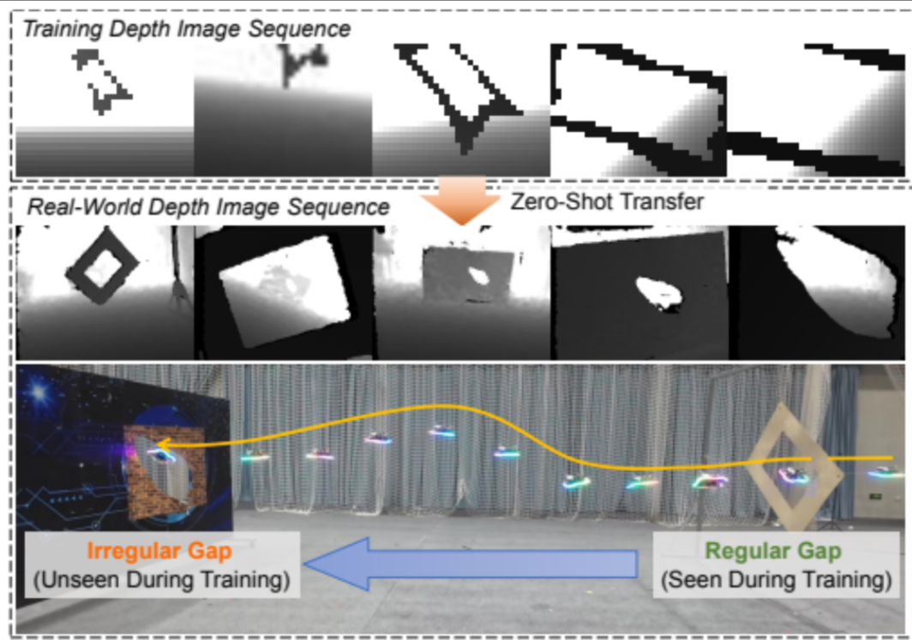
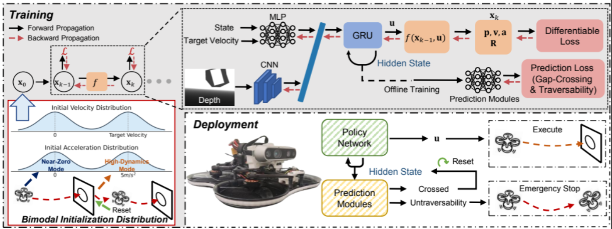
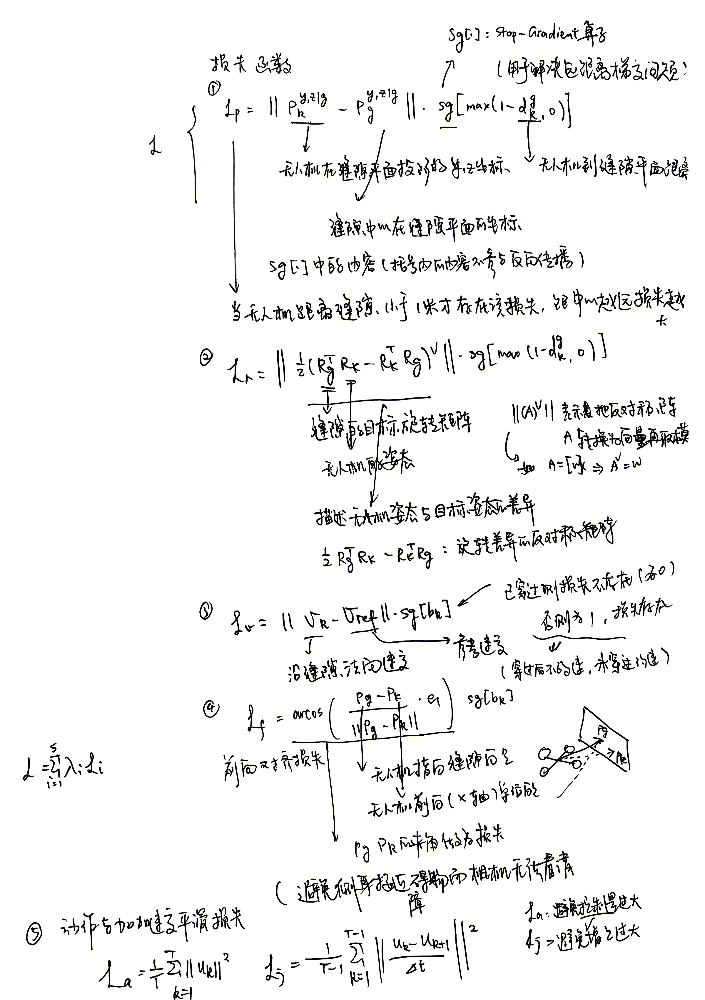
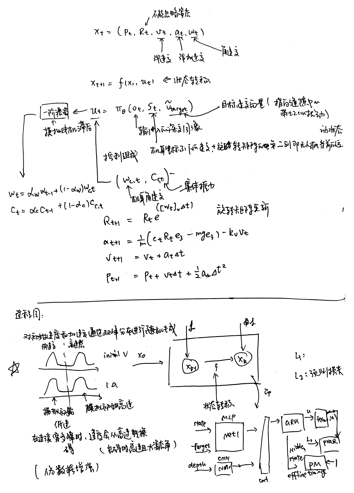

# 基于视觉的无人机通过可微模拟端到端学习穿越不规则间隙

原文链接：[[2604.02779] Vision-Based End-to-End Learning for UAV Traversal of Irregular Gaps via Differentiable Simulation](https://arxiv.org/abs/2604.02779)

任务：在狭窄和不规则间隙中导航

本文，张等人提出了一个完全基于视觉的端到端框架，将深度图像直接映射到控制命令，使无人机能够在未见过的环境中穿越复杂的间隙

在特殊欧几里得群SE(3)中操作，其中位置和方向紧密耦合，利用可微模拟、停止梯度算子和双峰初始化分布来实现连续间隙的稳定穿越。

> [!Tip]
>
> 端到端、未知环境、纯视觉
>
> 在欧几里得群SE(3)中操作
>
> 利用可微模拟、停止梯度算子和双峰初始化分布

两个辅助预测模块——**间隙穿越成功分类器**和**可通行性预测器**

## 引言

### **存在的问题**

**位置与姿态的耦合**：大多数基于视觉的导航方法[忽略了位置与姿态的耦合，没有考虑完整的SE(3)状态空间

**依赖反馈约束优化与环境先验知识**：传统的SE(3)规划与控制方法依赖于带反馈控制的约束优化，并需要准确的环境先验知识

**需要预设过隙姿势**：一般的用于SE(3)间隙穿越的学习型端到端策略—直接将感官输入映射到控制指令，需要已知的间隙姿势或几何线索来提取低维状态。

**分块掩码缺乏更细致的边角信息**：某些图像到控制的途径则依赖图像掩模进行特征提取，在穿越现实世界中常见的不规则间隙（如非矩形、不平坦或部分遮挡）时存在困难，因为缺乏明确的角和边缘阻碍了特征提取器推断出最佳的穿越姿态。

> [!Tip]
>
> **方案**：可微模拟（提供了精确且丰富的梯度信号）
>
> 可微模拟指的是一个系统动态是可微分的框架，允许任务损失通过时间反向传播，以进行基于梯度的策略优化
>
> 优点：这一范式使得能够通过系统动态高效学习，并提高了从简单训练环境到复杂现实世界场景的泛化能力，虽然在避障方面有效，但其对于需要高精度SE(3)控制的任务的使用大多尚未探索。

### 工作方案

**本文方案**：利用可微模拟来解决SE(3)规划和控制任务。我们提出了一个完全基于视觉的端到端框架，该框架直接将深度图像映射到控制命令，使无人机能够穿越狭窄和不规则形状的间隙

> **图片说明：**一个Stop-Gradient（SG）操作符，用于选择性地阻止某些飞行梯度，并采用双峰初始化分布来稳定连续间隙穿越和间隙后姿态控制。为了进一步提高实际应用性，我们引入了两个互补的数据驱动预测模块：一个间隙穿越成功分类器，促进连续多间隙导航并保持稳定飞行；以及一个可通过性预测器，基于策略的隐藏状态评估穿越可行性，使系统能够预见潜在危险。
>
> forward propagation：前向传播

**主要贡献**：

1. 一个实用且可部署的全视觉端到端SE(3)策略，能从常规训练间隙泛化到不规则的实际开口，对感知噪声具有固有的鲁棒性，并且表现优于依赖显式感知预处理的传统强化学习方法。
2. 设计辅助预测模块用于间隙穿越检测和可通过性评估，增强了连续导航的可靠性。
3. 在仿真和真实世界实验中的广泛验证，证明了所提方法的可行性、鲁棒性和泛化能力。

| 分类            | 相关方法 / 途径                            | 核心贡献与特点                                          | 局限性                                                                                   |
| :-------------- | :----------------------------------------- | :------------------------------------------------------ | :--------------------------------------------------------------------------------------- |
| **A. 间隙飞行** | 传统轨迹规划与优化 [9], [13]               | 利用微分平坦性简化规划；采用弹道轨迹或凸包约束优化。    | 依赖先验地图或几何模型；对感知噪声敏感，现实鲁棒性弱。                                   |
|                 | 基于视觉的端到端导航 [1]–[4]               | 直接从深度图映射至控制指令，避障能力强。                | 难以扩展至敏捷 SE(3) 间隙穿越任务。                                                      |
|                 | 基于学习的方法（需显式目标信息） [10]–[12] | 使用强化/模仿学习处理图像输入。                         | 需要额外模块提取间隙姿态或几何线索；泛化能力受限。                                       |
|                 | 强化模仿框架（吴等人） [13]                | 直接图像输入。                                          | 仍需辅助图像遮罩，非完全端到端；现实部署困难。                                           |
|                 | **本文方法**                               | 直接将原始深度图映射为 SE(3) 控制指令。                 | **（优势）** 完全基于视觉、鲁棒性强、对未见环境泛化好。                                  |
| **B. 可微模拟** | 经典可微模拟应用 [14]–[19]                 | 通过系统动力学梯度训练端到端策略，四旋翼/四足验证有效。 | 对视觉输入探索不足。                                                                     |
|                 | 基于 CUDA 渲染的可微模拟 [5], [6]          | 整合渲染与训练，仿真到现实迁移效果好。                  | 模拟器仅支持简单图元（球、立方体）；无法生成随机间隙等复杂结构。                         |
|                 | 高速可微模拟器 [17], [20], [21]            | 能生成更丰富对象。                                      | 对象形状与外观预定义，灵活性与随机化受限。                                               |
|                 | 简化动力学扩展（CTBR） [7]                 | 采用集体推力与机体速率公式。                            | 局限于简单点对点导航，缺乏紧密位置-姿态耦合。                                            |
|                 | **本文方法**                               | 结合可微仿真、基于网格的深度渲染器与 CTBR 动力学。      | **（优势）** 灵活生成复杂间隙几何；支持精确 SE(3) 控制；实现未见环境完全端到端视觉穿越。 |

> 集体推力和机体速率（CTBR）公式

## 算法逻辑

## 实验效果

1. 基线对比：感知噪声下的鲁棒性优势
   在AirSim仿真环境中，论文将所提方法与基于强化学习（RL）的传统方法进行了对比。
   抗噪性能：当使用真实深度图时，本文方法与RL基线成功率均较高（98% vs. 80%）。然而，当输入替换为带有真实噪声特性的SGM（半全局匹配）深度图时，RL基线因前端感知模块（边缘提取）失效导致成功率大幅下降；相比之下，本文的端到端策略仅出现轻微性能下降。
   任务适应性：对比仅考虑3D位置的导航方法（如Zhang et al.），该方法在遇到遮挡时会避让缝隙，在墙壁安装缝隙场景中成功率仅为40%（SGM输入下降至7%），而本文方法专注于穿越，保持了高性能。
2. 消融实验：核心组件的有效性
   通过移除关键模块验证了设计的必要性：
   Stop-Gradient (SG) 算子：如表I所示，移除SG后，在大倾角缝隙（60-80°）下，位置误差从0.14m激增至1.14m，姿态误差从11.1°增至55.0°。这表明SG有效防止了策略在远距离时的犹豫和梯度干扰。
   动力学模型：将CTBR（集体推力与机身角速率）模型替换为质点（Point Mass）模型后，在大倾角下姿态误差显著增大（26.3°），证明CTBR模型对高精度姿态控制的必要性。
   双模态初始化 (BIO)：在连续三缝隙穿越测试中，无BIO的策略误差迅速累积（第三缝位置误差达1.99m，姿态误差34.59°），常导致坠毁；而采用BIO的策略全程保持低误差，实现了稳定的连续导航。
3. 真机实验：零样本泛化与安全性
   在真实世界中部署于搭载Intel RealSense D435i和Radxa Zero3W的自定义四旋翼平台上（控制频率30Hz，推理时间约5ms）：
   泛化能力：尽管仅在规则形状缝隙的仿真中训练，策略成功穿越了多种未见过的真实场景，包括半遮挡圆环、不规则孔洞、瓷砖墙缝隙及门缝，证明了从仿真到现实的零样本迁移能力。
   安全预警：可穿越性预测模块在真机测试中表现可靠。例如，在成功穿越半遮挡圆环时预测分数保持高位；当目标切换至被遮挡的不规则孔洞时，预测分数骤降，成功触发紧急停机，避免了碰撞。
4. 鲁棒性补充验证
   目标方向不确定性：即使目标速度方向存在中等噪声（4-8 m），无人机仍能通过视觉反馈重新对准缝隙，仅在极大扰动（7-8 m）下才会失败，表明策略对粗略的方向指引具有较强容错性。
   预测精度饱和：可穿越性预测器的性能随模型增大而提升（AP: 1024→0.64, 4096→0.76），但在2048维后增益边际递减，说明现有模型规模已足够捕捉关键特征。
