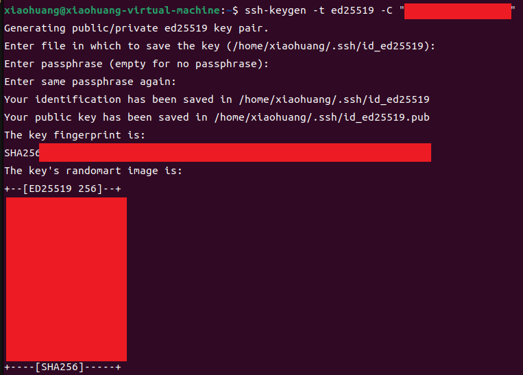
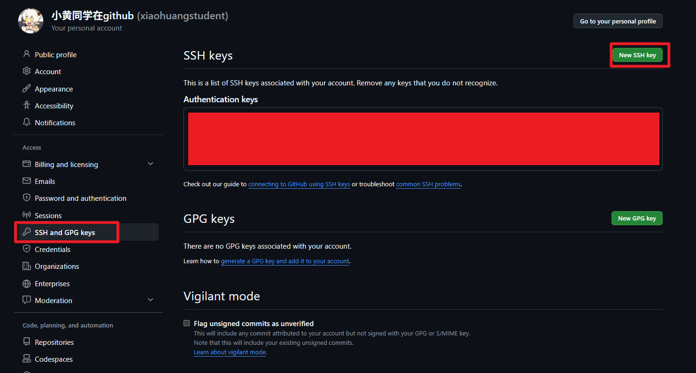
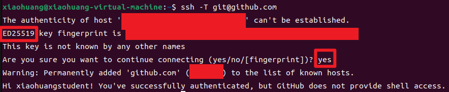

# Github SSH配置教程

## 第一步：生成 SSH 密钥对

在终端中执行以下命令（替换邮箱为你的 GitHub 注册邮箱）：

bash

```
ssh-keygen -t ed25519 -C "your_email@example.com"
```



**执行过程**：

1. 提示 `Enter file in which to save the key`：直接按 `Enter` 使用默认路径 `~/.ssh/id_ed25519`。
2. 提示 `Enter passphrase`：**建议设置一个密码**（增强安全性），输入时屏幕不显示，按 `Enter` 确认，再次输入相同密码。

**生成文件**：

- `~/.ssh/id_ed25519` — **私钥**（严禁泄露）
- `~/.ssh/id_ed25519.pub` — **公钥**（可公开，用于添加到 GitHub）

> [!Tip]
>
> 如果系统不支持 `ed25519`，可使用 RSA：
>
> ```
> ssh-keygen -t rsa -b 4096 -C "your_email@example.com"
> ```

## 第二步：查看并复制公钥

显示公钥内容并复制：

```
cat ~/.ssh/id_ed25519.pub
```


选中输出的全部内容（从 `ssh-ed25519` 开头到邮箱结尾），复制到剪贴板。

------

## 第三步：将公钥添加到 GitHub 账户

1. 登录 [GitHub](https://github.com/)，点击右上角**头像** → **Settings**。
2. 左侧菜单选择 **SSH and GPG keys**。
3. 点击绿色按钮 **New SSH key**。
4. 填写：
   - **Title**：给密钥起个名字（如 "My Ubuntu PC"）。
   - **Key**：粘贴之前复制的公钥内容。
5. 点击 **Add SSH key** 保存。



------

### 第四步：测试 SSH 连接

在终端中运行：

```
ssh -T git@github.com
```

**首次连接会提示**：

```
The authenticity of host 'github.com (20.205.243.166)' can't be established.
ED25519 key fingerprint is SHA256:+DiY3wvvV6TuJJhbpZisF/zLDA0zPMSvHdkr4UvCOqU.
Are you sure you want to continue connecting (yes/no/[fingerprint])?
```

**必须完整输入 `yes` 并按回车**（不是只按 Enter 或输入 `y`）。

如果看到以下信息，说明配置成功：

```
Hi <你的用户名>! You've successfully authenticated, but GitHub does not provide shell access.
```



------

### 第五步：使用 SSH 克隆仓库

现在可以稳定地克隆仓库了：

```
git clone git@github.com:用户名/仓库名.git
```

例如克隆 `ego-planner-swarm`：

```
cd ~/px4_work/px4_workspaces/pro2_egoswarm/src
git clone git@github.com:ZJU-FAST-Lab/ego-planner-swarm.git
```