# ROS2节点

## 节点简介

在通信时，不论采用何种方式，通信对象的构建都依赖于节点(Node)，在ROS2中，一般情况下每个节点都对应某一单一的功能模块(例如：雷达驱动节点可能负责发布雷达消息，摄像头驱动节点可能负责发布图像消息)。一个完整的机器人系统可能由许多协同工作的节点组成，ROS2中的单个可执行文件(C++程序或Python程序)可以包含一个或多个节点。

## 创建节点

- 创建python功能包

workspace替换成实际的工作空间路径

```
cd workspace/src
ros2 pkg create pkg_helloworld_py --build-type ament_python --dependencies rclpy --node-name helloworld
```

- 编写代码

执行上面命令后会创建pkg_helloworld_py，同时会创建helloworld.py文件来编写节点：

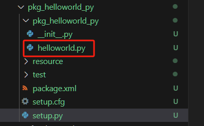

删除原本 helloworld.py 的代码，编写如下代码：

```
import rclpy                                     # ROS2 Python接口库
from rclpy.node import Node                      # ROS2 节点类
import time

"""
创建一个HelloWorld节点, 初始化时输出“hello world”日志
"""
class HelloWorldNode(Node):
    def __init__(self, name):
        super().__init__(name)                     # ROS2节点父类初始化
        while rclpy.ok():                          # ROS2系统是否正常运行
            self.get_logger().info("Hello World")  # ROS2日志输出
            time.sleep(0.5)                        # 休眠控制循环时间

def main(args=None):                               # ROS2节点主入口main函数
    rclpy.init(args=args)                          # ROS2 Python接口初始化
    node = HelloWorldNode("helloworld")            # 创建ROS2节点对象并进行初始化
    rclpy.spin(node)                               # 循环等待ROS2退出
    node.destroy_node()                            # 销毁节点对象
    rclpy.shutdown()                               # 关闭ROS2 Python接口

```

完成代码的编写后需要设置功能包的编译选项，让系统知道Python程序的入口，打开功能包的setup.py文件，加入如下入口点的配置：

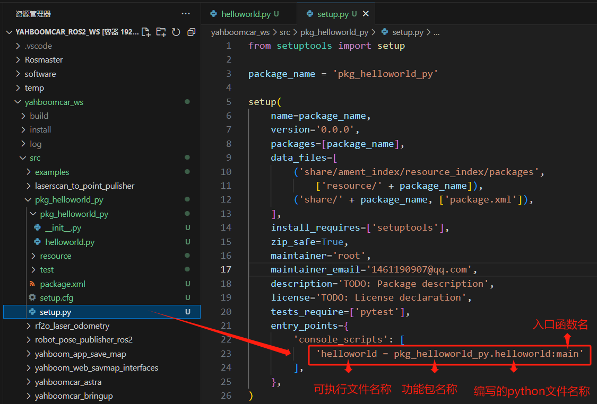

## 编译运行功能包

- 编译功能包

```
colcon build --packages-select pkg_helloworld_py
```

- 在工作空间下刷新环境变量

```
source install/setup.bash
```

- 运行节点

```
ros2 run pkg_helloworld_py helloworld
```

运行成功后，可以在终端中看到循环打印“Hello World”字符串的效果:

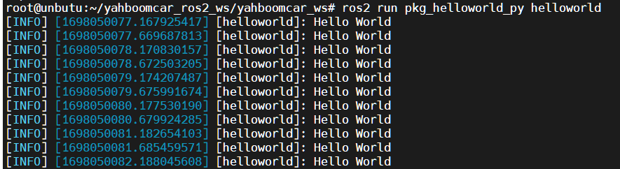

# ROS2话题通讯

## 话题通讯简介

话题通讯是ROS2使用频率最高的一种通信方式，有发布者发布指定话题的数据，订阅者只要订阅了该话题的数据，就可以接收到数据。

话题通信是基于发布/订阅模型，如图：


话题数据传输的特性是从一个节点到另外一个节点，发送数据的对象称之为**发布者**，接收数据的对象称之为**订阅者**，每一个话题都需要有一个名字，传输的数据也需要有固定的数据类型。

接下来就说明下如何使用Python语言实现节点之间的话题通讯。

## 实现包含“话题”发布方和订阅方的功能包（Py）

- 切换到工作空间src目录下
- 新建pkg_topic功能包

```
ros2 pkg create pkg_topic --build-type ament_python --dependencies rclpy --node-name publisher_demo
```

### 发布方实现

- 接下来编辑【publisher_demo.py】实现发布方的功能，添加如下代码：

```
#导入rclpy库
import rclpy
from rclpy.node import Node
#导入String字符串消息
from std_msgs.msg import String 
#创建一个继承于Node基类的Topic_Pub节点子类 传入一个参数name
class Topic_Pub(Node):
    def __init__(self,name):
        super().__init__(name)
        #创建一个发布者，使用create_publisher的函数，传入的参数分别是：
        #话题数据类型、话题名称、保存消息的队列长度
        self.pub = self.create_publisher(String,"/topic_demo",1) 
        #创建一个定时器，间隔1s进入中断处理函数，传入的参数分别是：
        #中断函数执行的间隔时间，中断处理函数
        self.timer = self.create_timer(1,self.pub_msg)
    #定义中断处理函数
    def pub_msg(self):
        msg = String()  #创建一个String类型的变量msg
        msg.data = "Hi,I send a message." #给msg里边的data赋值
        self.pub.publish(msg) #发布话题数据
        
#主函数
def main():
    rclpy.init() #初始化
    pub_demo = Topic_Pub("publisher_node") #创建Topic_Pub类对象，传入的参数就是节点的名字
    rclpy.spin(pub_demo)     #执行rclpy.spin函数，里边传入一个参数，参数是刚才创建好的Topic_Pub类对象
    pub_demo.destroy_node()  #销毁节点对象
    rclpy.shutdown()         #关闭ROS2 Python接口
```

- 编辑配置文件setup.py

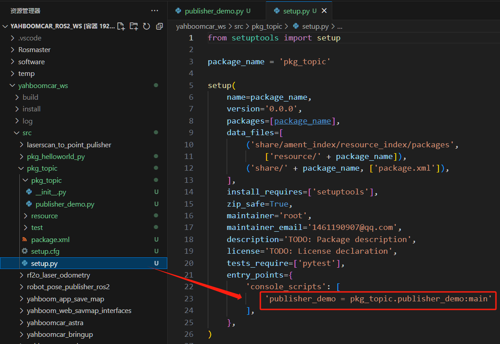

- 编译功能包

```
colcon build --packages-select pkg_topic
```

- 在工作空间下刷新环境变量

```
source install/setup.bash
```

- 运行命令

```
ros2 run pkg_topic publisher_demo
```

- 查看所有话题

```
ros2 topic list
```

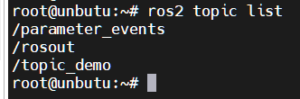

- 查看话题数据

```
ros2 topic echo /topic_demo
```

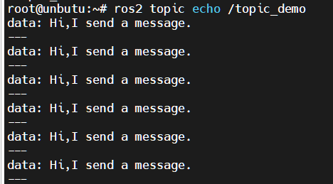

### 订阅方实现

在【publisher_demo.py】同级目录下新建文件【subscriber_demo.py】

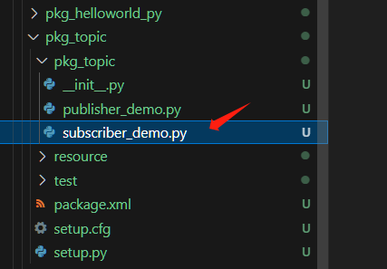

接下来编辑【subscriber_demo.py】实现订阅方的功能，添加如下代码：

```
#导入相关的库
import rclpy
from rclpy.node import Node
from std_msgs.msg import String

class Topic_Sub(Node):
    def __init__(self,name):
        super().__init__(name)  
        #创建订阅者使用的是create_subscription，传入的参数分别是：话题数据类型，话题名称，回调函数名称，队列长度
        self.sub = self.create_subscription(String,"/topic_demo",self.sub_callback,1) 
    #回调函数执行程序：打印接收的到信息
    def sub_callback(self,msg):
        # print(msg.data,flush=True)
        self.get_logger().info(msg.data)

def main():
    rclpy.init() #ROS2 Python接口初始化
    sub_demo = Topic_Sub("subscriber_node") # 创建对象并进行初始化
    rclpy.spin(sub_demo)
    sub_demo.destroy_node()  #销毁节点对象
    rclpy.shutdown()         #关闭ROS2 Python接口
```

- 编辑配置文件

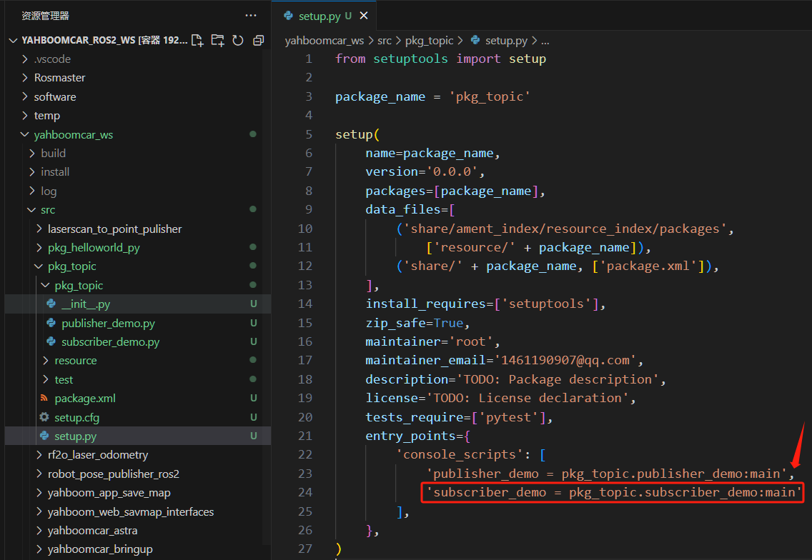

- 编译功能包

```
colcon build --packages-select pkg_topic
```

- 在工作空间下刷新环境变量

```
source install/setup.bash
```

- 分割终端执行如下：

```
#启动发布者节点
ros2 run pkg_topic publisher_demo
#启动订阅者节点
ros2 run pkg_topic subscriber_demo   
```

# ROS2服务通讯

## 服务通讯简介

服务通讯是一种基于请求响应的通信模型，在通信双方中，客户端发送请求数据到服务端，服务端响应结果给客户端。

客户端/服务器模型如下：


从服务的实现机制上来看，这种你问我答的形式叫做客户端/服务器模型，简称为CS模型，客户端在需要某些数据的时候，针对某个具体的服务，发送请求信息，服务器端收到请求之后，就会进行处理并反馈应答信息。

这种通信机制在生活中也很常见，比如我们经常浏览的各种网页，此时你的电脑浏览器就是客户端，通过域名或者各种操作，向网站服务器发送请求，服务器收到之后返回需要展现的页面数据。

## 实现包含"服务"服务端与客户端的功能包（Py）

- 在工作空间src目录下：

```
ros2 pkg create pkg_service --build-type ament_python --dependencies rclpy --node-name server_demo
```

执行完上述命令，会创建pkg_service功能包，同时会创建一个server_demo的节点，并且已经配置好相关的配置文件

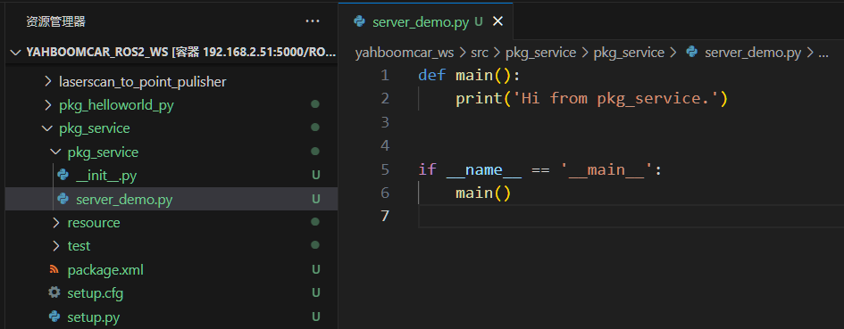

### 服务端实现

- 接下来编辑【server_demo.py】实现服务端的功能，添加如下代码：

```
#导入相关的库文件
import rclpy
from rclpy.node import Node
from example_interfaces.srv import AddTwoInts

class Service_Server(Node):
    def __init__(self,name):
        super().__init__(name)
        #创建一个服务端，使用的是create_service函数，传入的参数分别是：
        #服务数据的数据类型、服务的名称，服务回调函数（也就是服务的内容）
        self.srv = self.create_service(AddTwoInts, '/add_two_ints', self.Add2Ints_callback)
    #这里的服务回调函数的内容是把两个整型数相加，然后返回相加的结果    
    def Add2Ints_callback(self,request,response):
        response.sum = request.a + request.b
        print("response.sum = ",response.sum)
        return response
def main():
    rclpy.init()
    server_demo = Service_Server("publisher_node")
    rclpy.spin(server_demo)
    server_demo.destroy_node()                     # 销毁节点对象
    rclpy.shutdown()                               # 关闭ROS2 Python接口
```

重点看下服务回调函数，Add2Ints_callback，这里需要传入的参数除了self，还有就是request和response，request是服务需要的参数，response是服务的反馈结果。request.a和request.b是request部分的内容，response.sum是response部分的内容，这里首先看看下AddTwoInts这个类型的数据是怎么样的。

- 可以使用以下命令查看

```
ros2 interface show example_interfaces/srv/AddTwoInts
```

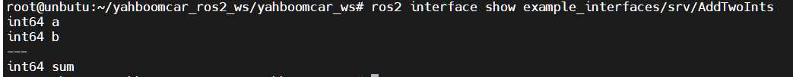

“---” 把该类型的数据划分成了两个部分，上边代表的是request，下边代表的是response。然后各自的领域中又各自的变量，比如int64 a、int64 b，所有在再传入参数的是，需要指定a、b的值是是多少。同样，反馈的结果也需要指定sum的值是多少。

- 打开setup.py,在console_scripts列表中添加

```
'server_demo = pkg_service.server_demo:main',
```

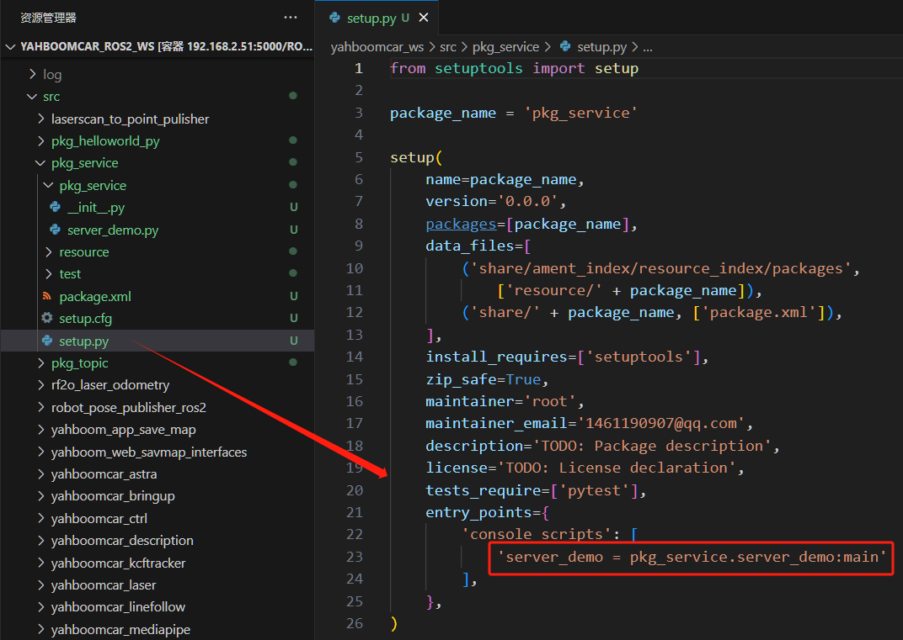

- 编译功能包

```
colcon build --packages-select pkg_service
```

- 在工作空间下刷新环境变量

```
source install/setup.bash
```

- 运行

```
ros2 run pkg_service server_demo
```

- 查询当前所有运行的服务

```
ros2 service list
```

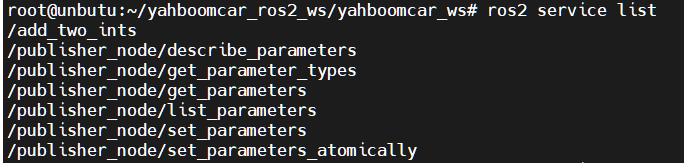

- 命令行测试某个服务：/add_two_ints就是我们需要调用的服务，通过以下命令进行调用，终端输入：

```
ros2 service call /add_two_ints example_interfaces/srv/AddTwoInts "{a: 1,b: 4}"
```

这里我们把a的值赋值成1，b的值赋值成4，也就是调用服务计算1和4的和：

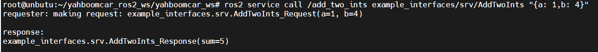

### 客户端实现

在【server_demo.py】同级目录下新建文件【client_demo.py】

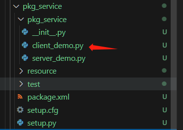

- 接下来编辑【client_demo.py】实现客户端的功能，添加如下代码：

```
#导入相关的库
import rclpy
from rclpy.node import Node
from example_interfaces.srv import AddTwoInts

class Service_Client(Node):
    def __init__(self,name):
        super().__init__(name)
        #创建客户端，使用的是create_client函数，传入的参数是服务数据的数据类型、服务的话题名称
        self.client = self.create_client(AddTwoInts,'/add_two_ints')
        # 循环等待服务器端成功启动
        while not self.client.wait_for_service(timeout_sec=1.0):
            print("service not available, waiting again...")
        # 创建服务请求的数据对象
        self.request = AddTwoInts.Request()
        
    def send_request(self): 
        self.request.a = 10
        self.request.b = 90
        #发送服务请求
        self.future = self.client.call_async(self.request)
        
def main():
    rclpy.init() #节点初始化
    service_client = Service_Client("client_node") #创建对象
    service_client.send_request() #发送服务请求
    while rclpy.ok():
        rclpy.spin_once(service_client)
        #判断数据是否处理完成
        if service_client.future.done():
            try:
                #获得服务反馈的信息并且打印
                response = service_client.future.result()
                print("service_client.request.a = ",service_client.request.a)
                print("service_client.request.b = ",service_client.request.b)
                print("Result = ",response.sum)
            except Exception as e:
                service_client.get_logger().info('Service call failed %r' % (e,))
        break
    service_client.destroy_node()                    
    rclpy.shutdown()                              
```

- 编辑配置文件，打开setup.py,在console_scripts列表中添加

```
'client_demo = pkg_service.client_demo:main'
```

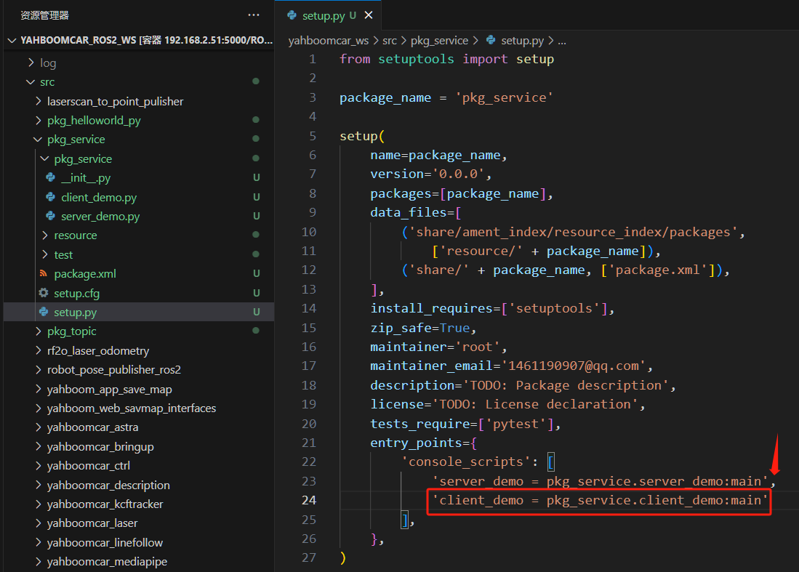

- 编译功能包

```
colcon build --packages-select pkg_service
```

- 在工作空间下刷新环境变量

```
source install/setup.bash
```

- 运行节点

```
#启动服务端节点
ros2 run pkg_service server_demo
#启动客户端节点
ros2 run pkg_service client_demo
```

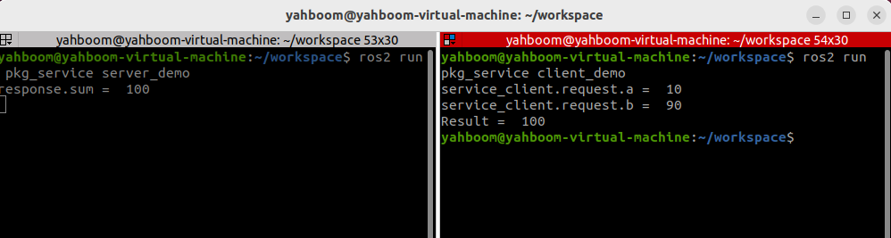

先运行服务端，然后运行客户端，客户端提供a=10，b=90，服务端进行求和，得到结果是100，结果在两者终端打印。

# ROS2动作通讯

## 动作通讯简介

动作通信是一种带有连续反馈的通信模型，在通信双方中，客户端发送请求数据到服务端，服务端响应结果给客户端，但是在服务端接收到请求到产生最终响应的过程中，会发送连续的反馈信息到客户端。

动作通讯客户端/服务器模型如下：


 

## 实现包含“动作”服务端与客户端的功能包（Py）

动作客户端提交一个整型数据N，动作服务端接收请求数据并累加1-N之间的所有整数，将最终结果返回给动作客户端，且每累加一次都计算当前运算进度并反馈给动作客户端。

### 创建动作接口功能包（C++）

- 动作通讯需要先创建动作通讯接口,在工作空间的src目录下新建pkg_interfaces功能包

```
ros2 pkg create --build-type ament_cmake pkg_interfaces
```

- 接着在pkg_interfaces功能包下面创建一个action的文件夹，并在action文件夹内新建【Progress.action】文件，文件内容如下：

```
int64 num
---
int64 sum
---
float64 progress
```

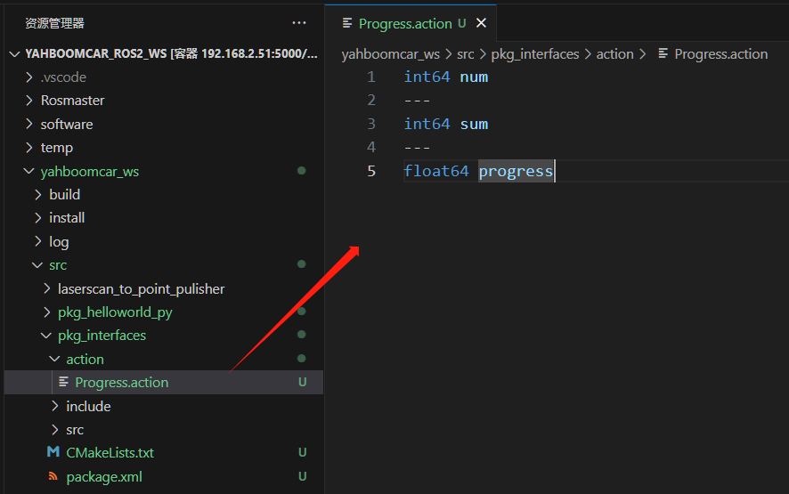

- 在package.xml中需要添加一些依赖包，具体内容如下：

```
<buildtool_depend>rosidl_default_generators</buildtool_depend>
<exec_depend>rosidl_default_runtime</exec_depend>
<depend>action_msgs</depend>
<member_of_group>rosidl_interface_packages</member_of_group>
```

- 在CMakeLists.txt 中添加如下配置：

```
find_package(rosidl_default_generators REQUIRED)

rosidl_generate_interfaces(${PROJECT_NAME}
  "action/Progress.action"
)
```

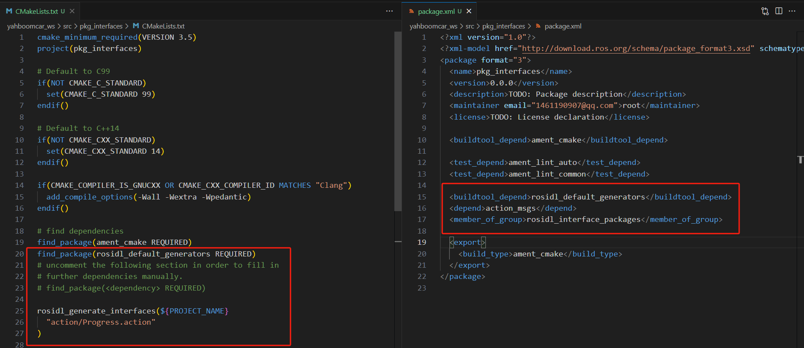

- 编译功能包：

```
colcon build --packages-select pkg_interfaces
```

- 编译完成之后，通过如下命令查看文件定义以及编译是否正常：

```
source install/setup.bash
ros2 interface show pkg_interfaces/action/Progress
```

正常情况下，终端将会输出与`Progress.action`文件一致的内容

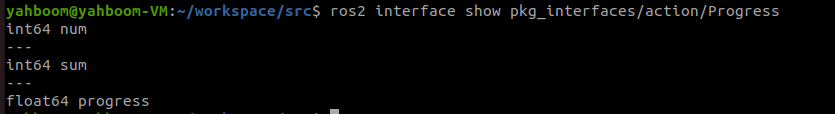

### 服务端实现

- 在工作空间的src目录下新建pkg_action功能包

```
ros2 pkg create pkg_action --build-type ament_python --dependencies rclpy pkg_interfaces --node-name action_server_demo 
```

- 接下来编辑【action_server_demo.py】实现服务端的功能，添加如下代码：

```
import time
import rclpy
from rclpy.action import ActionServer
from rclpy.node import Node

from pkg_interfaces.action import Progress


class Action_Server(Node):

    def __init__(self):
        super().__init__('progress_action_server')
        # 创建动作服务端
        self._action_server = ActionServer(
            self,
            Progress,
            'get_sum',
            self.execute_callback)
        self.get_logger().info('动作服务已经启动！')

    def execute_callback(self, goal_handle):
        self.get_logger().info('开始执行任务....')


        # 生成连续反馈；
        feedback_msg = Progress.Feedback()

        sum = 0
        for i in range(1, goal_handle.request.num + 1):
            sum += i
            feedback_msg.progress = i / goal_handle.request.num
            self.get_logger().info('连续反馈: %.2f' % feedback_msg.progress)
            goal_handle.publish_feedback(feedback_msg)
            time.sleep(1)

        # 生成最终响应。
        goal_handle.succeed()
        result = Progress.Result()
        result.sum = sum
        self.get_logger().info('任务完成！')

        return result


def main(args=None):

    rclpy.init(args=args)
    # 调用spin函数，并传入节点对象
    Progress_action_server = Action_Server()
    rclpy.spin(Progress_action_server)
    Progress_action_server.destroy_node() 
    # 释放资源
    rclpy.shutdown()
```

- 编辑配置文件：打开setup.py,在console_scripts列表中添加

```
'action_server_demo = pkg_action.action_server_demo:main',
```

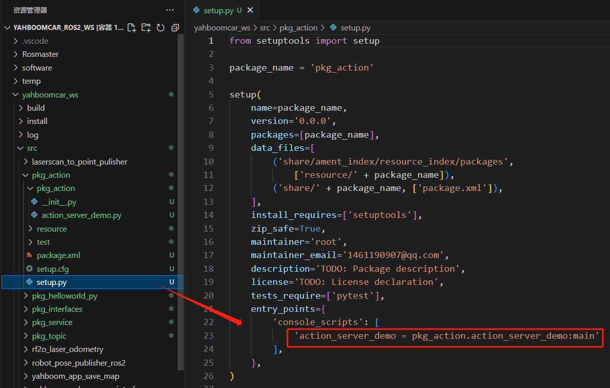

 

- 编译功能包

```
colcon build --packages-select pkg_action
```

-  运行程序

```
ros2 run pkg_action action_server_demo
```

- 检查动作服务是否启动，另一个终端输入：

```
ros2 action list
```

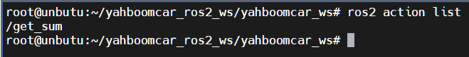

- 测试动作服务，/get_sum就是我们需要调用的动作，通过以下命令进行调用，终端输入：

```
ros2 action send_goal /get_sum pkg_interfaces/action/Progress "{num: 10}"
```

这里我们求1到10的和：

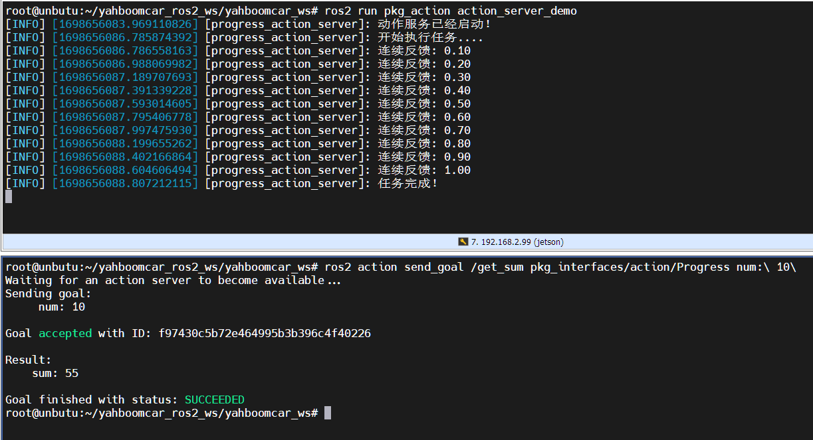

上图上面是服务端，下面是客户端。可以看到1到10的和计算的过程中有服务端一直在反馈计算的进度，最后显示任务完成，客户端也收到了反馈的和为55

### 客户端实现

在【action_server_demo.py】同级目录下新建文件【action_client_demo.py】


接下来编辑【action_client_demo.py】实现服务端的功能，添加如下代码：

```
import rclpy
from rclpy.action import ActionClient
from rclpy.node import Node
from pkg_interfaces.action import Progress

class Action_Client(Node):
    def __init__(self):
        super().__init__('progress_action_client')
        # 创建动作客户端；
        self._action_client = ActionClient(self, Progress, 'get_sum')

    def send_goal(self, num):
        # 发送请求；
        goal_msg = Progress.Goal()
        goal_msg.num = num
        self._action_client.wait_for_server()
        self._send_goal_future = self._action_client.send_goal_async(goal_msg, feedback_callback=self.feedback_callback)
        self._send_goal_future.add_done_callback(self.goal_response_callback)

    def goal_response_callback(self, future):
        # 处理目标发送后的反馈；
        goal_handle = future.result()
        if not goal_handle.accepted:
            self.get_logger().info('请求被拒绝')
            return

        self.get_logger().info('请求被接收，开始执行任务！')

        self._get_result_future = goal_handle.get_result_async()
        self._get_result_future.add_done_callback(self.get_result_callback)

    # 处理最终响应。
    def get_result_callback(self, future):
        result = future.result().result
        self.get_logger().info('最终计算结果:sum = %d' % result.sum)
        # 5.释放资源。
        rclpy.shutdown()

    # 处理连续反馈；
    def feedback_callback(self, feedback_msg):
        feedback = (int)(feedback_msg.feedback.progress * 100)
        self.get_logger().info('当前进度: %d%%' % feedback)


def main(args=None):
    rclpy.init(args=args)
    action_client = Action_Client()
    action_client.send_goal(10)
    rclpy.spin(action_client)
```

- 编辑配置文件，打开setup.py,在console_scripts列表中添加

```
'action_client_demo = pkg_action.action_client_demo:main'
```

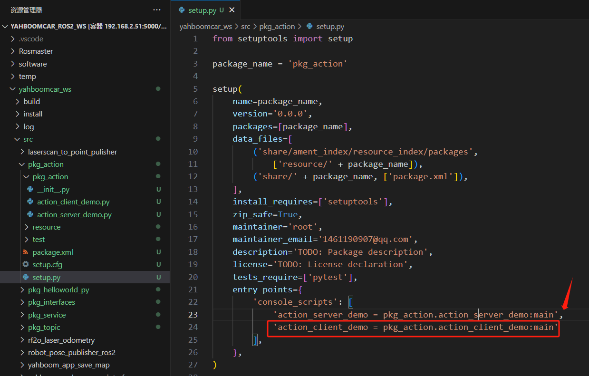

- 编译功能包

```
colcon build --packages-select pkg_action
```

- 在工作空间下刷新环境变量

```
source install/setup.bash
```

- 分终端执行如下：

```
#启动服务端节点
ros2 run pkg_action action_server_demo
#启动客户端节点
ros2 run pkg_action action_client_demo
```

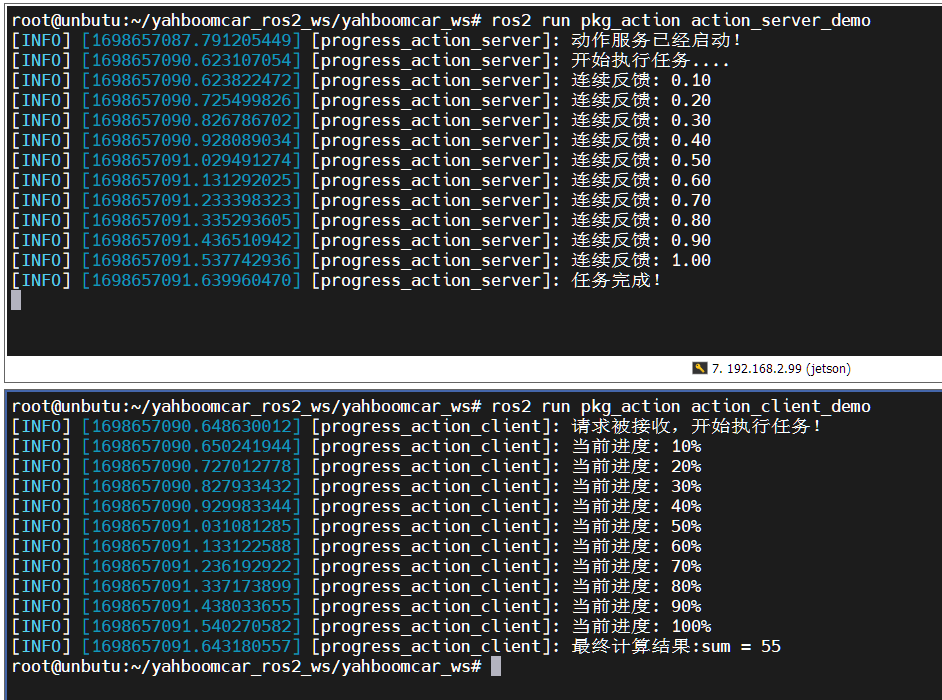

上图上面是服务端，下面是客户端。这里我们求1到10的和，可以看到1到10的和计算的过程中有服务端一直在反馈计算的进度，最后显示任务完成，客户端也收到了反馈的和为55

# ROS2自定义接口消息

## 通讯接口简介

在ROS系统中，无论话题、服务还是动作，都会用到一个重要的概念——通信接口。数据定义一个标准的结构，、就是通信接口。

接口可以让程序之间的依赖降低，便于我们使用别人的代码，也方便别人使用我们的代码，这就是ROS的核心目标，减少重复造轮子。

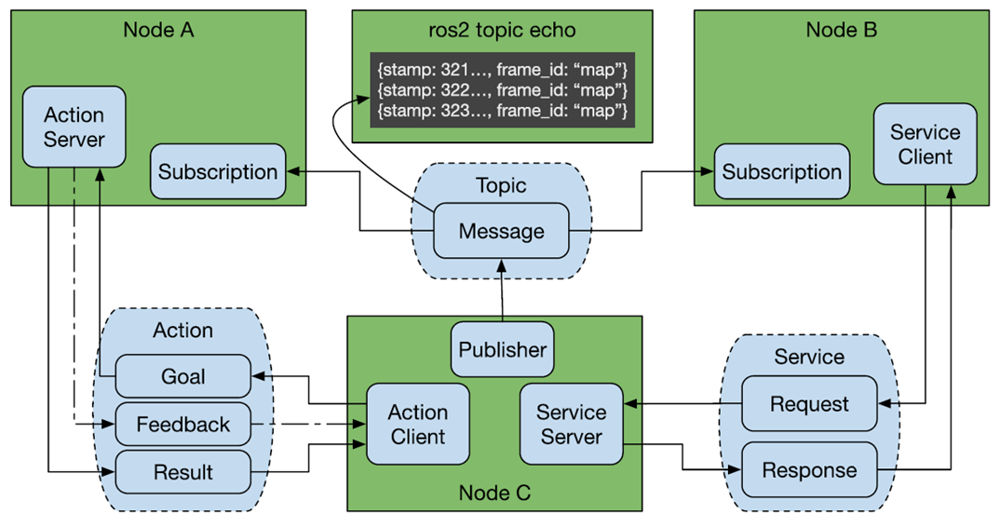

ROS有三种常用的通信机制，分别是话题、服务、动作，通过每一种通信种定义的接口，各种节点才能有机的联系到一起

## 实现自定义接口

### 实现话题的自定义接口

- 在工作空间的src目录下新建pkg_interfaces功能包（名字任意）

```
ros2 pkg create --build-type ament_cmake pkg_interfaces
```

- 在功能包pkg_interfaces下新建 msg 文件夹，msg文件夹下新建**Person.msg**文件，文件中输入如下内容：

```
string   name
int32    age
float64  height
```

- CMakeLists.txt中添加如下配置：

```
rosidl_generate_interfaces(${PROJECT_NAME}
  "action/Progress.action"
  "msg/Person.msg"
)
```

- package.xml中添加如下配置：

```
<buildtool_depend>rosidl_default_generators</buildtool_depend>
<exec_depend>rosidl_default_runtime</exec_depend>
<depend>action_msgs</depend>
<member_of_group>rosidl_interface_packages</member_of_group>
```

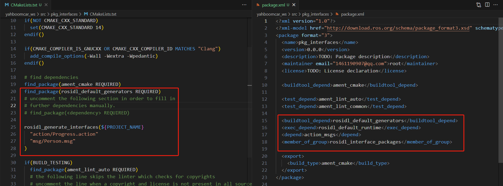

- 终端中进入当前工作空间，编译功能包：

```
colcon build --packages-select pkg_interfaces
```

- 先刷新环境变量

```
source install/setup.bash 
```

- 查看接口类型，测试接口是否正常

```
ros2 interface show pkg_interfaces/msg/Person
```

正常情况下，终端将会输出与`Person.msg`文件一致的内容。

### 实现服务的自定义接口

- 在工作空间的src目录下新建pkg_interfaces功能包（名字任意）

```
ros2 pkg create --build-type ament_cmake pkg_interfaces
```

- 功能包pkg_interfaces下新建srv文件夹，srv文件夹下新建Add.srv文件，文件中输入如下内容：

```
int32 num1
int32 num2
---
int32 sum
```

- CMakeLists.txt中添加如下配置：

```
rosidl_generate_interfaces(${PROJECT_NAME}
  "action/Progress.action"
  "msg/Person.msg"
  "srv/Add.srv"
)
```

- package.xml中添加如下配置：

```
<buildtool_depend>rosidl_default_generators</buildtool_depend>
<exec_depend>rosidl_default_runtime</exec_depend>
<depend>action_msgs</depend>
<member_of_group>rosidl_interface_packages</member_of_group>
```

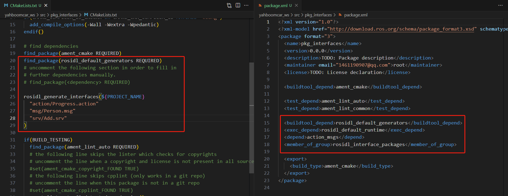

- 终端中进入当前工作空间，编译功能包：

```
colcon build --packages-select pkg_interfaces
source install/setup.bash
```

- 测试

```
ros2 interface show pkg_interfaces/srv/Add
```

正常情况下，终端将会输出与`Person.msg`文件一致的内容。

# ROS2 Launch启动文件配置

## launch简介

到目前为止，每当我们运行一个ROS节点，都需要打开一个新的终端运行一个命令。机器人系统中节点很多，每次都这样启动好麻烦呀。有没有一种方式可以一次性启动所有节点呢？答案当然是肯定的，那就是Launch启动文件，它是ROS系统中多节点启动与配置的一种脚本。

ROS2中，launch用于多节点启动和配置程序运行参数等功能，ROS2的launch文件格式有xml、yaml和python格式。本节课程以python格式的launch文件为例，相对于另外两种格式，python格式的更加灵活：

- python拥有众多的函数库，可以在启动文件中使用；
- ROS2通用启动特性和特定启动特性是用Python编写的，因此可以访问XML和YAML可能没有公开的启动特性；

使用python语言编写ROS2 launch文件，最主要的是把每个节点、文件、脚本等抽象成一个action，用统一的接口来启动。

参考资料：

- launch系统设计文档:[ROS 2 launch系统设计文档](https://design.ros2.org/articles/roslaunch.html)
- launch官方API文档：[launch API文档（随官方更新）](https://docs.ros.org/en/rolling/p/launch/architecture.html)

## 实现launch启动

- 准备工作，创建功能包存放程序文件

```
ros2 pkg create learn_launch --build-type ament_python
```

### 编写单个Node节点的launch

- 新建launch文件：在功能包下新建一个launch文件夹，然后在launch文件夹内新建【single_node_launch.py】文件，把以下内容复制到该文件中：

```
from launch import LaunchDescription
from launch_ros.actions import Node

def generate_launch_description():
    node = Node(
        package='pkg_helloworld_py',
        executable='helloworld',
        output='screen'
    )
    return LaunchDescription([node])
```

> [!Tip]
>
> **源码分析**
>
> 1、导入相关库
>
> ```
> from launch import LaunchDescription
> from launch_ros.actions import Node
> ```
>
> 2、定义一个函数generate_launch_description，并且返回一个launch_description
>
> ```
> def generate_launch_description():
>     node = Node(
>         package='pkg_helloworld_py',
>         executable='helloworld',
>     )
>     return LaunchDescription([node])
> ```
>
> 定义了一个变量node作为一个节点启动的返回值，调用Node函数，启动重要的两个参数，package和executable。
>
> - package：表示功能包，代表功能包的名字。
> - executable：表示执行的程序，可执行程序的名字。
>
> 最后调用LaunchDescription函数传入node参数执行返回。
>
> ```
> return LaunchDescription([node])
> ```

- 配置setup.py文件

launch文件命名常以LaunchName_launch.py，其中，LaunchName自定义，_launch.py是常认为固定的。需要修改功能包下的setup.py文件，修改内容为添加launch路径下的文件，编译才能生成执行的.py文件，

```
#1、导入相关的头文件
import os
from glob import glob

#2、在data_files的列表中，加上launch路径以及路径下的launch.py文件
(os.path.join('share',package_name,'launch'),glob(os.path.join('launch','*launch.py')))
```


- 编译功能包

```
colcon build --packages-select learn_launch
```

- 刷新环境变量，然后运行launch文件

```
ros2 launch learn_launch single_node_launch.py
```

### 编写多个Node节点的launch

- 新建launch文件夹，新建【multi_node_launch.py】文件，添加如下内容：

```
from launch import LaunchDescription
from launch_ros.actions import Node

def generate_launch_description():
    publisher_node = Node(
        package='pkg_topic',
        executable='publisher_demo',
        output='screen'
    )
    subscriber_node = Node(
        package='pkg_topic',
        executable='subscriber_demo',
        output='screen'
    )
    return LaunchDescription([
        publisher_node,
        subscriber_node
    ])
```

- 编译功能包

```
colcon build --packages-select learn_launch
```

- 刷新环境变量，然后运行launch文件

```
ros2 launch learn_launch multi_node_launch.py 
```

- 如果终端没有打印内容，我们可以查看哪些节点启动 来验证是否有启动成功，终端输入：

```
ros2 node list
```

## launch中的话题重映射

- 新建launch文件：在multi_node_launch.py同级目录下新建【remap_name_launch.py】文件，添加如下内容：

```
from launch import LaunchDescription
from launch_ros.actions import Node

def generate_launch_description():
    publisher_node = Node(
        package='pkg_topic',
        executable='publisher_demo',
        output='screen',
        remappings=[("/topic_demo", "/topic_update")]
    )
    return LaunchDescription([
        publisher_node
    ])
```

> [!Tip]
>
> **源码分析**
>
> 主要是加了以下部分：
>
> ```
> remappings=[("/topic_demo", "/topic_update")]
> ```
>
> 这里就是把原来的/topic_demo话题重映射成/topic_update

- 编译功能包

```
colcon build --packages-select learn_launch
```

- 运行程序

我们先看看没有重映射话题前，publisher_demo节点发布的话题是什么：

```
ros2 launch learn_launch multi_node_launch.py 
ros2 topic list
```


这里的话题是【/topic_demo】

- 再刷新环境变量，运行重映射话题后的程序，看看变化：

```
ros2 launch learn_launch remap_name_launch.py
ros2 topic list
```


由上图可知，重映射了话题名称为【/topic_update】

## launch文件嵌套启动另一个launch文件案例

- 新建launch文件：在multi_node_launch.py同级目录下新建【include_launch.py】文件，添加如下内容：

```
from launch import LaunchDescription
from launch_ros.actions import Node 
import os
from launch.actions import IncludeLaunchDescription
from launch.launch_description_sources import PythonLaunchDescriptionSource
from ament_index_python.packages import get_package_share_directory

def generate_launch_description():
    hello_launch = IncludeLaunchDescription(PythonLaunchDescriptionSource(
        [os.path.join(get_package_share_directory('learn_launch'), 'launch'),
        '/multi_node_launch.py']),
    )
    return LaunchDescription([
        hello_launch
    ])
```

> [!Tip]
>
> **源码分析**
>
> - 嵌套启动launch文件需要使用launch系统的 IncludeLaunchDescription和PythonLaunchDescriptionSource两个类
> - os.path.join(get_package_share_directory('learn_launch')：获取功能包的位置，其中的'learn_launch'为功能包的名字；
> - launch')：表示存放功能包下存放launch文件的文件夹；
> - /multi_node_launch.py'：表示该功能包launch文件夹下的/multi_node_launch.py文件。

- 编译功能包

```
colcon build --packages-select learn_launch
```

- 刷新环境变量运行launch文件

```
ros2 launch learn_launch include_launch.py
```

## 综合launch文件示例

本案例主要展示如何编写复杂的launch文件，程序的功能可忽略。

- 新建launch文件：在multi_node_launch.py同级目录下新建【complex_launch.py】文件，添加如下内容：

```
import os
from ament_index_python import get_package_share_directory
from launch import LaunchDescription
from launch.actions import DeclareLaunchArgument
from launch.actions import IncludeLaunchDescription
from launch.actions import GroupAction
from launch.launch_description_sources import PythonLaunchDescriptionSource
from launch.substitutions import LaunchConfiguration
from launch.substitutions import TextSubstitution
from launch_ros.actions import Node
from launch_ros.actions import PushRosNamespace


def generate_launch_description():

    # args that can be set from the command line or a default will be used
    background_r_launch_arg = DeclareLaunchArgument(
        "background_r", default_value=TextSubstitution(text="0")
    )
    background_g_launch_arg = DeclareLaunchArgument(
        "background_g", default_value=TextSubstitution(text="255")
    )
    background_b_launch_arg = DeclareLaunchArgument(
        "background_b", default_value=TextSubstitution(text="0")
    )
    chatter_ns_launch_arg = DeclareLaunchArgument(
        "chatter_ns", default_value=TextSubstitution(text="my/chatter/ns")
    )

    # include another launch file
    launch_include = IncludeLaunchDescription(
        PythonLaunchDescriptionSource(
            os.path.join(
                get_package_share_directory('demo_nodes_cpp'),
                'launch/topics/talker_listener.launch.py'))
    )
    # include another launch file in the chatter_ns namespace
    launch_include_with_namespace = GroupAction(
        actions=[
            # push-ros-namespace to set namespace of included nodes
            PushRosNamespace(LaunchConfiguration('chatter_ns')),
            IncludeLaunchDescription(
                PythonLaunchDescriptionSource(
                    os.path.join(
                        get_package_share_directory('demo_nodes_cpp'),
                        'launch/topics/talker_listener.launch.py'))
            ),
        ]
    )

    # start a turtlesim_node in the turtlesim1 namespace
    turtlesim_node = Node(
            package='turtlesim',
            namespace='turtlesim1',
            executable='turtlesim_node',
            name='sim'
        )

    # start another turtlesim_node in the turtlesim2 namespace
    # and use args to set parameters
    turtlesim_node_with_parameters = Node(
            package='turtlesim',
            namespace='turtlesim2',
            executable='turtlesim_node',
            name='sim',
            parameters=[{
                "background_r": LaunchConfiguration('background_r'),
                "background_g": LaunchConfiguration('background_g'),
                "background_b": LaunchConfiguration('background_b'),
            }]
        )

    # perform remap so both turtles listen to the same command topic
    forward_turtlesim_commands_to_second_turtlesim_node = Node(
            package='turtlesim',
            executable='mimic',
            name='mimic',
            remappings=[
                ('/input/pose', '/turtlesim1/turtle1/pose'),
                ('/output/cmd_vel', '/turtlesim2/turtle1/cmd_vel'),
            ]
        )

    return LaunchDescription([
        background_r_launch_arg,
        background_g_launch_arg,
        background_b_launch_arg,
        chatter_ns_launch_arg,
        launch_include,
        launch_include_with_namespace,
        turtlesim_node,
        turtlesim_node_with_parameters,
        forward_turtlesim_commands_to_second_turtlesim_node,
    ])
```

- 编译工作空间

```
colcon build --packages-select learn_launch
```

- 终端刷新环境变量，运行launch文件

```
ros2 launch learn_launch complex_launch.py
```

在宿主机的vnc上会显示两子小乌龟。

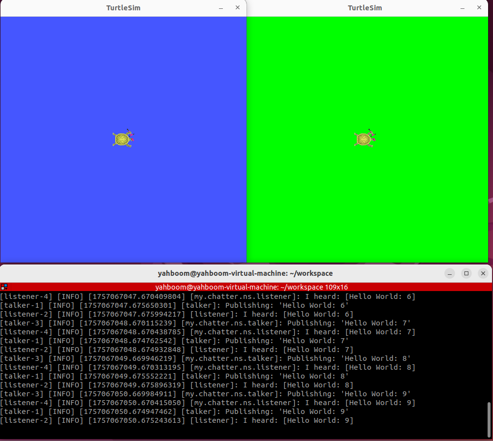

- 启动键盘控制节点，并添加命名空间（因为我们在launch文件中启动节点时添加了命名空间）

```
ros2 run turtlesim turtle_teleop_key --ros-args -r __ns:=/turtlesim1
```

- 使用上下左右键控制海龟1运动，海龟2会完全模仿海龟1的行为

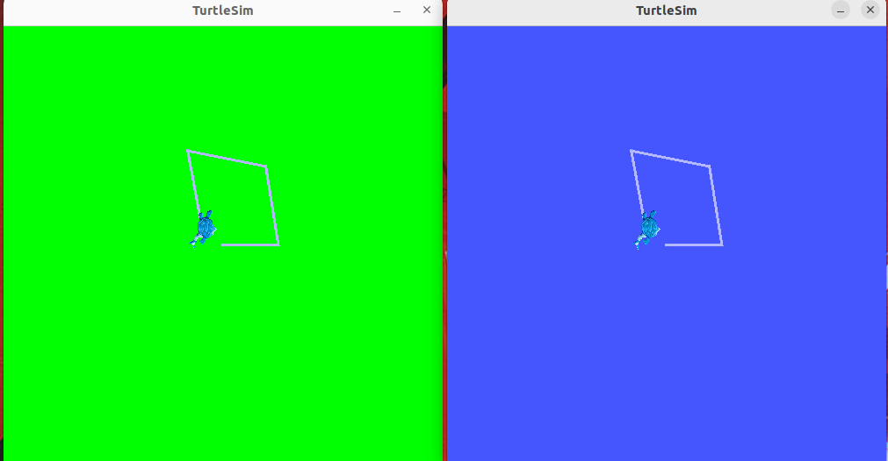

## xml实现与launch调用

- 新建launch文件：在complex_launch.py同级目录下新建【complex_launch.xml】文件，添加如下内容：

```
<launch>

    <!-- args that can be set from the command line or a default will be used -->
    <arg name="background_r" default="0"/>
    <arg name="background_g" default="255"/>
    <arg name="background_b" default="0"/>
    <arg name="chatter_ns" default="my/chatter/ns"/>
  
    <!-- include another launch file -->
    <include file="$(find-pkg-share demo_nodes_cpp)/launch/topics/talker_listener.launch.py"/>
    <!-- include another launch file in the chatter_ns namespace-->
    <group>
      <!-- push-ros-namespace to set namespace of included nodes -->
      <push-ros-namespace namespace="$(var chatter_ns)"/>
      <include file="$(find-pkg-share demo_nodes_cpp)/launch/topics/talker_listener.launch.py"/>
    </group>
  
    <!-- start a turtlesim_node in the turtlesim1 namespace -->
    <node pkg="turtlesim" exec="turtlesim_node" name="sim" namespace="turtlesim1"/>
    <!-- start another turtlesim_node in the turtlesim2 namespace
        and use args to set parameters -->
    <node pkg="turtlesim" exec="turtlesim_node" name="sim" namespace="turtlesim2">
      <param name="background_r" value="$(var background_r)"/>
      <param name="background_g" value="$(var background_g)"/>
      <param name="background_b" value="$(var background_b)"/>
    </node>
    <!-- perform remap so both turtles listen to the same command topic -->
    <node pkg="turtlesim" exec="mimic" name="mimic">
      <remap from="/input/pose" to="/turtlesim1/turtle1/pose"/>
      <remap from="/output/cmd_vel" to="/turtlesim2/turtle1/cmd_vel"/>
    </node>
</launch> 
```

- setup.py文件配置：需要配置编译文件，在编译时将我们.xml格式的launch文件拷贝到install安装目录下，ros系统才能找到我们的文件

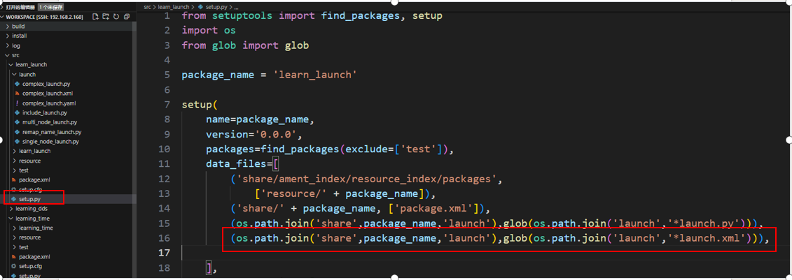

- 编译功能包

```
colcon build --packages-select learn_launch
```

- 运行，终端输入：

```
ros2 launch learn_launch complex_launch.xml
```

- 按照预期会出现两只小海龟，并且终端会打印日志信息


- 启动键盘控制节点，并添加命名空间

```
ros2 run turtlesim turtle_teleop_key --ros-args -r __ns:=/turtlesim1
```

使用键盘控制启动海龟1进行运行，海龟2会完全模仿海龟1的行为

 

## yaml实现与launch调用

- 新建launch文件，在complex_launch.py同级目录下新建【complex_launch.yaml】文件，添加如下内容：

```
launch:

# args that can be set from the command line or a default will be used
- arg:
    name: "background_r"
    default: "0"
- arg:
    name: "background_g"
    default: "255"
- arg:
    name: "background_b"
    default: "0"
- arg:
    name: "chatter_ns"
    default: "my/chatter/ns"


# include another launch file
- include:
    file: "$(find-pkg-share demo_nodes_cpp)/launch/topics/talker_listener.launch.py"

# include another launch file in the chatter_ns namespace
- group:
    - push-ros-namespace:
        namespace: "$(var chatter_ns)"
    - include:
        file: "$(find-pkg-share demo_nodes_cpp)/launch/topics/talker_listener.launch.py"

# start a turtlesim_node in the turtlesim1 namespace
- node:
    pkg: "turtlesim"
    exec: "turtlesim_node"
    name: "sim"
    namespace: "turtlesim1"

# start another turtlesim_node in the turtlesim2 namespace and use args to set parameters
- node:
    pkg: "turtlesim"
    exec: "turtlesim_node"
    name: "sim"
    namespace: "turtlesim2"
    param:
    -
      name: "background_r"
      value: "$(var background_r)"
    -
      name: "background_g"
      value: "$(var background_g)"
    -
      name: "background_b"
      value: "$(var background_b)"

# perform remap so both turtles listen to the same command topic
- node:
    pkg: "turtlesim"
    exec: "mimic"
    name: "mimic"
    remap:
    -
        from: "/input/pose"
        to: "/turtlesim1/turtle1/pose"
    -
        from: "/output/cmd_vel"
        to: "/turtlesim2/turtle1/cmd_vel" 
```

- 需要配置编译文件，在编译时将我们.yaml格式的launch文件拷贝到install安装目录下，ros系统才能找到我们的文件

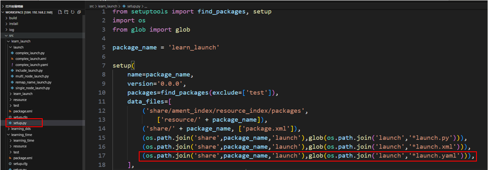

- 编译功能包

```
colcon build --packages-select learn_launch
```

- 运行程序，刷新环境变量然后运行

```
ros2 launch learn_launch complex_launch.yaml
```

- 按照预期会出现两只小海龟，并且终端会打印日志信息


- 启动键盘控制节点，并添加命名空间

```
ros2 run turtlesim turtle_teleop_key --ros-args -r __ns:=/turtlesim1
```

使用键盘控制启动海龟1进行运行，海龟2会完全模仿海龟1的行为

# ROS2 TF2坐标变换

## TF2简介

坐标系是我们非常熟悉的一个概念，也是机器人学中的重要基础，在一个完整的机器人系统中，会存在很多坐标系，这些坐标系之间的位置关系该如何管理？ROS给我们提供了一个坐标系的管理神器：TF2

TF系统参考文献：[tf: The transform library | IEEE Conference Publication | IEEE Xplore](https://ieeexplore.ieee.org/abstract/document/6556373)

## 机器人中的坐标系

在移动机器人系统中，坐标系一样至关重要，比如一个移动机器人的中心点是基坐标系Base Link，雷达所在的位置叫做雷达坐标系laser link，机器人要移动，里程计会累积位置，这个位置的参考系叫做里程计坐标系odom，里程计又会有累积误差和漂移，绝对位置的参考系叫做地图坐标系map。

一层一层坐标系之间关系复杂，有一些是相对固定的，也有一些是不断变化的，看似简单的坐标系也在空间范围内变得复杂，良好的坐标系管理系统就显得格外重要。

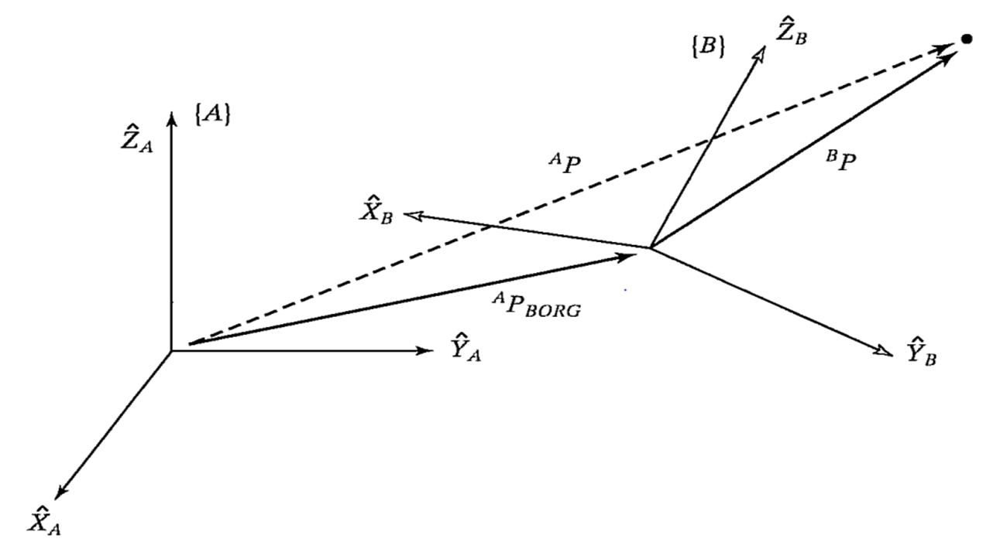

关于坐标系变换关系的基本理论，在每一本机器人学的教材中都会有讲解，可以分解为**平移和旋转**两个部分，通过一个四乘四的矩阵进行描述，在空间中画出坐标系，那两者之间的变换关系，其实就是向量的数学描述。

ROS中TF功能的底层原理，就是对这些数学变换进行了封装，详细的理论知识大家可以参考机器人学的教材，我们主要讲解TF坐标管理系统的使用方法。 

## TF命令行操作

我们先通过两只小海龟的示例，了解下基于坐标系的一种机器人跟随算法。**为方便演示，本节课程最好选择在虚拟机中操作**

### 安装相关工具

这个示例需要我们先安装相应的功能包、tf海龟模拟器案例、tf树可视化工具

```
sudo apt install ros-${ROS_DISTRO}-turtle-tf2-py ros-humble-tf2-tools
sudo pip3 install transforms3d
sudo apt install ros-${ROS_DISTRO}-rqt-tf-tree
```

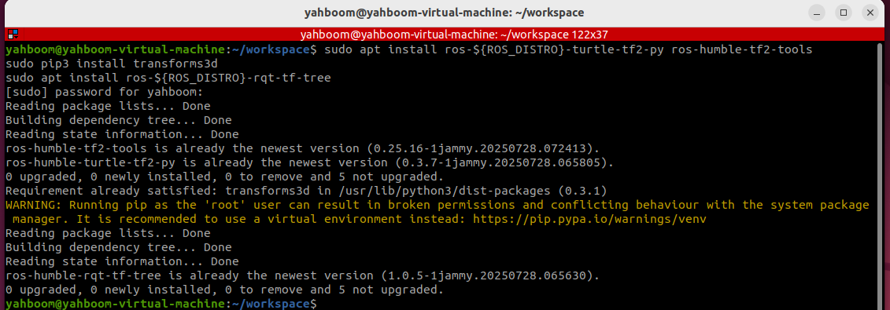

### 启动

然后就可以通过一个launch文件启动，之后我们可以控制其中的一只小海龟，另外一只小海龟会自动跟随运动。

```
ros2 launch turtle_tf2_py turtle_tf2_demo.launch.py
ros2 run turtlesim turtle_teleop_key
```

当我们控制一只海龟运动时，另外一只海龟也会跟随运动。 

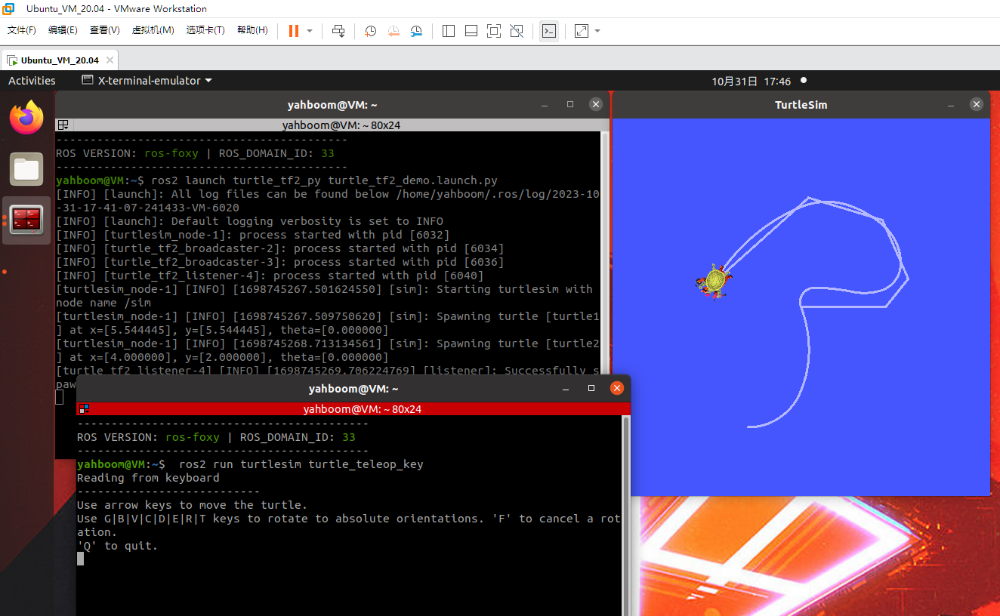

- 查看TF树

```
ros2 run rqt_tf_tree rqt_tf_tree
```

可以在rqt窗口中看到TF变换树

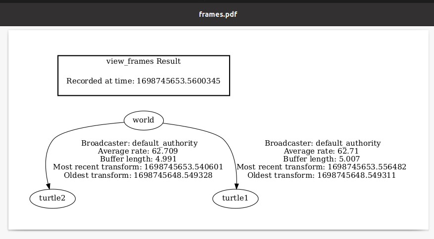

- 查询坐标变换信息：只看到坐标系的结构还不行，如果我们想要知道某两个坐标系之间的具体关系，可以通过tf2_echo这个工具查看：

```
ros2 run tf2_ros tf2_echo turtle2 turtle1
```

运行成功后，终端中就会循环打印坐标系的变换数值了

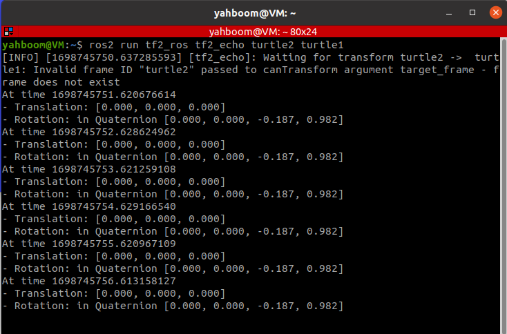

- 坐标系可视化：运行rviz2，然后添加TF显示插件

```
rviz2
```

rivz2中设置参考坐标系为：world，添加TF显示，再让小海龟动起来，Rviz中的坐标轴就会开始运动，这样是不是更加直观了呢！

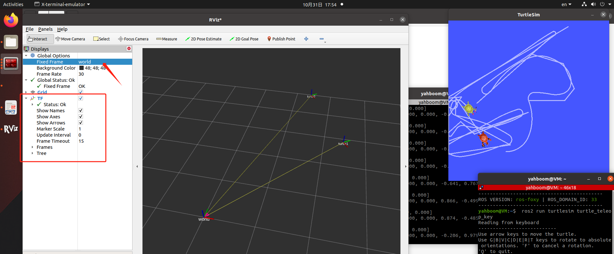

## 静态坐标变换

所谓静态坐标变换，是指两个坐标系之间的相对位置是固定的。如雷达和base_link之间的位置是固定的。

示例：**为方便演示，本节课程最好选择在虚拟机中操作**

### 发布A到B的位姿

```
ros2 run tf2_ros static_transform_publisher 0 0 3 0 0 3.14 A B
```


### 监听/获取TF关系

```
ros2 run tf2_ros tf2_echo A B
```

### rivz可视化

- 运行rviz2，然后添加TF显示插件

```
rviz2
```

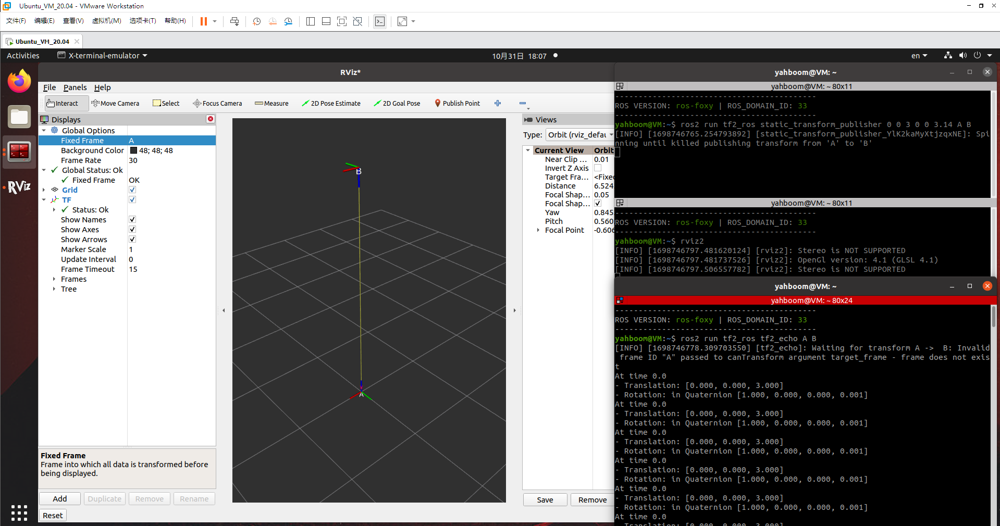

## TF发布实现案例

- 新建功能包

1. 在工作空间的src目录下新建功能包用于存放我们的文件

```
ros2 pkg create pkg_tf --build-type ament_python --dependencies rclpy --node-name turtle_tf_broadcaster
```

执行完上述命令，会创建pkg_tf功能包，同时会创建一个turtle_tf_broadcaster的节点，并且已经配置好相关的配置文件，在【turtle_tf_broadcaster.py】文件中添加如下代码：

```
import rclpy                                       # ROS2 Python接口库
from rclpy.node import Node                        # ROS2 节点类
from geometry_msgs.msg import TransformStamped     # 坐标变换消息
import tf_transformations                          # TF坐标变换库
from tf2_ros import TransformBroadcaster           # TF坐标变换广播器
from turtlesim.msg import Pose                     # turtlesim小海龟位置消息

class TurtleTFBroadcaster(Node):

    def __init__(self, name):
        super().__init__(name)                                # ROS2节点父类初始化

        self.declare_parameter('turtlename', 'turtle')        # 创建一个海龟名称的参数
        self.turtlename = self.get_parameter(                 # 优先使用外部设置的参数值，否则用默认值
            'turtlename').get_parameter_value().string_value

        self.tf_broadcaster = TransformBroadcaster(self)      # 创建一个TF坐标变换的广播对象并初始化

        self.subscription = self.create_subscription(         # 创建一个订阅者，订阅海龟的位置消息
            Pose,
            f'/{self.turtlename}/pose',                       # 使用参数中获取到的海龟名称
            self.turtle_pose_callback, 1)

    def turtle_pose_callback(self, msg):                              # 创建一个处理海龟位置消息的回调函数，将位置消息转变成坐标变换
        transform = TransformStamped()                                # 创建一个坐标变换的消息对象

        transform.header.stamp = self.get_clock().now().to_msg()      # 设置坐标变换消息的时间戳
        transform.header.frame_id = 'world'                           # 设置一个坐标变换的源坐标系
        transform.child_frame_id = self.turtlename                    # 设置一个坐标变换的目标坐标系
        transform.transform.translation.x = msg.x                     # 设置坐标变换中的X、Y、Z向的平移
        transform.transform.translation.y = msg.y
        transform.transform.translation.z = 0.0
        q = tf_transformations.quaternion_from_euler(0, 0, msg.theta) # 将欧拉角转换为四元数（roll, pitch, yaw）
        transform.transform.rotation.x = q[0]                         # 设置坐标变换中的X、Y、Z向的旋转（四元数）
        transform.transform.rotation.y = q[1]
        transform.transform.rotation.z = q[2]
        transform.transform.rotation.w = q[3]

        # Send the transformation
        self.tf_broadcaster.sendTransform(transform)     # 广播坐标变换，海龟位置变化后，将及时更新坐标变换信息

def main(args=None):
    rclpy.init(args=args)                                # ROS2 Python接口初始化
    node = TurtleTFBroadcaster("turtle_tf_broadcaster")  # 创建ROS2节点对象并进行初始化
    rclpy.spin(node)                                     # 循环等待ROS2退出
    node.destroy_node()                                  # 销毁节点对象
    rclpy.shutdown()                                     # 关闭ROS2 Python接口
```

2、接下来在turtle_tf_broadcaster.py同级目录下新建【turtle_following.py】文件，添加如下代码：

```
import math
import rclpy                                              # ROS2 Python接口库
from rclpy.node import Node                               # ROS2 节点类
import tf_transformations                                 # TF坐标变换库
from tf2_ros import TransformException                    # TF左边变换的异常类
from tf2_ros.buffer import Buffer                         # 存储坐标变换信息的缓冲类
from tf2_ros.transform_listener import TransformListener  # 监听坐标变换的监听器类
from geometry_msgs.msg import Twist                       # ROS2 速度控制消息
from turtlesim.srv import Spawn                           # 海龟生成的服务接口
class TurtleFollowing(Node):

    def __init__(self, name):
        super().__init__(name)                                      # ROS2节点父类初始化

        self.declare_parameter('source_frame', 'turtle1')           # 创建一个源坐标系名的参数
        self.source_frame = self.get_parameter(                     # 优先使用外部设置的参数值，否则用默认值
            'source_frame').get_parameter_value().string_value

        self.tf_buffer = Buffer()                                   # 创建保存坐标变换信息的缓冲区
        self.tf_listener = TransformListener(self.tf_buffer, self)  # 创建坐标变换的监听器

        self.spawner = self.create_client(Spawn, 'spawn')           # 创建一个请求产生海龟的客户端
        self.turtle_spawning_service_ready = False                  # 是否已经请求海龟生成服务的标志位
        self.turtle_spawned = False                                 # 海龟是否产生成功的标志位

        self.publisher = self.create_publisher(Twist, 'turtle2/cmd_vel', 1) # 创建跟随运动海龟的速度话题

        self.timer = self.create_timer(1.0, self.on_timer)         # 创建一个固定周期的定时器，控制跟随海龟的运动

    def on_timer(self):
        from_frame_rel = self.source_frame                         # 源坐标系
        to_frame_rel   = 'turtle2'                                 # 目标坐标系

        if self.turtle_spawning_service_ready:                     # 如果已经请求海龟生成服务
            if self.turtle_spawned:                                # 如果跟随海龟已经生成
                try:
                    now = rclpy.time.Time()                        # 获取ROS系统的当前时间
                    trans = self.tf_buffer.lookup_transform(       # 监听当前时刻源坐标系到目标坐标系的坐标变换
                        to_frame_rel,
                        from_frame_rel,
                        now)
                except TransformException as ex:                   # 如果坐标变换获取失败，进入异常报告
                    self.get_logger().info(
                        f'Could not transform {to_frame_rel} to {from_frame_rel}: {ex}')
                    return

                msg = Twist()                                      # 创建速度控制消息
                scale_rotation_rate = 1.0                          # 根据海龟角度，计算角速度
                msg.angular.z = scale_rotation_rate * math.atan2(
                    trans.transform.translation.y,
                    trans.transform.translation.x)

                scale_forward_speed = 0.5                          # 根据海龟距离，计算线速度
                msg.linear.x = scale_forward_speed * math.sqrt(
                    trans.transform.translation.x ** 2 +
                    trans.transform.translation.y ** 2)

                self.publisher.publish(msg)                        # 发布速度指令，海龟跟随运动
            else:                                                  # 如果跟随海龟没有生成
                if self.result.done():                             # 查看海龟是否生成
                    self.get_logger().info(
                        f'Successfully spawned {self.result.result().name}')
                    self.turtle_spawned = True                     
                else:                                              # 依然没有生成跟随海龟
                    self.get_logger().info('Spawn is not finished')
        else:                                                      # 如果没有请求海龟生成服务
            if self.spawner.service_is_ready():                    # 如果海龟生成服务器已经准备就绪
                request = Spawn.Request()                          # 创建一个请求的数据
                request.name = 'turtle2'                           # 设置请求数据的内容，包括海龟名、xy位置、姿态
                request.x = float(4)
                request.y = float(2)
                request.theta = float(0)

                self.result = self.spawner.call_async(request)     # 发送服务请求
                self.turtle_spawning_service_ready = True          # 设置标志位，表示已经发送请求
            else:
                self.get_logger().info('Service is not ready')     # 海龟生成服务器还没准备就绪的提示


def main(args=None):
    rclpy.init(args=args)                       # ROS2 Python接口初始化
    node = TurtleFollowing("turtle_following")  # 创建ROS2节点对象并进行初始化
    rclpy.spin(node)                            # 循环等待ROS2退出
    node.destroy_node()                         # 销毁节点对象
    rclpy.shutdown()                            # 关闭ROS2 Python接口
```

3、在pkg_tf功能包下新建launch文件夹，在launch文件夹内新建【turtle_following.launch.py】文件，添加如下内容：

```
from launch import LaunchDescription
from launch.actions import DeclareLaunchArgument
from launch.substitutions import LaunchConfiguration
from launch_ros.actions import Node

def generate_launch_description():
    
    return LaunchDescription([
        DeclareLaunchArgument('source_frame', default_value='turtle1', description='Target frame name.'),
        Node(
            package='turtlesim',
            executable='turtlesim_node',
        ),
        Node(
            package='pkg_tf',
            executable='turtle_tf_broadcaster',
            name='broadcaster1',
            parameters=[
                {'turtlename': 'turtle1'}
            ]
        ),
        Node(
            package='pkg_tf',
            executable='turtle_tf_broadcaster',
            name='broadcaster2',
            parameters=[
                {'turtlename': 'turtle2'}
            ]
        ),
        Node(
            package='pkg_tf',
            executable='turtle_following',
            name='listener',
            parameters=[
                {'source_frame': LaunchConfiguration('source_frame')}
            ]
        ), 
    ])
```

- setup.py中配置

- 导入相关库

```
import os
from glob import glob
```

- 添加turtle_following节点信息，并添加一下命令将launch文件拷贝到install中共享目录中

```
(os.path.join('share',package_name,'launch'),glob('launch/*')),
```

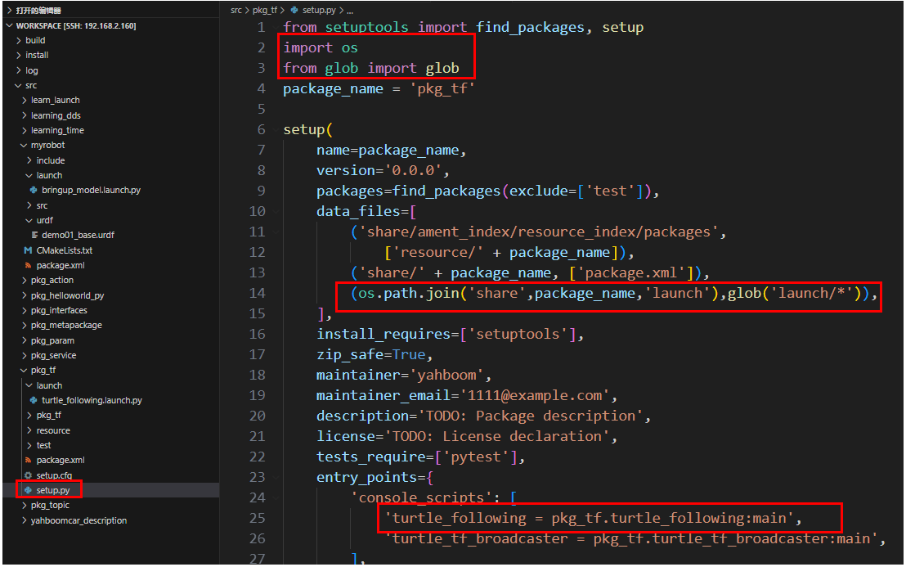

- 编译功能包

```
colcon build --packages-select pkg_tf
```

- 刷新终端环境变量，然后运行

```
ros2 launch pkg_tf turtle_following.launch.py
```

- 启动海龟键盘控制节点，控制第一只小海龟运动，第二只海龟会自动跟随

```
ros2 run turtlesim turtle_teleop_key
```

在此终端内按键盘的上下左右键可以控制其中的一个小乌龟运动，然后另外一个小乌龟会跟着运动直到它们重合。

## 进阶内容

- 理解TF的跨时间维度变换能力

  Buffer能够通过缓冲区自动缓存过去10s内TF系统内所有的TF变换关系（可以通过Buffer构造参数自己设置任意的缓存时长），缓冲区内所有的变换以时间戳为单位，所有变换都是连续可追溯的，即使两个坐标系处于不同的时间点，也能查找出之间的坐标变换关系，这一点可以参考设计TF系统的参考文献，有详细的原理讲解（文献在本节课程文件夹下、或者通过本节开头时的链接）

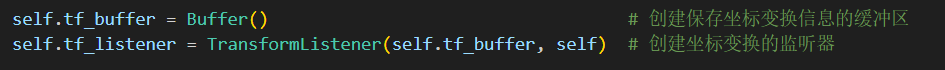

- 以下是对我们上述海龟跟随案例的补充，红色箭头表示可以跨时间查找不同时间点的两个坐标系之间的变换

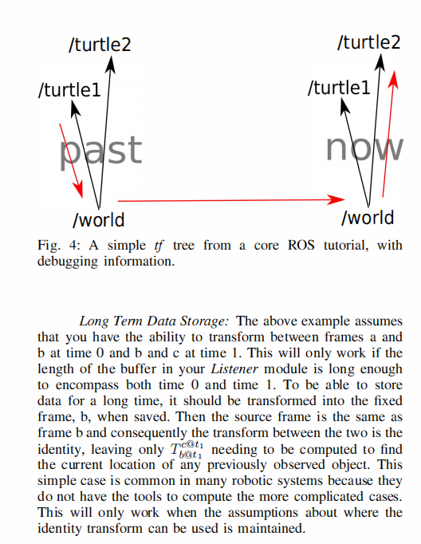
