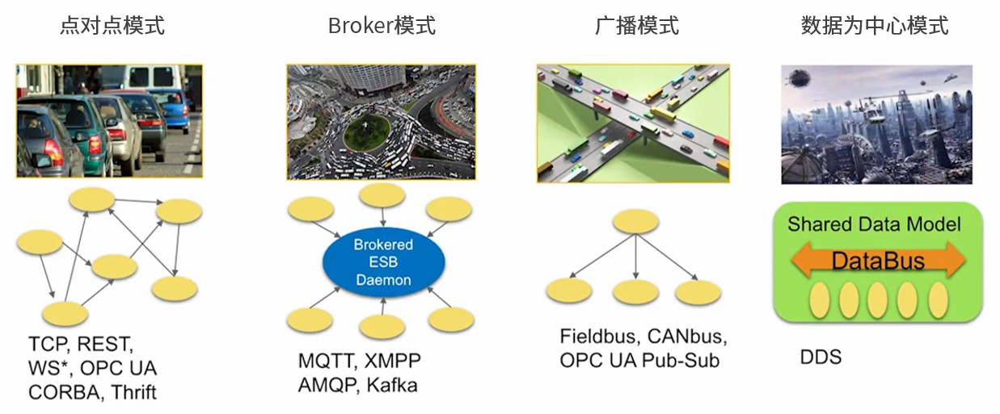
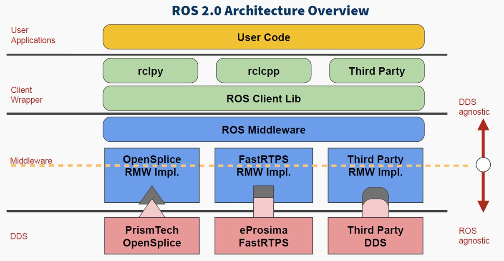
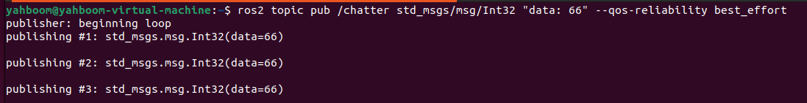
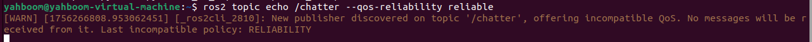
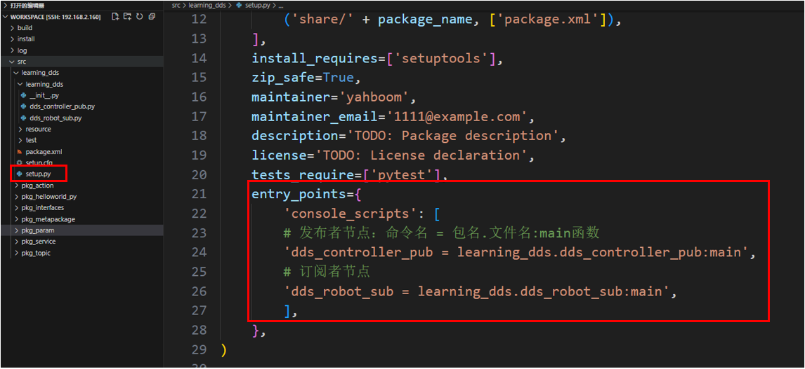
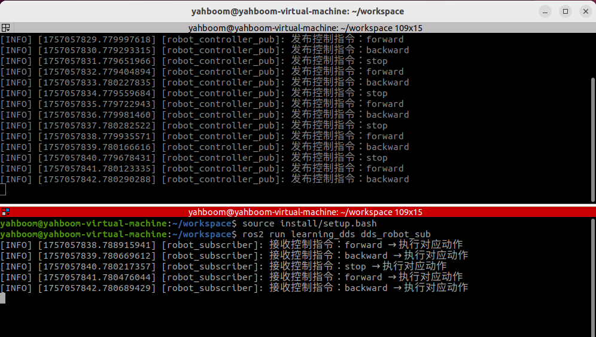
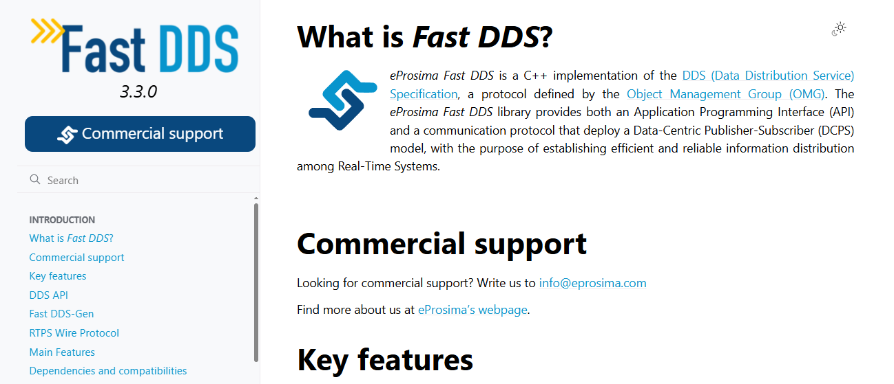

# ROS2元功能包

## 元功能包简介

完成一个系统性的功能，可能涉及到多个功能包，比如实现了机器人导航模块，该模块下有地图、定位、路径规划...等不同的子级功能包。那么调用者安装该模块时，需要逐一的安装每一个功能包吗？

显而易见的，逐一安装功能包的效率低下，在ROS2中，提供了一种方式可以将不同的功能包打包成一个功能包，当安装某个功能模块时，直接调用打包后的功能包即可，该包又称之为元功能包(metapackage)。

MetaPackage是Linux的一个文件管理系统的概念。是 ROS2 中的一个虚包，里面没有实质性的内容，但是它依赖了其他的软件包，通过这种方法可以把其他包组合起来，我们可以认为它是一本书的目录索引，告诉我们这个包集合中有哪些子包，并且该去哪里下载。

例如：sudo apt install ros-humle-desktop 命令安装 ros2 时就使用了元功能包，该元功能包依赖于 ROS2 中的其他一些功能包，安装该包时会一并安装依赖。

元功能包经典案例：navigation2 

- navigation2 github仓库：[GitHub - ros-navigation/navigation2: ROS 2 Navigation Framework and System](https://github.com/ros-navigation/navigation2)

方便用户的安装，我们只需要这一个包就可以把其他相关的软件包组织到一起安装了。

## ROS2实现元功能包

- 新建一个功能包

```
ros2 pkg create pkg_metapackage
```

- 修改 package.xml 文件，添加执行时所依赖的包

```
<?xml version="1.0"?>
<?xml-model href="http://download.ros.org/schema/package_format3.xsd" schematypens="http://www.w3.org/2001/XMLSchema"?>
<package format="3">
  <name>pkg_metapackage</name>
  <version>0.0.0</version>
  <description>TODO: Package description</description>
  <maintainer email="1461190907@qq.com">root</maintainer>
  <license>TODO: License declaration</license>

  <buildtool_depend>ament_cmake</buildtool_depend>

  <exec_depend>pkg_interfaces</exec_depend>
  <exec_depend>pkg_helloworld_py</exec_depend>
  <exec_depend>pkg_topic</exec_depend>
  <exec_depend>pkg_service</exec_depend>
  <exec_depend>pkg_action</exec_depend>
  <exec_depend>pkg_param</exec_depend>

  <test_depend>ament_lint_auto</test_depend>
  <test_depend>ament_lint_common</test_depend>

  <export>
    <build_type>ament_cmake</build_type>
  </export>
</package>

```

- 修改CMakeLists.txt，文件CMakeLists.txt内容如下

```
cmake_minimum_required(VERSION 3.5)
project(pkg_metapackage)

if(CMAKE_COMPILER_IS_GNUCXX OR CMAKE_CXX_COMPILER_ID MATCHES "Clang")
  add_compile_options(-Wall -Wextra -Wpedantic)
endif()

find_package(ament_cmake REQUIRED)

ament_package()
```

4.编译元功能包

- 不会有任何实际可执行文件

```
colcon build --packages-select pkg_metapackage
```

# ROS2分布式通讯

## ROS2-DDS简介

多机通讯即分布式通信是指可以通过网络在不同主机之间实现数据交互的一种通信策略。

ROS2本身是一个分布式通信框架，可以很方便的实现不同设备之间的通信，ROS2所基于的中间件是DDS，当处于同一网络中时，通过DDS的域ID机制(ROS_DOMAIN_ID)可以实现分布式通信，大致流程是：在启动节点之前，可以设置域ID的值，不同节点如果域ID相同，那么可以自由发现并通信，反之，如果域ID值不同，则不能实现。默认情况下，所有节点启动时所使用的域ID为0，换言之，只要保证在同一网络，你不需要做任何配置，不同ROS2设备上的不同节点即可实现分布式通信。

分布式通信的应用场景是较为广泛的，无人车编队、无人机编队、远程控制等等， 这些数据的交互都依赖于分布式通信。

## 实现主从局域网通信

只需要将主机和从机【可以有多个】处于同一个网络中，就已经实现了分布式通讯。比如主机和从机连接同一个WiFi或者同一个路由器。

Windows中虚拟机设置网络为【桥接模式】就和主机处于同一个网络了。

- ROS2提供了一个DOMAIN的机制，就类似分组一样，处于同一个DOMAIN中的计算机才能通信，我们可以在主机端【小车】和从机端【虚拟机】的.bashrc中加入这样一句配置，即可将两者分配到一个小组中：

```
$ export ROS_DOMAIN_ID=<your_domain_id>
```

如果主机端【小车】和从机端【虚拟机】分配的ID不同，则两者无法实现通信，达到分组的目的。

- 主机端【小车】执行：

这里演示的是小车处于docker中，docker使用的网络模式是host模式，host模式简单来说就是和小车共用一个网络，所以跟在小车上执行没有区别。

```
echo "export ROS_DOMAIN_ID=6" >> ~/.bashrc  # 这里的6是ROS_DOMAIN_ID, 不一定要用6，符合ROS_DOMAIN_ID的规则即可
source ~/.bashrc
ros2 run demo_nodes_py talker
```

- 从机端【虚拟机】执行：

```
echo "export ROS_DOMAIN_ID=6" >> ~/.bashrc  # 这里和主机端的值保持一致
source ~/.bashrc
ros2 run demo_nodes_py listener
```

- 注意，在设置ROS_DOMAIN_ID的值时并不是随意的，也是有一定约束的：

1. 建议ROS_DOMAIN_ID的取值在[0,101] 之间，包含0和101；
2. 每个域ID内的节点总数是有限制的，需要小于等于120个；
3. 如果域ID为101，那么该域的节点总数需要小于等于54个。

- 域ID值的相关计算规则如下：

1. DDS是基于TCP/IP或UDP/IP网络通信协议的，网络通信时需要指定端口号，端口号由2个字节的无符号整数表示，其取值范围在[0,65535]之间；
2. 端口号的分配也是有其规则的，并非可以任意使用的，根据DDS协议规定以7400作为起始端口，也即可用端口为[7400,65535]，又已知按照DDS协议默认情况下，每个域ID占用250个端口，那么域ID的个数为：(65535-7400)/250 = 232(个)，对应的其取值范围为[0,231]；
3. 操作系统还会设置一些预留端口，在DDS中使用端口时，还需要避开这些预留端口，以免使用中产生冲突，不同的操作系统预留端口又有所差异，其最终结果是，在Linux下，可用的域ID为[0,101]与[215-231]，在Windows和Mac中可用的域ID为[0,166]，综上，为了兼容多平台，建议域ID在[0,101] 范围内取值。
4. 每个域ID默认占用250个端口，且每个ROS2节点需要占用两个端口，另外，按照DDS协议每个域ID的端口段内，第1、2个端口是Discovery Multicast端口与User Multicast端口，从第11、12个端口开始是域内第一个节点的Discovery Unicast端口与User Unicast，后续节点所占用端口依次顺延，那么一个域ID中的最大节点个数为：(250-10)/2 = 120(个)；
5. 特殊情况：域ID值为101时，其后半段端口属于操作系统的预留端口，其节点最大个数为54个。

# ROS2 DDS详细

## DDS简介

DDS的全称是Data Distribution Service，也就是数据分发服务，2004年由对象管理组织OMG发布和维护，是一套专门为实时系统设计的数据分发/订阅标准，最早应用于美国海军， 解决舰船复杂网络环境中大量软件升级的兼容性问题，现在已经成为强制标准。

DDS强调以数据为中心，可以提供丰富的服务质量策略，以保障数据进行实时、高效、灵活地分发，可满足各种分布式实时通信应用需求。

**参考资料：**

- Fast DDS官网文档：[3.3.0](https://fast-dds.docs.eprosima.com/en/latest/)
- ros2官方文档DDS进阶功能：[点击跳转](https://docs.ros.org/en/humble/Tutorials/Advanced/Discovery-Server/Discovery-Server.html)

DDS的核心是通信，能够实现通信的模型和软件框架非常多，这里我们列出常用的四种模型。



- 第一种，**点对点模型**，许多客户端连接到一个服务端，每次通信时，通信双方必须建立一条连接。当通信节点增多时，连接数也会增多。而且每个客户端都需要知道服务器的具体地址和所提供的服务，一旦服务器地址发生变化，所有客户端都会受到影响。
- 第二种，**Broker模型**，针对点对点模型进行了优化，由Broker集中处理所有人的请求，并进一步找到真正能响应该服务的角色。这样客户端就不用关心服务器的具体地址了。不过问题也很明显，Broker作为核心，它的处理速度会影响所有节点的效率，当系统规模增长到一定程度，Broker就会成为整个系统的性能瓶颈。更麻烦是，如果Broker发生异常，可能导致整个系统都无法正常运转。之前的ROS1系统，使用的就是类似这样的架构。
- 第三种，**广播模型**，所有节点都可以在通道上广播消息，并且节点都可以收到消息。这个模型解决了服务器地址的问题，而且通信双方也不用单独建立连接，但是广播通道上的消息太多了，所有节点都必须关心每条消息，其实很多是和自己没有关系的。
- 第四种，就是**以数据为中心的DDS模型**了，这种模型与广播模型有些类似，所有节点都可以在DataBus上发布和订阅消息。但它的先进之处在于，通信中包含了很多并行的通路，每个节点可以只关心自己感兴趣的消息，忽略不感兴趣的消息，有点像是一个旋转火锅，各种好吃的都在这个DataBus传送，我们只需要拿自己想吃的就行，其他的和我们没有关系。

可见，在这几种通信模型中，DDS的优势更加明显。

### DDS在ROS2中的应用

DDS在ROS2系统中的位置至关重要，所有上层建设都建立在DDS之上。在这个ROS2的架构图中，蓝色和红色部分就是DDS。



在ROS的四大组成部分中，由于DDS的加入，大大提高了分布式通信系统的综合能力，这样我们在开发机器人的过程中，就不需要纠结通信的问题，可以把更多时间放在其他部分的应用开发上。

###  质量服务策略QoS

DDS中的基本结构是Domain，Domain将各个应用程序绑定在一起进行通信，回忆下之前我们配置树莓派和电脑通信的时候，配置的那个DOMAIN ID，就是对全局数据空间的分组定义，只有处于同一个DOMAIN小组中的节点才能互相通信。这样可以避免无用数据占用的资源。

DDS中另外一个重要特性就是质量服务策略：QoS。

QoS是一种网络传输策略，应用程序指定所需要的网络传输质量行为，QoS服务实现这种行为要求，尽可能地满足客户对通信质量的需求，可以理解为数据提供者和接收者之间的合约。

策略如下：

- **DEADLINE**策略，表示通信数据必须要在每次截止时间内完成一次通信；
- **HISTORY**策略，表示针对历史数据的一个缓存大小；
- **RELIABILITY**策略，表示数据通信的模式，配置成BEST_EFFORT，就是尽力传输模式，网络情况不好的时候，也要保证数据流畅，此时可能会导致数据丢失，配置成RELIABLE，就是可信赖模式，可以在通信中尽量保证图像的完整性，我们可以根据应用功能场景选择合适的通信模式；
- **DURABILITY**策略，可以配置针对晚加入的节点，也保证有一定的历史数据发送过去，可以让新节点快速适应系统。

### 使用DDS

### 案例1—通过命令行配置DDS

- 打开第一个终端，使用以下命令发布话题：

```
ros2 topic pub /chatter std_msgs/msg/Int32 "data: 66" --qos-reliability best_effort
```



- 再次打开一个终端，使用不同的Qos去打印话题，如果使用的Qos策略与发布方不同，则会出现警告信息不能正常接收到话题数据：

```
ros2 topic echo /chatter --qos-reliability reliable
```



- 我们使用和话题发布方一样的Qos策略即可接收到话题数据

```
ros2 topic echo /chatter --qos-reliability best_effort
```


### 案例2—编写话题节点配置Qos服务策略

- 使用以下命令新建功能包

```
ros2 pkg create learning_dds --build-type ament_python --dependencies rclpy std_msgs
```

- 新建一个dds_controller_pub.py文件，作为话题通信的发布方，填入一下内容：

```
import rclpy
from rclpy.node import Node
from std_msgs.msg import String
# 导入QoS相关类
from rclpy.qos import QoSProfile, QoSReliabilityPolicy, QoSHistoryPolicy

class ControllerPublisher(Node):
    def __init__(self, name):
        super().__init__(name)
        # 1. 配置QoS策略：可靠传输，保留最后1条历史数据
        self.qos_profile = QoSProfile(
            reliability=QoSReliabilityPolicy.RELIABLE,  # 可靠传输（重传丢失数据）
            history=QoSHistoryPolicy.KEEP_LAST,         # 保留最后N条数据
            depth=1                                     # 保留1条历史数据
        )
        # 2. 创建发布者：话题名/robot_cmd，消息类型String，QoS策略
        self.publisher = self.create_publisher(
            String, 
            "/robot_cmd", 
            self.qos_profile
        )
        # 3. 创建定时器：每秒发送一次指令
        self.timer = self.create_timer(1.0, self.timer_callback)
        self.cmd_list = ["forward", "backward", "stop"]  # 指令列表
        self.cmd_index = 0  # 指令索引，循环切换


    def timer_callback(self):
        # 循环切换指令（前进→后退→停止→前进...）
        current_cmd = self.cmd_list[self.cmd_index % 3]
        # 创建消息并填充数据
        msg = String()
        msg.data = current_cmd
        # 发布消息
        self.publisher.publish(msg)
        # 打印日志（显示发布的指令）
        self.get_logger().info(f"发布控制指令：{msg.data}")
        # 更新指令索引
        self.cmd_index += 1


def main(args=None):
    # 初始化ROS2
    rclpy.init(args=args)
    # 创建发布者节点
    node = ControllerPublisher("robot_controller_pub")
    # 循环运行节点
    rclpy.spin(node)
    # 销毁节点并关闭ROS2
    node.destroy_node()
    rclpy.shutdown()


if __name__ == "__main__":
    main()
```

- 订阅方代码实现，新建一个dds_robot_sub.py文件，填入下方订阅方实现代码

```
import rclpy
from rclpy.node import Node
from std_msgs.msg import String
from rclpy.qos import QoSProfile, QoSReliabilityPolicy, QoSHistoryPolicy

class RobotSubscriber(Node):
    def __init__(self, name):
        super().__init__(name)
        # 1. 配置与发布者兼容的QoS策略
        self.qos_profile = QoSProfile(
            reliability=QoSReliabilityPolicy.BEST_EFFORT,
            history=QoSHistoryPolicy.KEEP_LAST,
            depth=1
        )
        # 2. 创建订阅者：话题名/robot_cmd，回调函数，QoS策略
        self.subscription = self.create_subscription(
            String,
            "/robot_cmd",
            self.cmd_callback,  # 接收到数据后执行的回调函数
            self.qos_profile
        )

    def cmd_callback(self, msg):
        # 回调函数：处理接收到的指令
        self.get_logger().info(f"接收控制指令：{msg.data} → 执行对应动作")


def main(args=None):
    rclpy.init(args=args)
    node = RobotSubscriber("robot_subscriber")
    rclpy.spin(node)
    node.destroy_node()
    rclpy.shutdown()


if __name__ == "__main__":
    main()
```

- 配置编译文件（setup.py）

```
entry_points={
    'console_scripts': [
        # 发布者节点：命令名 = 包名.文件名:main函数
        'dds_controller_pub = learning_dds.dds_controller_pub:main',
        # 订阅者节点
        'dds_robot_sub = learning_dds.dds_robot_sub:main',
    ],
},
```



 

- 在工作空间目录下打开终端，编译功能包

```
colcon build --packages-select learning_dds
```

- 设置环境变量，每次重新编译后都需要设置环境变量

```
source install/setup.bash
```

- 运行发布方和订阅方节点

```
ros2 run learning_dds dds_controller_pub
ros2 run learning_dds dds_robot_sub
```



 

**机器人开发进阶：**

- 通常情况下，话题通信的发布方和订阅方需要保持一样的Qos通信策略，避免一些隐性的通信层问题；
- Qos通信策略的设置要根据实际的应用场景来选择；
- 如果应用场景涉及：无人机通信、加密通信、实时通信等对通信层有特殊的要求场景，在本节教程简介中找到Fast-DDS的官方手册，对DDS功能有更详尽的说明；


