# ROS2时间相关API

## 时间相关API简介

ros2涉及时间相关的API有Rate，Time，Duration，Time与Duration的运算等，下面分别讲解。

## 实现ROS2时间与定时功能

- 首先，创建一个功能包，用来存放相关的程序文件

```
ros2 pkg create learning_time --build-type ament_python --dependencies rclpy
```

### 使用Rate实现定频率运行

ROS2 中还提供了create_rate函数，用于**控制循环执行频率**的工具，其核心作用是让一段代码按照**固定频率周期性执行**，`Rate` 通过控制循环的 “休眠时间” 来保证循环执行频率的稳定性。**切记**，`Rate`一般不能直接用于主线程，否则会永久阻塞回调事件，一般只用于带有多线程回调的程序或子线程中使用。

具体工作原理：

1. 记录每次循环开始的时间；
2. 执行循环内的代码；
3. 计算当前循环实际耗时与 “目标间隔时间” 的差值；
4. 自动休眠对应的差值时间，确保从一次循环开始到下一次循环开始的间隔严格等于 “目标间隔”（如 100 毫秒）。

虽然 `Rate` 和 `Timer` 都能实现周期性执行，但适用场景不同：

| 特性     | `Rate`                                                       | `Timer`                                            |
| -------- | ------------------------------------------------------------ | -------------------------------------------------- |
| 实现方式 | 基于循环内主动休眠（阻塞当前线程）                           | 基于回调函数（非阻塞，由 ROS 2 事件循环触发）      |
| 适用场景 | 适用于需要在**同一线程**内按固定频率执行的循环（如主控制逻辑） | 适用于需要**异步执行**的周期性任务（不阻塞主线程） |
| 灵活性   | 循环内可直接控制流程（如 break 退出）                        | 需通过标志位等方式控制回调执行                     |

以下是 `Rate` 的基本用法，实现一个每秒执行 2 次的循环：

- 功能包中新建一个文件rate_demo.py

```
import rclpy
from rclpy.node import Node
import threading

class RateExampleNode(Node):
    def __init__(self):
        super().__init__("rate_example_node")
        self.get_logger().info("Rate 示例节点启动")

    def run_loop(self):
        # 使用节点的create_rate()创建2Hz的Rate
        rate = self.create_rate(2)
        
        count = 0
        try:
            while rclpy.ok():
                self.get_logger().info(f"循环执行 {count} 次")
                count += 1
                rate.sleep()  # 休眠到下一个周期（0.5秒）
        except KeyboardInterrupt:
            self.get_logger().info("循环被中断")

def main(args=None):
    rclpy.init(args=args)
    node = RateExampleNode()
    
    # 创建线程运行循环（避免阻塞主线程）
    loop_thread = threading.Thread(target=node.run_loop)
    loop_thread.start()
    
    # 主线程执行spin，维持ROS 2节点运行
    try:
        rclpy.spin(node)
    except KeyboardInterrupt:
        pass
    finally:
        loop_thread.join()  # 等待线程结束
        node.destroy_node()
        rclpy.shutdown()

if __name__ == "__main__":
    main()
    
```

- 配置对应的setup.py配置文件，在console_scripts中添加

```
'rate_demo=learning_time.rate_demo:main'
```

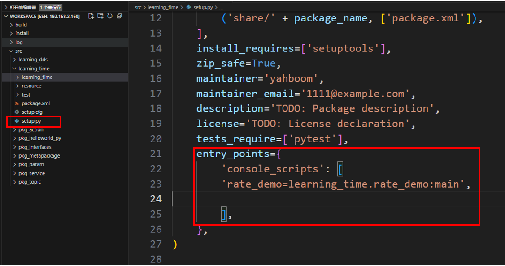

- 编译功能包

```
colcon build --packages-select learning_time
```

- 刷新工作空间环境并运行节点

```
 source ./install/setup.bash
ros2 run learning_time rate_demo
```

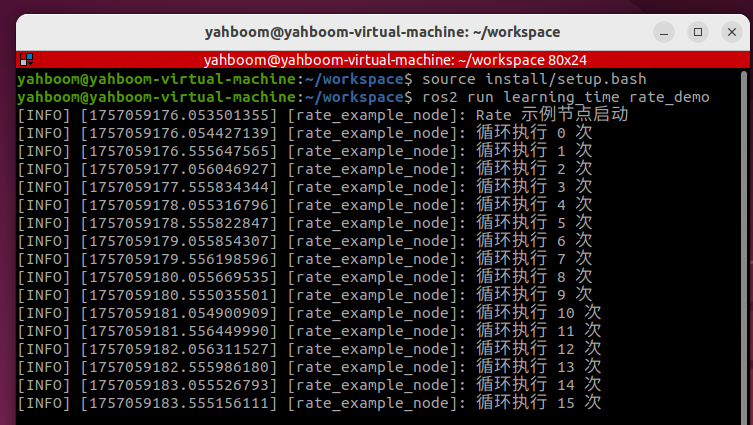

### 使用Timer定时器实现定频率运行

- Timer用于创建一个定时触发的定时器来执行一些周期性任务
- 示例：创建两个定时器一个1秒执行一次打印执行次数，一个0.5秒执行一次打印当前时间
- 新建一个程序文件Timer_demo.py

```
import rclpy
from rclpy.node import Node

class TimerDemoNode(Node):
    def __init__(self):
        super().__init__('timer_demo_node')
        
        # 计数器，用于演示定时器执行次数
        self.counter = 0
        
        # 创建定时器：每1秒执行一次callback函数
        self.timer = self.create_timer(1.0, self.timer_callback)
        
        # 创建一个更快的定时器：每0.5秒执行一次
        self.fast_timer = self.create_timer(0.5, self.fast_timer_callback)
        
        self.get_logger().info("定时器节点已启动")

    def timer_callback(self):
        """1秒定时器回调函数"""
        self.counter += 1
        current_time = self.get_clock().now()
        
        # 打印当前时间和计数器值
        self.get_logger().info(
            f"[1秒定时器] 第 {self.counter} 次执行，当前时间: {current_time.seconds_nanoseconds()}"
        )

    def fast_timer_callback(self):
        """0.5秒定时器回调函数"""
        # 打印当前时间戳（纳秒）
        self.get_logger().info(
            f"[0.5秒定时器] 当前时间戳: {self.get_clock().now().nanoseconds}"
        )

def main(args=None):
    # 初始化ROS 2
    rclpy.init(args=args)
    
    # 创建节点
    node = TimerDemoNode()
    
    # 运行节点
    rclpy.spin(node)
    
    # 关闭ROS 2
    node.destroy_node()
    rclpy.shutdown()

if __name__ == '__main__':
    main()

```

- 配置对应的setup.py配置文件，在console_scripts中添加

```
'Timer_demo=learning_time.Timer_demo:main'
```

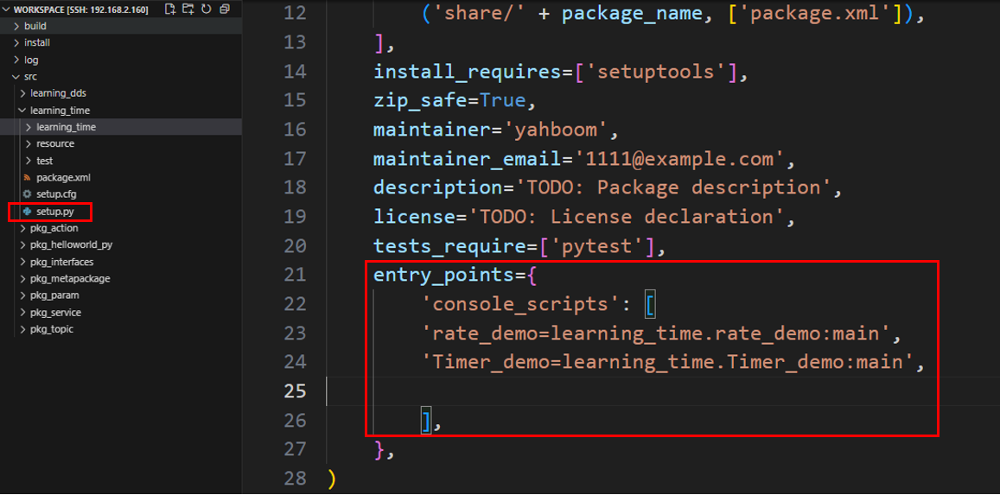

- 编译功能包

```
colcon build --packages-select learning_time
```

- 刷新工作空间环境并运行节点

```
source ./install/setup.bash
ros2 run learning_time Timer_demo
```

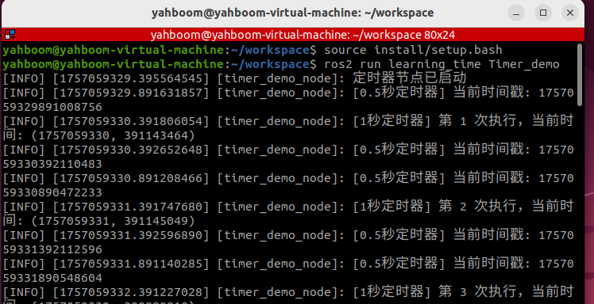

- 可以看出定时器按照设定的定时时间触发，在各自的回调函数中打印对应的日志信息

###  使用get_clock获取当前时刻时间

- get_clock函数可以用来获取到时钟对象，再通过()方法获取到当前时刻时间
- 新建程序文件get_clock_demo.py,填入以下示例程序：

```
import rclpy
from rclpy.node import Node
from rclpy.time import Time

class TimeExampleNode(Node):
    def __init__(self):
        super().__init__("time_example_node")
        
        # 获取节点的时钟对象（默认使用系统时钟）
        self.clock = self.get_clock()
        
        # 获取当前时间（返回Time对象）
        current_time = self.clock.now()
        self.get_logger().info(f"当前时间：{current_time}")

def main(args=None):
    rclpy.init(args=args)
    node = TimeExampleNode()
    rclpy.spin_once(node)  # 运行一次节点
    node.destroy_node()
    rclpy.shutdown()

if __name__ == "__main__":
    main()
```

- 配置对应的setup.py配置文件，在console_scripts中添加

```
'get_clock_demo=learning_time.get_clock_demo:main'
```

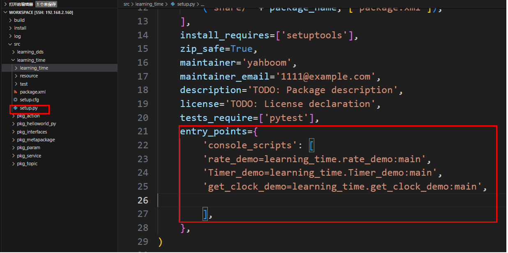

- 编译功能包

```
colcon build --packages-select learning_time
```

- 刷新工作空间环境并运行节点

```
source ./install/setup.bash
ros2 run learning_time get_clock_demo
```

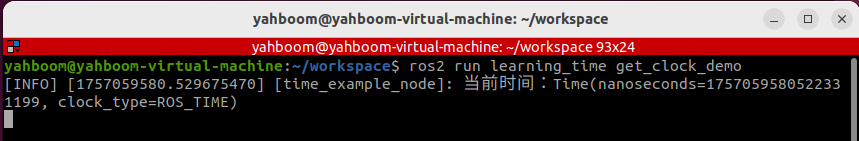

### 使用Duration计算时间间隔

Time 与 Duration

- **`Time`**类在ros中用于表示一个具体的**时间点**（如 "2023-10-01 12:00:00"），通常用于标记事件发生的**时刻**。
- **`Duration`**类表示两个时间点之间的**间隔**（如 "5 秒"），用于计算时间差或延迟。
- **示例：**Time 以及 Duration 应用
- 创建一个新的程序文件TimeDuration_demo.py

```
import rclpy
from rclpy.time import Time
from rclpy.duration import Duration

def main():
    rclpy.init()
    node = rclpy.create_node("time_opt_node")
   
    #time类的使用方法，创建‘时间点、时刻’
    time1 = Time(seconds=10)
    time2 = Time(seconds=4)
    #Duration类使用方法，创建‘持续时间、一段时间’
    duration1 = Duration(seconds=3)
    duration2 = Duration(seconds=5)
          
    # 时刻可以进行比较
    node.get_logger().info("time1 >= time2 ? %d" % (time1 >= time2))
    node.get_logger().info("time1 < time2 ? %d" % (time1 < time2))
    
    # 时间段与时刻可以数学运算
    t3 = time1 + duration1
    t4 = time1 - time2    
    t5 = time1 - duration1

    node.get_logger().info("t3 = %d" % t3.nanoseconds)
    node.get_logger().info("t4 = %d" % t4.nanoseconds)
    node.get_logger().info("t5 = %d" % t5.nanoseconds)

    # 时间段可以进行比较
    node.get_logger().info("-" * 80)
    node.get_logger().info("duration1 >= duration2 ? %d" % (duration1 >= duration2))
    node.get_logger().info("duration1 < duration2 ? %d" % (duration1 < duration2))

    rclpy.shutdown()

if __name__ == "__main__":
    main()
```

- 配置对应的setup.py配置文件，在console_scripts中添加

```
'TimeDuration_demo=learning_time.TimeDuration_demo:main'
```

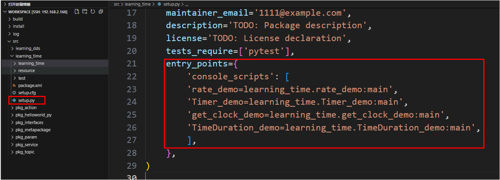

- 编译功能包

```
colcon build --packages-select learning_time
```

- 刷新工作空间环境并运行节点

```
 source ./install/setup.bash
ros2 run learning_time TimeDuration_demo
```

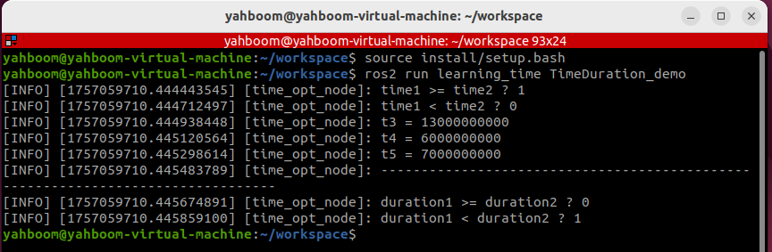

# ROS2常用命令工具

## ros2 pkg

### 快速创建功能包ros2 pkg create

功能：创建功能包，创建时候需要指定包名、编译方式、依赖项等。

格式：

```
ros2 pkg create <package_name> --build-type <build-type> --dependencies <dependencies>
```

ros2命令中：

- **pkg**：表示功能包相关的功能；
- **create**：表示创建功能包；
- **package_name**：必须项：新建功能包的名字；
- **build-type**：必须项：表示新创建的功能包是C++还是Python的，如果使用C++或者C，那这里就跟ament_cmake，如果使用Python，就跟ament_python；
- **dependencies**：可选项:表示功能包的依赖项，C++功能包需包含rclcpp，Python功能包需包含rclpy ,还有其它需要的依赖

### 查看所有功能包ros2 pkg list

功能：查看系统中功能包列表

格式：

```
ros2 pkg list
```

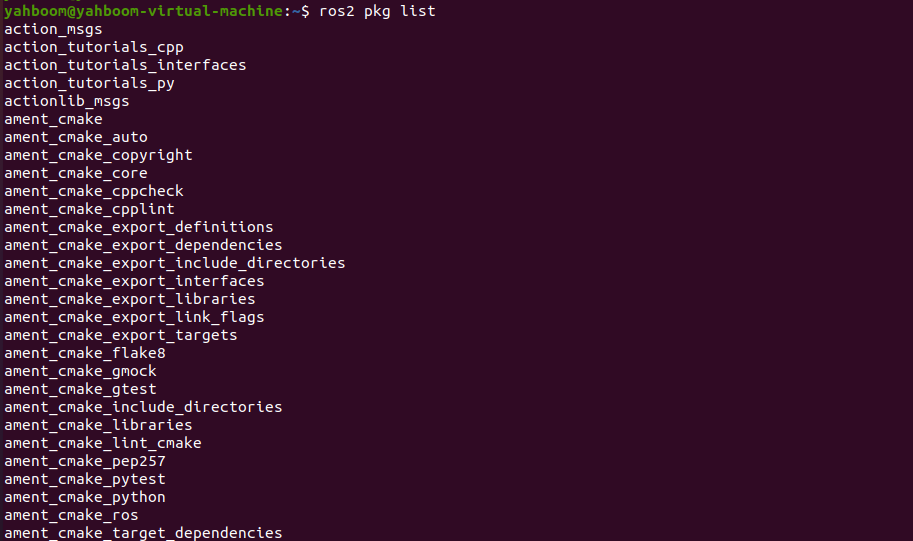

 

### 查看所有可执行文件ros2 pkg executeables

功能：查看某个包内所有可执行文件

格式： 

```
ros2 pkg executables pkg_name
```

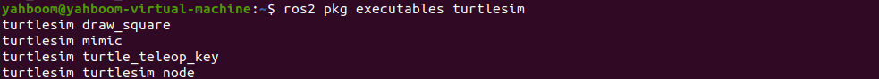

## 节点运行 ros2 run

功能：运行功能包节点程序

格式：

```
ros2 run pkg_name node_name
```

- pkg_name：功能包名字
- node_name：可执行程序的名字


 

## 节点相关工具 ros2 node

### 查看所有节点ros2 node list

功能： 罗列出所有在当前域内节点名称

格式：

```
 ros2 node list
```


### 查看节点信息ros2 node info

功能： 查看节点详细信息，包括订阅、发布的消息，开启的服务和动作等

格式：

```
ros2 node info node_name
```

- node_name：需要查看的节点名称


 

## 话题相关工具 ros2 topic

### 查看运行中的话题ros2 topic list

功能：罗列出当前域内的所有话题

格式：

```
ros2 topic list
```


 

### 查看话题信息ros2 topic info

功能：显示话题消息类型，订阅者/发布者数量

格式：

```
ros2 topic info topic_name
```

- topic_name：需要查询的话题的名字


 

### 查看话题类型ros2 topic type

功能：查看话题的消息类型

格式：

```
ros2 topic type topic_name
```

- topic_name：需要查询话题类型的名字


### 查看话题频率ros2 topic hz

功能：显示话题平均发布频率

格式：

```
ros2 topic hz topic_name
```

- topic_name：需要查询话题频率的名字


### 查看话题内容ros2 topic echo

功能：在终端打印话题消息，类似于一个订阅者

格式：ros2 topic echo topic_name

- topic_name：需要打印消息的话题的名字


### 手动发布一个话题ros2 topic pub

功能：在终端发布指定话题消息

格式：

```
ros2 topic pub topic_name message_type message_content
```

- topic_name：需要发布话题消息的话题的名字
- message_type：话题的数据类型
- message_content：消息内容

默认是以1Hz的频率循环发布，可以设置以下参数，

- 参数-1只发布一次，ros2 topic pub -1 topic_name message_type message_content
- 参数-t count循环发布count次结束，ros2 topic pub -t count topic_name message_type message_content
- 参数-r count以count Hz的频率循环发布，ros2 topic pub -r count topic_name message_type message_content

示例：

- 通过命令行发布速度指令
- 这里需要注意的是每个冒号后是有个空格，否则的话会提示格式错误

```
ros2 topic pub turtle1/cmd_vel geometry_msgs/msg/Twist "{linear: {x: 0.5, y: 0.0, z: 0.0}, angular: {x: 0.0, y: 0.0, z: 0.2}}"
```


 

## 接口相关工具ros2 interface

### 查看所有接口ros2 interface list

功能：罗列当前系统的所有接口，包括话题、服务、动作。

格式：

```
ros2 interface list
```


 

### 查看接口信息ros2 interface show

功能：显示指定接口的详细内容

格式：

```
ros2 interface show interface_name
```

- interface_name：需要显示的接口内容的名字


## 服务相关工具 ros2 service

### 查看所有服务ros2 service list

功能：罗列出当前域内所有的服务

格式：

```
ros2 interface show interface_name
```


### 手动调用服务ros2 service call

功能：调用指定服务

格式：

```
ros2 interface call service_name service_Type arguments
```

- service_name：需要调用的服务
- service_Type：服务数据类型
- arguments：提供服务需要的参数

例如，调用生成海龟服务

```
ros2 service call /spawn turtlesim/srv/Spawn "{x: 2, y: 2, theta: 0.2, name: 'turtle10'}"
```


# ROS2 Rviz2使用

## Rviz2简介

机器人开发过程中，各种各样的功能，如果我们只是从数据层面去做分析，很难快速理解数据的效果，比如机器人模型，我们需要知道自己设计的模型长啥样，还有模型内部众多坐标系在运动过程中都在哪些位置。

再比如机械臂运动规划和移动机器人自主导航，我们希望可以看到机器人周边的环境、规划的路径，当然还有传感器的信息，摄像头、三维相机、激光雷达等等，数据是用来做计算的，可视化的效果才是给人看的。

所以，数据可视化可以大大提高开发效率，Rviz2就是这样一款机器人开发过程中的数据可视化软件，机器人模型、传感器信息、环境信息等等，全都可以在这里搞定。

- 如果有实体机器人可以在机器人主控端启动rviz练习本节课程内容，如果没有实体机器人，我们可以通过gazebo仿真的方式启动turtlebot3仿真机器人，来模拟激光雷达、相机等话题，方便接下来的数据可视化

**注意：**以下的安装步骤非必须，如果手中有实体机器人，设置好多机通信之后可以直接使用实机的雷达信息，可以自行选择使用实机雷达或虚拟仿真机器人；以下内容适合没有实机的用户使用。

- 本节课程以仿真机器人为例，教学rviz2的可视化功能，不管是实机还是仿真机器人，rviz2的操作流程都是相同的。
- 安装tutlebot3模拟器功能包

```
sudo apt install ros-${ROS_DISTRO}-turtlebot3*
```

- 安装ros和gazebo桥接工具

```
sudo apt install ros-${ROS_DISTRO}-ros-gz
```

- 设置turtlebot3机器人类型环境变量

```
export TURTLEBOT3_MODEL=waffle
```

- 启动gazebo仿真环境

```
ros2 launch turtlebot3_gazebo turtlebot3_world.launch.py
```


## Rviz2使用教程

启动一个终端，使用如下命令即可启动：

```
rviz2
```

如果是在docker中启动，请务必确保已经开启了GUI显示。


### 图像数据可视化

在左侧Displays窗口中点击“Add”，找到Image显示项，OK确认后就可以加入显示列表啦，然后配置好该显示项订阅的图像话题，就可以顺利看到机器人的摄像头图像啦。


- 将`Fixed Frame`选择为`base_footprint`坐标系，放置坐标变换错误
- 选择相机彩色画面话题`/camera/image_raw`
- 此时我们可以看到Camera窗口中看到当前仿真机器人的视角画面


### 雷达数据可视化

在左侧Displays窗口中点击“Add”，选择Laserscan，然后配置订阅的话题名，此时就可以看到激光点啦


- `LaserScan`的`Topic`话题选择`/sacn`
- 此时我们就可以看到激光雷达的点云轮廓


### 机器人模型可视化

在左侧Displays窗口中点击“Add”，选择RobotModel


- 在机器人的`DescriptionTopic`选项中，选择话题`/robot_deseription`
- 此时我们就可以在Rviz2中看到机器人的可视化模型


# ROS2 Rqt工具箱

## Rqt简介

Rqt是ROS提供的另外一种模块化可视化工具，正如Rqt的命名，它和Rviz一样，也是基于QT可视化工具开发而来，在使用前，我们需要通过这样一句指令进行安装，然后就可以通过rqt这个命令启动使用了。

## Rqt使用教程

常用的`rqt`启动命令有：

- 方式1：`rqt`

- 方式2：`ros2 run rqt_gui rqt_gui`

### 插件使用

启动rqt之后，可以通过plugins添加所需的插件：

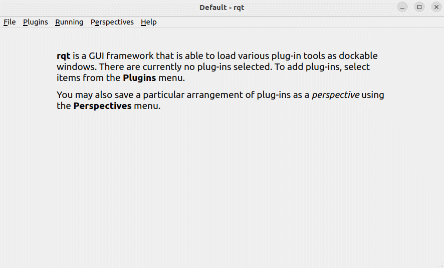

在plugins中包含了话题、服务、动作、参数、日志等等相关的插件，我们可以按需选用，方便的实现ROS2程序调试。使用示例如下。

#### topic 插件

添加topic插件并发送速度指令控制乌龟运动。

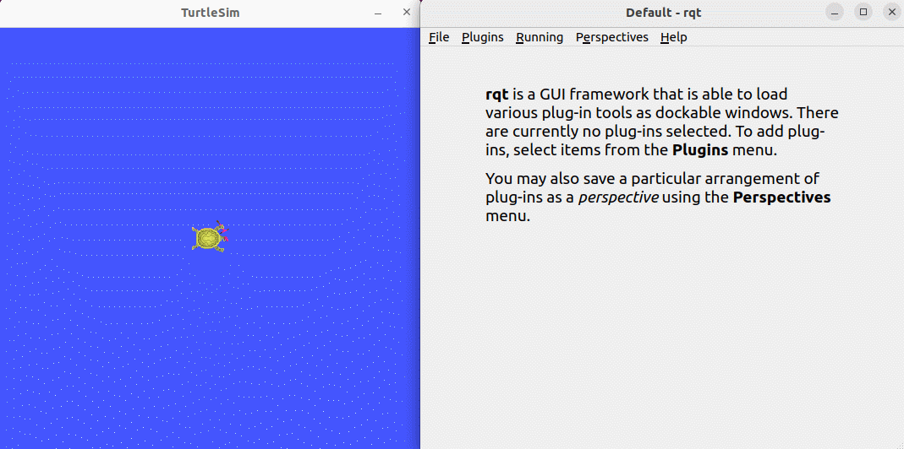

### service插件

添加 service 插件并发送请求，在制定位置生成一只乌龟。

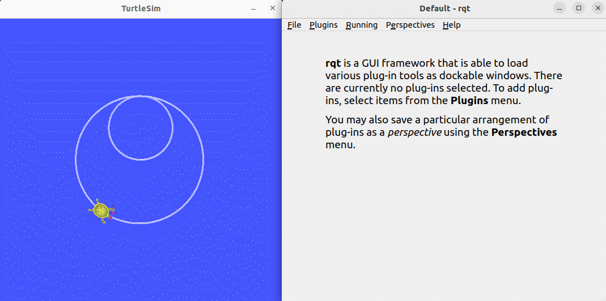

### 参数插件

通过参数插件动态修改乌龟窗体背景颜色。

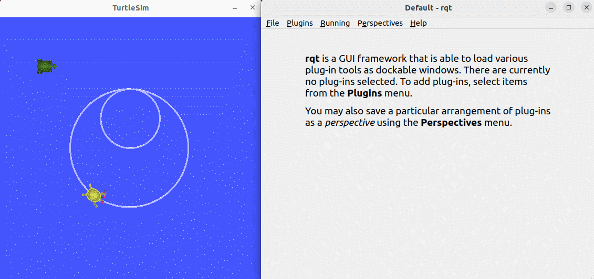

# ROS2录制回放工具

## 录制回放工具简介

ROS2中常用的录制回放工具——bag2，这个工具用于记录话题的数据。我们就可以使用这个指令将话题数据存储为文件 ，后续我们无需启动节点，直接可以将bag文件里的话题数据发布出来。

这个工具在我们做一个真实机器人的时候非常有用，比如我们可以录制一段机器人发生问题的话题数据，录制完成后可以多次发布出来进行测试和实验，也可以将话题数据分享给别人用于验证算法等。

我们尝试使用bag工具来记录话题数据，并二次重放。 

## 使用教程

- 启动要录制的话题节点

如ros2 demo中的talker：

```
ros2 run demo_nodes_py talker
```

- 记录

`/topic-name` 为话题名字

```
# 记录单个话题
ros2 bag record /topic-name
# 记录多个话题
ros2 bag record topic-name1 topic-name2
# 记录所有话题
ros2 bag record -a
```

其它选项

-o name 自定义输出文件的名字

```
ros2 bag record -o file-name topic-name
```

-s 存储格式

目前仅支持sqllite3,其他还带拓展

- 查看录制出话题的信息

我们在播放一个视频前，可以通过文件信息查看视频的相关信息，比如话题记录的时间，大小，类型，数量

```
# 假设录制的file为rosbag2_2023_10_31-07_58_23
ros2 bag info rosbag2_2023_10_31-07_58_23
```

- 播放

接着我们就可以重新播放数据，使用下面的指令可以播放数据

```
ros2 bag play rosbag2_2023_10_31-07_58_23
```

- 查看

使用ros2的topic的指令来查看数据

```
ros2 topic echo /chatter
```

播放选项

1、倍速播放 -r

-r选项可以修改播放速率，比如 -r 值，比如 -r 10,就是10倍速，十倍速播放话题

```
ros2 bag play rosbag2_2023_10_31-07_58_23 -r 10
```

2、循环播放 -l

单曲循环就是它了

```
ros2 bag play rosbag2_2023_10_31-07_58_23 -l
```

3、播放单个话题

```
ros2 bag play rosbag2_2023_10_31-07_58_23 --topics /chatter
```

##  示例

- 运行talker节点

```
ros2 run demo_nodes_py talker
```

- 录制

```
# 记录所有话题
ros2 bag record -a
```

 

如何停止录制呢？我们直接在终端中使用`Ctrl+C`指令打断录制即可

接着你会在终端中发现多处一个文件夹，名字叫做`rosbag2_2023_10_31-08_21_21`

打开文件夹，可以看到内容


这样我们就完成了录制。

- 播放并查看，这里我们循环播放

```
ros2 bag play rosbag2_2023_10_31-07_58_23 -l  
```

开启另一个终端查看topic：

```
ros2 topic echo /chatter
```


# ROS2 URDF模型

## URDF简介

ROS中的建模方法叫做URDF，全称是统一机器人描述格式，不仅可以清晰描述机器人自身的模型，还可以描述机器人的外部环境。URDF模型文件使用的是XML格式。

solidworks模型转URDF插件：[sw_urdf_exporter - ROS Wiki](https://wiki.ros.org/sw_urdf_exporter)

- 机器人的组成

建模描述机器人的过程中，我们自己需要先熟悉机器人的组成和参数，比如机器人一般是由**硬件结构、驱动系统、传感器系统、控制系统**四大部分组成，市面上一些常见的机器人，无论是移动机器人还是机械臂，我们都可以按照这四大组成部分进行分解。


- 硬件结构就是底盘、外壳、电机等实打实可以看到的设备；
- 驱动系统就是可以驱使这些设备正常使用的装置，比如电机的驱动器，电源管理系统等；
- 传感系统包括电机上的编码器、板载的IMU、安装的摄像头、雷达等等，便于机器人感知自己的状态和外部的环境；
- 控制系统就是我们开发过程的主要载体了，一般是树莓派、电脑等计算平台，以及里边的操作系统和应用软件。

机器人建模的过程，其实就是按照类似的思路，通过建模语言，把机器人每一个部分都描述清楚，再组合起来的过程。

## URDF语法

### 连杆Link的描述

标签用来描述机器人某个刚体部分的外观和物理属性，外观包括尺寸、颜色、形状，物理属性包括质量、惯性矩阵、碰撞参数等。


以这个机械臂连杆为例，它的link描述如下：


link标签中的name表示该连杆的名称，我们可以自定义，未来joint连接link的时候，会使用到这个名称。

link里边的部分用来描述机器人的外观，比如：

- 表示几何形状，里边使用调用了一个在三维软件中提前设计好的蓝色外观，就是这个stl文件，看上去和真实机器人是一致的
- 表示坐标系相对初始位置的偏移，分别是x、y、z方向上的平移，和roll、pitch、raw旋转，不需要偏移的话，就全为0。

第二个部分，描述碰撞参数，里边的内容似乎和一样，也有和，看似相同，其实区别还是比较大的。

- 部分重在描述机器人看上去的状态，也就是视觉效果；
- 部分则是描述机器人运动过程中的状态，比如机器人与外界如何接触算作碰撞。

在这个机器人模型中，蓝色部分是通过来描述的，在实际控制过程中，这样复杂的外观在计算碰撞检测时，要求的算力较高，为了简化计算，我们将碰撞检测用的模型简化为了绿色框的圆柱体，也就是里边描述的形状。坐标系偏移也是类似，可以描述刚体质心的偏移。


如果是移动机器人的话，link也可以用来描述小车的车体、轮子等部分。

### 关节Joint描述

机器人模型中的刚体最终要通过关节joint连接之后，才能产生相对运动。

URDF中的关节有六种运动类型。


1. continuous，描述旋转运动，可以围绕某一个轴无限旋转，比如小车的轮子，就属于这种类型。
2. revolute，也是旋转关节，和continuous类型的区别在于不能无限旋转，而是带有角度限制，比如机械臂的两个连杆，就属于这种运动。
3. prismatic，是滑动关节，可以沿某一个轴平移，也带有位置的极限，一般直线电机就是这种运动方式。
4. fixed，固定关节，是唯一一种不允许运动的关节，不过使用还是比较频繁的，比如相机这个连杆，安装在机器人上，相对位置是不会变化的，此时使用的连接方式就是Fixed。
5. Floating是浮动关节，第六种planar是平面关节，这两种使用相对较少。


在URDF模型中，每一个link都使用这样一段xml内容描述，比如关节的名字叫什么，运动类型是哪一种。


- parent标签：描述父连杆；
- child标签：描述子连杆，子连杆会相对父连杆发生运动；
- origin：表示两个连杆坐标系之间的关系，也就是图中红色的向量，可以理解为这两个连杆该如何安装到一起；
- axis表示关节运动轴的单位向量，比如z等于1，就表示这个旋转运动是围绕z轴的正方向进行的；
- limit就表示运动的一些限制了，比如最小位置，最大位置，和最大速度等。

### 完整机器人模型


最终所有的link和joint标签完成了对机器人每个部分的描述和组合，全都放在一个robot标签中，就形成了完整的机器人模型。


所以大家在看某一个URDF模型时，先不着急看每一块代码的细节，先来找link和joint，看下这个机器人是由哪些部分组成的，了解完全局之后，再看细节。 

### 创建机器人模型

以muto的模型为例，将本节教程文件夹中的`yahboomcar_description`功能包复制到工作空间的src目录下：


- urdf：存放机器人模型的URDF或xacro文件
- meshes：放置URDF中引用的模型渲染文件
- launch：保存相关启动文件
- rviz：保存rviz的配置文件

之后编译功能包

```
colcon build --packages-select yahboomcar_description
```

### 模型可视化效果

- 刷新环境变量，然后运行启动命令

```
ros2 launch yahboomcar_description display.launch.py
```

之后会自动启动rviz，并显示机器人模型：


#  ROS2 Gazebo仿真平台

 

## Gazebo简介

Gazebo是ROS系统中最为常用的**三维物理仿真平台**，支持动力学引擎，可以实现高质量的图形渲染，不仅可以模拟机器人及周边环境，还可以加入摩擦力、弹性系数等物理属性。

比如我们要开发一个火星车，那就可以在Gazebo中模拟火星表面的环境，再比如我们做无人机，续航和限飞都导致我们没有办法频繁用实物做实验，此时不妨使用Gazebo先做仿真，等算法开发的差不多了，再部署到实物上来运行。

所以类似Gazebo这样的仿真平台，可以帮助我们验证机器人算法、优化机器人设计、测试机器人场景应用，为机器人开发提供更多可能。

**注意：本章节只做了解学习，教程中并未配置该环境，因为这边直接用的真机调试**

## 安装运行

- 通过命令apt进行安装gazebo

```
sudo apt install ros-${ROS_DISTRO}-gazebo-*
```

- 运行gazebo
- 通过以下命令启动或直接通过桌面图标启动

```
gazebo --verbose -s libgazebo_ros_init.so -s libgazebo_ros_factory.so 
```

运行之后可以看到如下页面：


- 可选项：为保证模型顺利加载，可以将请将离线模型下载并放置到~/.gazebo/models路径下，下载链接如下：https://github.com/osrf/gazebo_models

### gazebo启动节点与服务

1、查看节点

```
ros2 node list
```


正确返回：/gazebo 2、查看节点的对外提供的服务：

```
ros2 service list
```

可以看出如下的结果：


出去最后几个常规的服务，我们只注意前三个特殊的服务：

- /spawn_entity，用于加载模型到gazebo中
- /get_model_list，用于获取模型列表
- /delete_entity，用于删除gazbeo中已经加载的模型

### 创建功能包

- 创建一个myrobot功能包，用来存放我们的URDF模型文件和启动文件

```
ros2 pkg create myrobot --build-type ament_cmake
```

- 进入到myrobot的目录下，创建launch、urdf文件夹，在urdf文件夹下创建一个demo01_base.urdf文件，这个文件就是一个简单的演示文件，只有一个基础的立方体。

```
<robot name="myrobot">
    <link name="base_link">
        <visual>
            <geometry>
                <box size="0.2 0.2 0.2"/>
            </geometry>
            <origin xyz="0.0 0.0 0.0"/>
        </visual>
        <collision>
            <geometry>
                <box size="0.2 0.2 0.2"/>
            </geometry>
            <origin xyz="0.0 0.0 0.0"/>
        </collision>
        <inertial>
            <mass value="0.1"/>
            <inertia ixx="0.000190416666667" ixy="0" ixz="0" iyy="0.0001904" iyz="0" izz="0.00036"/>
        </inertial>
    </link>
    <gazebo reference="base_link">
        <material>Gazebo/Red</material>
    </gazebo>
</robot>
```

### 编写launch启动文件

launch文件的编写，launch文件主要启动两个部分，启动Gazebo文件，然后将机器人模型加载到Gazebo中。

```
start_gazebo_cmd =  ExecuteProcess(
        cmd=['gazebo', '--verbose','-s', 'libgazebo_ros_init.so', '-s', 'libgazebo_ros_factory.so'],
        output='screen')
```

这个命令就是启动Gazebo的，就是一个启动命令，并没有特别复杂的地方，下面是加载模型的命令：

```
 spawn_entity_cmd = Node(
        package='gazebo_ros', 
        executable='spawn_entity.py',
        arguments=['-entity', robot_name_in_model,  '-file', urdf_model_path ], output='screen')
```

这个命令注意后面两个参数-entity是模型文件中的名字，-file是通过urdf文件加载参数，后面我们还可以看到通过topic话题加载模型的。在launch目录下新建一个bringup_model.launch.py文件完整的启动文件如下：

```
import os
from launch import LaunchDescription
from launch.actions import ExecuteProcess
from launch_ros.actions import Node
from launch_ros.substitutions import FindPackageShare
from launch_ros.parameter_descriptions import ParameterValue
from launch.substitutions import Command

def generate_launch_description():
    robot_name_in_model = 'myrobot'
    package_name = 'myrobot'
    urdf_name = "demo01_base.urdf"
   
    ld = LaunchDescription()
    pkg_share = FindPackageShare(package=package_name).find(package_name) 
    urdf_model_path = os.path.join(pkg_share, f'urdf/{urdf_name}')
   
    # Start Gazebo server
    start_gazebo_cmd =  ExecuteProcess(
        cmd=['gazebo', '--verbose','-s', 'libgazebo_ros_init.so', '-s', 'libgazebo_ros_factory.so'],
        output='screen')

    # Launch the robot
    spawn_entity_cmd = Node(
        package='gazebo_ros', 
        executable='spawn_entity.py',
        arguments=['-entity', robot_name_in_model,  '-file', urdf_model_path ], output='screen')

    ld.add_action(start_gazebo_cmd)
    ld.add_action(spawn_entity_cmd)

    return ld

```

- 在Cmakelist中填入以下内容，用于将我们的urdf和launch文件夹安装进install目录下

```
install(
    DIRECTORY urdf launch
    DESTINATION share/${PROJECT_NAME}
)
```

- 之后编译运行功能包

```
colcon build --packages-select myrobot
```

- 刷新环境变量然后运行launch启动文件

```
ros2 launch myrobot bringup_model.launch.py
```


 

启动之后可以看到如下的Gazebo模型：


可以看到红色的模型，因为最后加上了Gazebo的标签设置。