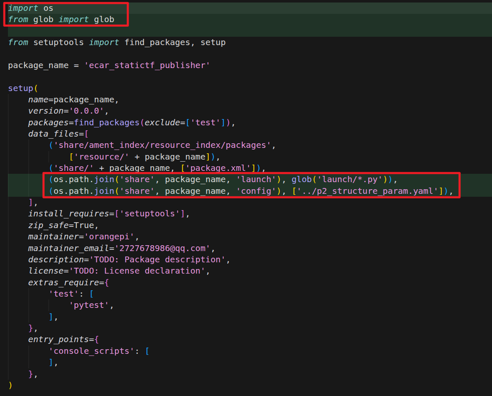
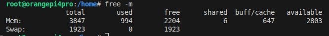
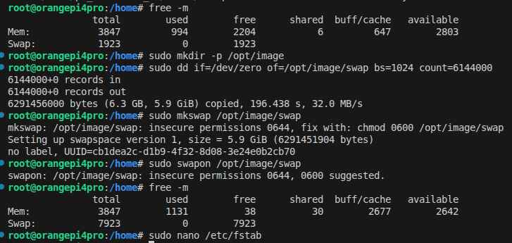

# ROS2笔记

## 参考

[动手学ROS2](https://fishros.com/d2lros2/#/)

## 常用代码

### 创建功能包

```bash
ros2 pkg create Superpi_p2_ecar --build-type ament_cmake
ros2 pkg create run_algorithm_application --build-type ament_python --dependencies rclpy
ros2 pkg create run_driver_application --build-type ament_python --dependencies rclpy
ros2 pkg create underboard_communication --build-type ament_python --dependencies rclpy
ros2 pkg create motorcontroller --build-type ament_python --dependencies rclpy
ros2 pkg create motorvel --build-type ament_cmake
ros2 pkg create remote_app_msgs --build-type ament_cmake
ros2 pkg create basicmsgs --build-type ament_cmake
```

### ROS构建与清除

```bash
rm -rf build/ install/ log/ #清空原先编译的环境
colcon build  #可以通过添加参数来设置构建顺序和个别构建
source install/setup.bash
ros2 run facereco_python_service run_facereco_python_main
```

自动设置source install/setup.bash

在 `~/.bashrc` 末尾添加一行，**建议先判断文件是否存在**，避免移动或删除工作空间后终端报错：

```bash
echo 'if [ -f ~/Desktop/superpi_autodriver/install/setup.bash ]; then source ~/Desktop/superpi_autodriver/install/setup.bash; fi' >> ~/.bashrc
source ~/.bashrc
```

### 显示运行信息

```bash
source install/setup.bash
```

| 类别                     | 命令                                                                | 说明                                                        | 常用选项/示例                                                  |
| ------------------------ | ------------------------------------------------------------------- | ----------------------------------------------------------- | -------------------------------------------------------------- |
| **节点 (Node)**          | `ros2 node list`                                                    | 列出所有运行中的节点                                        |                                                                |
|                          | `ros2 node info <node_name>`                                        | 显示节点的详细信息（订阅/发布/服务/动作）                   | 示例：`ros2 node info /turtlesim`                              |
|                          | inf`ros2 node list -s`                                              | 仅显示节点名称（无额外信息）                                | ROS2 中通常直接用 `list`，`-s` 在部分发行版中无效              |
| **话题 (Topic)**         | `ros2 topic list`                                                   | 列出所有活动的话题                                          |                                                                |
|                          | `ros2 topic list -t`                                                | 列出话题及其消息类型                                        |                                                                |
|                          | `ros2 topic info <topic_name>`                                      | 查看话题的发布者、订阅者数量及消息类型                      |                                                                |
|                          | `ros2 topic echo <topic_name>`<br/>ros2 topic echo /imu/data --once | 实时打印话题上的消息内容                                    | 可添加 `--once` 仅输出一次，`--csv` 输出为 CSV 格式            |
|                          | `ros2 topic find <type_name>`                                       | 查找使用特定消息类型的所有话题                              | 示例：`ros2 topic find geometry_msgs/msg/Twist`                |
|                          | `ros2 topic hz <topic_name>`                                        | 显示话题的发布频率                                          | 用于性能分析                                                   |
|                          | `ros2 topic bw <topic_name>`                                        | 显示话题的带宽使用情况                                      | 需要安装 `ros-<distro>-topic-monitor`                          |
|                          | `ros2 topic delay <topic_name>`                                     | 显示消息从发布到接收的延迟                                  | 需要安装 `ros-<distro>-topic-monitor`                          |
| **服务 (Service)**       | `ros2 service list`                                                 | 列出所有可用的服务                                          |                                                                |
|                          | `ros2 service list -t`                                              | 列出服务及其服务类型                                        |                                                                |
|                          | `ros2 service type <service_name>`                                  | 查看指定服务的类型                                          |                                                                |
|                          | `ros2 service find <type_name>`                                     | 查找使用特定服务类型的所有服务                              | 示例：`ros2 service find std_srvs/srv/Empty`                   |
|                          | `ros2 service info <service_name>`                                  | 显示服务的服务端和客户端信息（需要 ROS2 版本支持）          | 部分发行版中可能不可用                                         |
| **动作 (Action)**        | `ros2 action list`                                                  | 列出所有可用的动作                                          |                                                                |
|                          | `ros2 action list -t`                                               | 列出动作及其动作类型                                        |                                                                |
|                          | `ros2 action info <action_name>`                                    | 显示动作的服务端和客户端信息                                |                                                                |
| **参数 (Parameter)**     | `ros2 param list`                                                   | 列出所有节点的参数                                          | 可加 `--param-type` 显示类型                                   |
|                          | `ros2 param get <node_name> <param_name>`                           | 获取指定参数的当前值                                        |                                                                |
|                          | `ros2 param describe <node_name> <param_name>`                      | 查看参数的描述、类型、默认值等信息                          |                                                                |
|                          | `ros2 param dump <node_name>`                                       | 将节点的所有参数导出为 YAML 文件                            | 示例：`ros2 param dump /turtlesim > params.yaml`               |
| **接口 (Interface)**     | `ros2 interface list`                                               | 列出所有已安装的消息/服务/动作类型                          | 输出数量较多，可配合 `grep` 使用                               |
|                          | `ros2 interface list -s`                                            | 仅列出服务类型                                              |                                                                |
|                          | `ros2 interface list -m`                                            | 仅列出消息类型                                              |                                                                |
|                          | `ros2 interface list -a`                                            | 仅列出动作类型                                              |                                                                |
|                          | `ros2 interface show <type_name>`                                   | 显示接口类型的详细定义                                      | 示例：`ros2 interface show geometry_msgs/msg/Twist`            |
|                          | `ros2 interface package <package_name>`                             | 列出某个包提供的所有接口                                    | 示例：`ros2 interface package geometry_msgs`                   |
|                          | `ros2 interface proto <type_name>`                                  | 显示接口的原始定义（.msg/.srv/.action 文件内容）            |                                                                |
| **日志 (Log)**           | `ros2 bag list`                                                     | 列出已记录的 bag 文件                                       | 需在 bag 文件所在目录或指定路径                                |
|                          | `ros2 bag info <bag_file>`                                          | 显示 bag 文件的元信息（话题、消息数量、时长等）             |                                                                |
|                          | `ros2 log list`                                                     | 列出所有可用的日志记录器                                    | 需要安装 `ros2run rqt_logger_level` 或直接查看节点日志         |
|                          | `ros2 log get <node_name>`                                          | 获取节点的日志级别                                          |                                                                |
| **包 (Package)**         | `ros2 pkg list`                                                     | 列出所有已安装的 ROS2 包                                    |                                                                |
|                          | `ros2 pkg executables <package_name>`                               | 列出某个包中的所有可执行文件                                |                                                                |
|                          | `ros2 pkg prefix <package_name>`                                    | 显示包的安装路径                                            |                                                                |
|                          | `ros2 pkg xml <package_name>`                                       | 打印包的 package.xml 内容                                   |                                                                |
| **启动 (Launch)**        | `ros2 launch -l` 或 `ros2 launch --list-packages`                   | 列出所有可用的 launch 文件（部分发行版支持）                | 示例：`ros2 launch --list-packages`                            |
|                          | `ros2 launch --show-arguments <launch_file>`                        | 显示 launch 文件可接受的参数                                | 示例：`ros2 launch --show-arguments turtlesim_mimic_launch.py` |
| **生命周期 (Lifecycle)** | `ros2 lifecycle list`                                               | 列出所有生命周期节点                                        |                                                                |
|                          | `ros2 lifecycle get <node_name>`                                    | 获取生命周期节点的当前状态                                  |                                                                |
|                          | `ros2 lifecycle get -a`                                             | 获取所有生命周期节点的状态                                  |                                                                |
| **图形化工具**           | `rqt_graph`                                                         | 可视化显示节点、话题、动作等通信关系                        | 可勾选“Debug”显示临时节点                                      |
|                          | `rqt`                                                               | 启动 rqt 图形界面，可加载各种插件（如节点监控、话题监控等） | 通过 `rqt` 后选择相应插件                                      |
|                          | `rqt_console`                                                       | 查看和过滤日志消息                                          |                                                                |
|                          | `rqt_topic`                                                         | 监控话题消息频率、类型等                                    |                                                                |
|                          | `rqt_service_caller`                                                | 查看并调用服务                                              |                                                                |
|                          | `rqt_action`                                                        | 查看并调用动作                                              |                                                                |
| **其他**                 | `ros2 run <pkg> <executable> -- --help`                             | 查看节点或可执行文件的帮助信息                              |                                                                |
|                          | `ros2 doctor`                                                       | 检查 ROS2 系统健康状态，诊断问题                            |                                                                |
|                          | `ros2 daemon status`                                                | 查看 ROS2 守护进程状态                                      |                                                                |
|                          | `ros2 security list`                                                | 列出启用了安全配置的节点（若启用安全）                      |                                                                |

确认坐标系信息：

```bash
ros2 topic echo /scan --once | grep frame_id
```

TF树

```bash
sudo apt install ros-humble-rqt-tf-tree
ros2 run rqt_tf_tree rqt_tf_tree
```

配置ROS_DOMAIN_ID

```bash
export ROS_DOMAIN_ID=0
```

```bash
echo 'export ROS_DOMAIN_ID=0' >> ~/.bashrc
source ~/.bashrc
```

查看坐标变换

```bash
ros2 run tf2_ros tf2_echo base_link laser_frame
```

查看所有usb

```bash
lsusb
ls /dev/ttyUSB*
ls /dev/ttyACM*
```

只编译一个包

```bash
colcon build --packages-select XXX
```

**清除“幽灵”节点**

```bash
ros2 node list | xargs -I {} ros2 node kill {}
```

执行如下，如果输出中 `Publisher count: 0`，说明它是一个没有发布者的“幽灵”话题，这几乎肯定是缓存问题。

```bash
ros2 topic info /map --verbose
```

**对于 Fast DDS**：最直接的清理方法是删除其缓存文件，执行：

```bash
rm -rf ~/.ros/fastdds_discovery_* ~/ros2_fastdds_cache/
```

## 常用功能

### 新建虚拟环境

参考：[ubuntu下使用Python虚拟环境编译ROS2](https://blog.csdn.net/A1127409282/article/details/156061728?ops_request_misc=elastic_search_misc&request_id=bb33153bc31c0d90c7b0dbf25ccdd3d9&biz_id=0&utm_medium=distribute.pc_search_result.none-task-blog-2~all~ElasticSearch~search_v2-4-156061728-null-null.142%5Ev102%5Epc_search_result_base2&utm_term=ros%E7%B3%BB%E7%BB%9F%E4%BD%BF%E7%94%A8python%E8%99%9A%E6%8B%9F%E7%8E%AF%E5%A2%83&spm=1018.2226.3001.4187)

```bash
sudo apt update
sudo apt install python3
sudo apt install python3-pip
```

安装虚拟环境并运行

```bash
#创建虚拟环境
python3 -m venv ros2_venv
#将虚拟环境放入启动脚本
echo export PATH="$HOME/ros2_venv/bin:$PATH" >> ~/.bashrc
# 激活虚拟环境
source ros2_venv/bin/activate
# 查看已安装包
pip list
# 查看已激活的虚拟环境和绝对路径（/home/xiaohuang/ros2_venv）
echo $VIRTUAL_ENV
```

进入虚拟环境，安装人脸识别库安装

```bash
pip3 install face_recognition -i https://pypi.tuna.tsinghua.edu.cn/simple
pip install opencv-python opencv-contrib-python -i https://pypi.tuna.tsinghua.edu.cn/simple
pip install numpy -i https://pypi.tuna.tsinghua.edu.cn/simple
pip install pillow -i https://pypi.tuna.tsinghua.edu.cn/simple
pip3 install setuptools -i https://pypi.tuna.tsinghua.edu.cn/simple
pip install empy -i https://pypi.tuna.tsinghua.edu.cn/simple
```

其他更重要的库（ROS2的必要依赖）

```bash
pip install \
    catkin-pkg \
    empy \
    lark \
    lark-parser \
    setuptools \
    pyyaml \
    ament-copyright \
    ament-flake8 \
    ament-pep257 \
    ament-xmllint
```

建立一个功能包，用于提供人脸识别的服务（在--dependencies中要添加facereco_interface）

```bash
ros2 pkg create facereco_python_service --build-type ament_python --dependencies rclpy facereco_interface --license Apache-2.0
```

在python功能包的setup.py中添加

```bash
options={
        'build_scripts':{
            'executable': "/home/xiaohuang/ros2_venv",  # 使用虚拟环境的Python
        }
    }
```

### python常用包

```bash
pip3 install face_recognition -i https://pypi.tuna.tsinghua.edu.cn/simple
pip install opencv-python opencv-contrib-python -i https://pypi.tuna.tsinghua.edu.cn/simple
pip install numpy -i https://pypi.tuna.tsinghua.edu.cn/simple
pip install pillow -i https://pypi.tuna.tsinghua.edu.cn/simple
pip3 install setuptools -i https://pypi.tuna.tsinghua.edu.cn/simple
pip3 install pyyaml -i https://pypi.tuna.tsinghua.edu.cn/simple
```

### 添加图片等资源

将要识别的图像放在resourse文件下，并在setup.py中添加

```python
('share/' + package_name+"/resource", ['resource/image.png']),
```

### 串口绑定

检查有多少个设备，ubuntu系统USB串口绑定/dev/ttyACM0 为under_control_serial

```bash
ls /dev/ttyUSB*
ls /dev/ttyACM*
#ls /sys/class/tty/ttyUSB* -l

sudo nano /etc/udev/rules.d/99-under-control-serial.rules
# 将特定USB串口设备绑定为under_control_serial
SUBSYSTEM=="tty", KERNEL=="ttyACM0", SYMLINK+="under_control_serial", GROUP="dialout", MODE="0666"
#保存规则文件后，需要重新加载udev规则使更改生效
sudo udevadm control --reload-rules
sudo udevadm trigger
#重新插入USB串口设备，然后检查是否成功创建了符号链接
ls -l /dev/under_control_serial
```

蓝海激光串口绑定

```bash
ls /dev/ttyUSB*
ls /dev/ttyACM*
#ls /sys/class/tty/ttyUSB* -l

udevadm info -a -n /dev/ttyUSB0 --query=all
#下面的参数根据上面的修改
SUBSYSTEM=="tty", ATTRS{idVendor}=="10c4", ATTRS{idProduct}=="ea60", ATTRS{serial}=="e4f768b87436ec11a93c9b75b659684c", SYMLINK+="bluesea_lidar"

sudo udevadm control --reload-rules
sudo udevadm trigger
```

下控绑定

```bash
SUBSYSTEM=="tty", ATTRS{idVendor}=="10c4", ATTRS{idProduct}=="ea60", ATTRS{serial}=="0001", SYMLINK+="underboard"

sudo cp /home/orangepi/Desktop/superpi_autodriver/udev/99-underboard-serial.rules /etc/udev/rules.d/
sudo udevadm control --reload-rules
sudo udevadm trigger
ls -l /dev/underboard
```

陀螺仪绑定

```bash
SUBSYSTEM=="tty", ATTRS{idVendor}=="10c4", ATTRS{idProduct}=="ea60", ATTRS{serial}=="0001", SYMLINK+="imu_usb"

sudo cp /home/orangepi/Desktop/superpi_autodriver/udev/99-underboard-serial.rules /etc/udev/rules.d/
sudo udevadm control --reload-rules
sudo udevadm trigger
ls -l /dev/underboard
```

### TF工具

先安装相应的功能包、tf海龟模拟器案例、tf树可视化工具

```bash
sudo apt install ros-${ROS_DISTRO}-turtle-tf2-py ros-humble-tf2-tools

sudo pip3 install transforms3d

sudo apt install ros-${ROS_DISTRO}-rqt-tf-tree
```

启动tf树工具

```bash
ros2 run rqt_tf_tree rqt_tf_tree
```

运行 view_frames 工具

```bash
ros2 run tf2_tools view_frames
```

实时显示tf树

```bash
ros2 run rqt_tf_tree rqt_tf_tree
```

### 启动PC显示数据ROS

```bash
# 在两台设备的终端中都要执行
export ROS_DOMAIN_ID=0
# 可以使用 echo 命令检查是否设置成功
echo $ROS_DOMAIN_ID
```

永久设置方法

```bash
# 使用 nano（简单易用）
nano ~/.bashrc
# ROS2 domain ID setting
export ROS_DOMAIN_ID=0
```

### 添加launch与yaml



```python
import os
from glob import glob
```

```python
(os.path.join('share', package_name, 'launch'), glob('launch/*.py')),
(os.path.join('share', package_name, 'config'), ['../p2_structure_param.yaml']),
```

### 包记录

记录所有话题

```bash
ros2 bag record -a
```

记录指定话题

```bash
ros2 bag record /topic1 /topic2 /topic3
```

指定路径

```bash
ros2 bag record -o src/part4_application/bags/posenav_task /under_control_data /smart_board_control /cartonav2_followcontroller/debug
```

查看

启动

```bash
ros2 run plotjuggler plotjuggler
```

### 地图相关处理

#### 地图保存

```bash
#!/usr/bin/env python3
import rclpy
from rclpy.node import Node
from nav_msgs.msg import OccupancyGrid
import cv2
import numpy as np
import yaml
import sys

class MapSaver(Node):
    def __init__(self, filename):
        super().__init__('map_saver_custom')
        self.filename = filename
        self.received = False

        # 定义与 hector_mapping 完全匹配的 QoS
        qos = rclpy.qos.QoSProfile(
            reliability=rclpy.qos.ReliabilityPolicy.RELIABLE,
            durability=rclpy.qos.DurabilityPolicy.VOLATILE,
            history=rclpy.qos.HistoryPolicy.KEEP_LAST,
            depth=1
        )

        self.sub = self.create_subscription(OccupancyGrid, '/map', self.callback, qos)
        self.get_logger().info('等待地图消息 (/map) ...')

    def callback(self, msg):
        if self.received:
            return
        self.received = True
        self.get_logger().info('已收到地图，正在保存...')

        # 解析地图数据
        width = msg.info.width
        height = msg.info.height
        resolution = msg.info.resolution
        origin = msg.info.origin
        data = np.array(msg.data, dtype=np.int8).reshape((height, width))

        # 转换为图像 (ROS OccupancyGrid: 0=空闲, 100=占用, -1=未知)
        img = np.zeros((height, width), dtype=np.uint8)
        img[data == 0] = 255      # 空闲 -> 白色
        img[data == 100] = 0      # 占用 -> 黑色
        img[data == -1] = 128     # 未知 -> 灰色

        pgm_path = self.filename + '.pgm'
        cv2.imwrite(pgm_path, img)

        # 保存 YAML 元数据
        yaml_data = {
            'image': pgm_path,
            'resolution': resolution,
            'origin': [origin.position.x, origin.position.y, origin.position.z],
            'negate': 0,
            'occupied_thresh': 0.65,
            'free_thresh': 0.25
        }
        yaml_path = self.filename + '.yaml'
        with open(yaml_path, 'w') as f:
            yaml.dump(yaml_data, f, default_flow_style=False)

        self.get_logger().info(f'地图已保存为: {pgm_path} 和 {yaml_path}')
        rclpy.shutdown()

def main(args=None):
    rclpy.init(args=args)
    if len(sys.argv) < 2:
        print('用法: python3 save_map.py <地图文件名前缀>')
        print('示例: python3 save_map.py p2_map_ed1')
        return
    filename = sys.argv[1]
    node = MapSaver(filename)
    rclpy.spin(node)

if __name__ == '__main__':
    main()
```

执行

```bash
python3 save_maps.py superpi_map1
```

#### 官方地图保存

```bash
ros2 run nav2_map_server map_saver_cli -f ref_map
```

#### 加载地图

进入：part4_application/maps，启动map_server

```bash
ros2 run nav2_map_server map_server --ros-args -p yaml_filename:=ref_map.yaml
```

打开一个新终端，进入地图文件所在的目录（或使用绝对路径），运行：

```bash
ros2 lifecycle set /map_server configure
ros2 lifecycle set /map_server activate
```

## 常用功能包

#### CH343一拖四模块

##### Orangepi驱动安装

##### 一拖四功能包安装

```bash
ros2 pkg create ch343_parser --build-type ament_python --dependencies rclpy std_msgs
```

解析数据

```bash
#!/usr/bin/env python3

# 用于解析ch343的数据
# 该模块是四个串口转usb的模块，编号0-3,0为和小车下控通信的模块

#!/usr/bin/env python3

import rclpy
from rclpy.node import Node
from std_msgs.msg import String
import serial
import struct
import array

# 导入自定义消息
from basic_selfmsgs.msg import SmartBoardData, UnderControlData

# ---------- CRC 表格（与 C 代码完全一致）----------
CRC_TABLE = [
    0x00, 0x9b, 0xad, 0x36, 0xc1, 0x5a, 0x6c, 0xf7,
    0x19, 0x82, 0xb4, 0x2f, 0xd8, 0x43, 0x75, 0xee,
    0x32, 0xa9, 0x9f, 0x04, 0xf3, 0x68, 0x5e, 0xc5,
    0x2b, 0xb0, 0x86, 0x1d, 0xea, 0x71, 0x47, 0xdc,
    0x64, 0xff, 0xc9, 0x52, 0xa5, 0x3e, 0x08, 0x93,
    0x7d, 0xe6, 0xd0, 0x4b, 0xbc, 0x27, 0x11, 0x8a,
    0x56, 0xcd, 0xfb, 0x60, 0x97, 0x0c, 0x3a, 0xa1,
    0x4f, 0xd4, 0xe2, 0x79, 0x8e, 0x15, 0x23, 0xb8,
    0xc8, 0x53, 0x65, 0xfe, 0x09, 0x92, 0xa4, 0x3f,
    0xd1, 0x4a, 0x7c, 0xe7, 0x10, 0x8b, 0xbd, 0x26,
    0xfa, 0x61, 0x57, 0xcc, 0x3b, 0xa0, 0x96, 0x0d,
    0xe3, 0x78, 0x4e, 0xd5, 0x22, 0xb9, 0x8f, 0x14,
    0xac, 0x37, 0x01, 0x9a, 0x6d, 0xf6, 0xc0, 0x5b,
    0xb5, 0x2e, 0x18, 0x83, 0x74, 0xef, 0xd9, 0x42,
    0x9e, 0x05, 0x33, 0xa8, 0x5f, 0xc4, 0xf2, 0x69,
    0x87, 0x1c, 0x2a, 0xb1, 0x46, 0xdd, 0xeb, 0x70,
    0x0b, 0x90, 0xa6, 0x3d, 0xca, 0x51, 0x67, 0xfc,
    0x12, 0x89, 0xbf, 0x24, 0xd3, 0x48, 0x7e, 0xe5,
    0x39, 0xa2, 0x94, 0x0f, 0xf8, 0x63, 0x55, 0xce,
    0x20, 0xbb, 0x8d, 0x16, 0xe1, 0x7a, 0x4c, 0xd7,
    0x6f, 0xf4, 0xc2, 0x59, 0xae, 0x35, 0x03, 0x98,
    0x76, 0xed, 0xdb, 0x40, 0xb7, 0x2c, 0x1a, 0x81,
    0x5d, 0xc6, 0xf0, 0x6b, 0x9c, 0x07, 0x31, 0xaa,
    0x44, 0xdf, 0xe9, 0x72, 0x85, 0x1e, 0x28, 0xb3,
    0xc3, 0x58, 0x6e, 0xf5, 0x02, 0x99, 0xaf, 0x34,
    0xda, 0x41, 0x77, 0xec, 0x1b, 0x80, 0xb6, 0x2d,
    0xf1, 0x6a, 0x5c, 0xc7, 0x30, 0xab, 0x9d, 0x06,
    0xe8, 0x73, 0x45, 0xde, 0x29, 0xb2, 0x84, 0x1f,
    0xa7, 0x3c, 0x0a, 0x91, 0x66, 0xfd, 0xcb, 0x50,
    0xbe, 0x25, 0x13, 0x88, 0x7f, 0xe4, 0xd2, 0x49,
    0x95, 0x0e, 0x38, 0xa3, 0x54, 0xcf, 0xf9, 0x62,
    0x8c, 0x17, 0x21, 0xba, 0x4d, 0xd6, 0xe0, 0x7b
]

def calc_crc(data: bytes) -> int:
    """
    计算给定数据的 CRC 校验码（与 C 代码完全一致）
    data: 要计算 CRC 的字节数组
    """
    crc = 0
    for byte in data:
        crc = CRC_TABLE[byte ^ crc]
    return crc

def encode_smart_board_data(y_ad: int, x_ad: int) -> bytes:
    """编码摇杆数据为 0xEA 帧（16 字节）"""
    y_ad = max(-1023, min(1023, y_ad))
    x_ad = max(-1023, min(1023, x_ad))
    frame = bytearray(16)
    frame[0] = 0x3A
    frame[1] = 0xEA
    frame[2] = 16
    frame[3] = y_ad & 0xFF
    frame[4] = (y_ad >> 8) & 0xFF
    frame[5] = x_ad & 0xFF
    frame[6] = (x_ad >> 8) & 0xFF
    # 7-14 保留为0
    crc = calc_crc(frame[:15])
    frame[15] = crc
    return bytes(frame)

class CH343Parser(Node):
    def __init__(self):
        super().__init__('ch343_parser')

        # 参数声明
        self.declare_parameter('port', '/dev/ttyACM0')  # 使用第一个串口转USB模块
        self.declare_parameter('baudrate', 9600)
        self.declare_parameter('timeout', 1.0)

        port = self.get_parameter('port').get_parameter_value().string_value
        baudrate = self.get_parameter('baudrate').get_parameter_value().integer_value
        timeout = self.get_parameter('timeout').get_parameter_value().double_value

        # 打开串口
        try:
            self.ser = serial.Serial(
                port=port,
                baudrate=baudrate,
                timeout=timeout,
                parity=serial.PARITY_NONE,
                stopbits=serial.STOPBITS_ONE,
                bytesize=serial.EIGHTBITS
            )
            self.get_logger().info(f"Opened serial port {port} at {baudrate} baud")
        except Exception as e:
            self.get_logger().error(f"Failed to open serial port: {e}")
            return

        # 创建发布者
        self.smart_board_pub = self.create_publisher(SmartBoardData, '/smart_board_data', 10)
        self.under_control_pub = self.create_publisher(UnderControlData, '/under_control_data', 10)

        # 数据缓冲区（字节数组）
        self.buffer = bytearray()

        # 定时器（每 10ms 检查一次，可根据需要调整）
        self.timer = self.create_timer(0.001, self.timer_callback)

    def timer_callback(self):
        """定时读取串口数据并解析帧"""
        if not self.ser or not self.ser.is_open:
            return

        # 读取所有可用数据
        try:
            raw = self.ser.read(self.ser.in_waiting or 1)
            if raw:
                self.buffer.extend(raw)
        except Exception as e:
            self.get_logger().error(f"Read error: {e}")
            return

        # 处理缓冲区中的完整帧
        self.process_buffer()

    def process_buffer(self):
        """从缓冲区中提取并解析帧"""
        while len(self.buffer) > 0:
            # 查找帧头 0x3A
            header_idx = self.buffer.find(b'\x3A')
            if header_idx == -1:
                # 没有帧头，等待积累更多数据
                break

            # 移除帧头之前的数据
            if header_idx > 0:
                self.buffer = self.buffer[header_idx:]
                header_idx = 0

            # 至少需要 2 个字节（帧头和命令）才能确定帧长
            if len(self.buffer) < 2:
                break

            cmd = self.buffer[1]
            # 根据命令确定帧长（不包括帧头？注意：C代码中帧长字段包含所有字节）
            # 帧格式：帧头(1) + 命令(1) + 帧长(1) + 数据 + CRC(1)
            # 帧长字段表示整个帧的长度（包括帧头、命令、帧长本身、数据、CRC）
            # 所以我们需要根据帧长字段来获取完整帧。
            # 但需要先有帧长字段，即 buffer 中至少要有 3 个字节。
            if len(self.buffer) < 3:
                break

            frame_len = self.buffer[2]   # 帧长
            #显示收到的数据buffer帧长,并显示在命令行，以便调试
            self.get_logger().info(f"帧长: {len(self.buffer)}, 规定: {frame_len}")
            if len(self.buffer) < frame_len:
                break   # 数据不足，等待更多数据

            # 取出一帧
            frame = self.buffer[:frame_len]
            self.buffer = self.buffer[frame_len:]

            # 校验 CRC（前 frame_len-1 个字节的 CRC 应该等于最后一个字节）
            crc_calc = calc_crc(frame[:-1])
            if crc_calc != frame[-1]:
                self.get_logger().warn(f"CRC mismatch: calculated {crc_calc:02x}, received {frame[-1]:02x}")
                continue

            if cmd == 0xEB:   # 下控发送的数据（电机转速+版本）
                # 帧结构：帧头(1)+命令(1)+帧长(1)+左电机低(1)+左电机高(1)+右电机低(1)+右电机高(1)+保留(16)+版本低(1)+版本高(1)+CRC(1)
                # 总长 29 字节
                if frame_len != 29:
                    self.get_logger().warn(f"Unexpected frame length for cmd 0xEB: {frame_len}, expected 29")
                    continue
                left_speed = struct.unpack('<h', frame[3:5])[0] #'<h'表示小端 int16
                right_speed = struct.unpack('<h', frame[5:7])[0]
                version = struct.unpack('<H', frame[26:28])[0]   # 注意：根据表格，版本在26-27字节（0-based索引26和27）,'<H'表示小端 uint16
                msg = UnderControlData()
                msg.left_motor_speed = left_speed
                msg.right_motor_speed = right_speed
                msg.version = version
                self.under_control_pub.publish(msg)
                self.get_logger().debug(f"Published UnderControlData: left={left_speed}, right={right_speed}, ver={version}")

            else:
                self.get_logger().warn(f"Unknown command: 0x{cmd:02x}")

    def destroy_node(self):
        if self.ser and self.ser.is_open:
            self.ser.close()
            self.get_logger().info("Serial port closed")
        super().destroy_node()

def main(args=None):
    rclpy.init(args=args)
    node = CH343Parser()
    try:
        rclpy.spin(node)
    except KeyboardInterrupt:
        pass
    finally:
        node.destroy_node()
        rclpy.shutdown()

if __name__ == '__main__':
    main()
```

运行

```bash
source install/setup.bash
ros2 run ch343_parser ch343_parser_node
```

打开新终端，查看上控数据：

```bash
source install/setup.bash
ros2 topic echo /smart_board_data
```

查看下控数据：

```bash
source install/setup.bash
ros2 topic echo /under_control_data
```

#### 键盘控制

安装工具包

```bash
ros2 pkg create p2ecar_keyboard_control --build-type ament_python --dependencies rclpy std_msgs basic_selfmsgs
```

启动键盘

```bash
source install/setup.bash
ros2 run p2ecar_keyboard_control keyboard_control_node
```

#### 演示包

创建功能包

```bash
ros2 pkg create demo_show_pkg --build-type ament_python --dependencies rclpy std_msgs basic_selfmsgs
```

运行演示包

```bash
source install/setup.bash
ros2 launch demo_show_pkg ch343_demo.launch.py
```

#### gmapping

教程：[【激光SLAM专题】GMapping原理通俗易懂\_哔哩哔哩\_bilibili](https://www.bilibili.com/video/BV1Sf42197m6?spm_id_from=333.788.videopod.sections&vd_source=7c2e8d193f6e7e6e1641077021d0803a)

#### cartographer

```bash
sudo apt install ros-humble-cartographer ros-humble-cartographer-ros
sudo apt install ros-humble-navigation2
```

**源码安装**

jazzy版本

```bash
cd ~/your_workspace/src
git clone https://github.com/cartographer-project/cartographer.git
git clone https://github.com/cartographer-project/cartographer_ros.git

# 安装系统依赖
rosdep install --from-paths src --ignore-src -r -y
```

测试

```bash
ros2 pkg list | grep cartogrpaher
```

ros2 humble cartographer会下载到电脑的路径为 `/opt/ros/humble/share/cartographer_ros/launch`

**实时建图**，通常选择 `backpack_2d.launch.py` 或 `demo_backpack_2d.launch.py`（后者会启动 RViz）。

如果我cartographer订阅里程计话题名字`odom`，但是我发布的话题不是`odom`，我们可以使用`remappings=[('odom', '/odometry/filtered')]`, 即可将cartographer订阅的话题名映射过去

```bash
ros2 pkg create --build-type ament_python cartographer_config
cd cartographer_config
mkdir config launch
```

运行

```bash
source install/setup.bash
```

#### hector建图

先安装

```bash
sudo apt install libzbar-dev
```

启动雷达

```bash
source install/setup.bash
ros2 launch ydlidar_ros2_driver ydlidar_launch.py
```

启动hector

```bash
source install/setup.bash
ros2 launch hector_mapping lidar_hector_launch.py
```

### IMU建图

#### JY61p

教程：[ROS2 Pyhon使用说明 · 深圳维特智能科技有限公司](https://wit-motion.yuque.com/wumwnr/ltst03/hniprp8t4rm44fod)

### 规划算法

clone

```bash
https://github.com/JackJu-HIT/Ego-Planner-2D-ROS2.git
```

```bash
ros2 topic pub /trigger_plan std_msgs/Bool "{data: true}"
```

## 常见报错及其解决

### cv_bridge与numpy版本冲突

```python
def ros_image_to_cv2(self, ros_image_msg):
        """
        将ROS Image消息转换为OpenCV图像
        参数:
            ros_image_msg: sensor_msgs/Image 消息
        返回:
            cv2图像 (numpy数组)
        """
        try:
            # 获取图像参数
            height = ros_image_msg.height
            width = ros_image_msg.width
            encoding = ros_image_msg.encoding
            data = ros_image_msg.data

            self.get_logger().debug(f"图像尺寸: {width}x{height}, 编码: {encoding}")

            # 根据编码格式处理图像数据
            if encoding in ['rgb8', 'bgr8']:
                # 彩色图像 - 3通道
                image_array = np.frombuffer(data, dtype=np.uint8).reshape((height, width, 3))

                # 如果是RGB编码，需要转换为BGR（OpenCV默认使用BGR）
                if encoding == 'rgb8':
                    image_array = cv2.cvtColor(image_array, cv2.COLOR_RGB2BGR)

            elif encoding in ['mono8', '8UC1']:
                # 灰度图像 - 单通道
                image_array = np.frombuffer(data, dtype=np.uint8).reshape((height, width))
                # 转换为BGR三通道（人脸识别需要彩色图像）
                image_array = cv2.cvtColor(image_array, cv2.COLOR_GRAY2BGR)

            elif encoding in ['bgra8', 'rgba8']:
                # 带alpha通道的图像 - 4通道
                image_array = np.frombuffer(data, dtype=np.uint8).reshape((height, width, 4))

                if encoding == 'rgba8':
                    # 从RGBA转换为BGR
                    image_array = cv2.cvtColor(image_array, cv2.COLOR_RGBA2BGR)
                else:  # bgra8
                    # 从BGRA转换为BGR
                    image_array = cv2.cvtColor(image_array, cv2.COLOR_BGRA2BGR)

            elif encoding in ['32FC1', '32FC2', '32FC3', '32FC4']:
                # 浮点类型图像
                self.get_logger().warning(f"浮点类型图像编码可能需要特殊处理: {encoding}")
                # 尝试转换为8位
                image_array = np.frombuffer(data, dtype=np.float32)
                if 'C1' in encoding:
                    image_array = image_array.reshape((height, width))
                    image_array = cv2.cvtColor(image_array, cv2.COLOR_GRAY2BGR)
                else:
                    channels = int(encoding[-1])
                    image_array = image_array.reshape((height, width, channels))
                    # 归一化到0-255范围
                    image_array = cv2.normalize(image_array, None, 0, 255, cv2.NORM_MINMAX)
                    image_array = np.uint8(image_array)

            else:
                # 其他编码格式
                self.get_logger().error(f"不支持的图像编码格式: {encoding}")
                self.get_logger().info("尝试作为通用格式处理...")
                # 尝试通用处理
                try:
                    image_array = np.frombuffer(data, dtype=np.uint8)
                    # 尝试猜测通道数
                    total_pixels = height * width
                    if len(image_array) == total_pixels:
                        image_array = image_array.reshape((height, width))
                        image_array = cv2.cvtColor(image_array, cv2.COLOR_GRAY2BGR)
                    elif len(image_array) == total_pixels * 3:
                        image_array = image_array.reshape((height, width, 3))
                    elif len(image_array) == total_pixels * 4:
                        image_array = image_array.reshape((height, width, 4))
                        image_array = cv2.cvtColor(image_array, cv2.COLOR_RGBA2BGR)
                    else:
                        raise ValueError("无法确定图像格式")
                except Exception as e:
                    self.get_logger().error(f"图像转换失败: {str(e)}")
                    return None

            return image_array

        except Exception as e:
            self.get_logger().error(f"转换ROS图像到OpenCV时出错: {str(e)}")
            return None
```

# 基础配置软件

边缘端安装ros（Ubuntu 22.04 Jammy-humble）

参考教程：

[ros安装（一键最简安装，吹爆鱼香ROS，请叫我鱼吹）\_一键安装ros-CSDN博客](https://blog.csdn.net/jianlai_/article/details/123545130?ops_request_misc=elastic_search_misc&request_id=9b4353b12c34ef1355e387d94632a64e&biz_id=0&utm_medium=distribute.pc_search_result.none-task-blog-2~all~top_positive~default-1-123545130-null-null.142^v102^pc_search_result_base2&utm_term=%E5%B0%8F%E9%B1%BCros%E4%B8%80%E9%94%AE%E5%AE%89%E8%A3%85&spm=1018.2226.3001.4187)

```bash
wget http://fishros.com/install -O fishros && . fishroswget http://fishros.com/install -O fishros && . fishros
```

安装onboard

```bash
touch ~/Desktop/onboard.desktop
```

```desktop
[Desktop Entry]
Type=Application
Name=屏幕键盘
Comment=启动 Onboard 虚拟键盘
Exec=onboard
Icon=onboard
Terminal=false
Categories=Utility;
```

## 远端屏幕显示

### DISPLAY方法

```bash
export DISPLAY=:0
export XAUTHORITY=/var/run/lightdm/root/:0
rviz2
```

rqt

```bash
export DISPLAY=:0
export XAUTHORITY=/var/run/lightdm/root/:0
rqt
```

### VNC

#### 解决 VNC 启动问题

从你的输出看，set_vnc.sh 脚本似乎多次启动了 VNC 服务，并且出现了权限和 PID 文件找不到的错误。建议使用标准方式启动 VNC 服务，而不是依赖可能有问题的自定义脚本。

首先清理现有 VNC 会话

```bash
查看当前运行的 VNC 进程

ps aux | grep vnc

# 杀掉所有 Xtightvnc 进程（注意：谨慎操作，确保没有重要会话）

pkill Xtightvnc

# 删除可能残留的锁文件

rm -f /tmp/.X1-lock /tmp/.X2-lock /tmp/.X3-lock
rm -f /home/orangepi/.vnc/*.pid /root/.vnc/*.pid
```

#### 以 `orangepi` 用户身份启动一个干净的 VNC 桌面

```bash
su - orangepi
vncpasswd
vncserver :1 -geometry 1920x1080 -depth 24
```

#### VNC复制粘贴问题

第一步：在 Orange Pi（服务端）安装依赖工具
首先，在 VNC 窗口里或通过 SSH 登录到你的 Orange Pi，运行以下命令来安装剪贴板同步所需的核心工具：

```bash
ash
sudo apt update
sudo apt install autocutsel xclip xsel -y
```

xclip 和 xsel：是 Linux 系统下常用的剪贴板命令行工具，很多应用依赖它们。

🛠️ 第二步：配置 VNC 服务端（核心步骤）
我们需要编辑 xstartup 文件，确保每次 VNC 会话启动时，都自动运行剪贴板服务。

编辑启动脚本：运行 nano ~/.vnc/xstartup。

添加剪贴板服务：在文件开头 #!/bin/sh 或 #!/bin/bash 下面，添加以下两行：

启动剪贴板服务

```bash
autocutsel -f &
vncconfig -nowin &
```

关于 vncconfig 的补充：如果你使用的是 tightvncserver，vncconfig -nowin & 就是启用剪贴板同步的关键命令。为了确保万无一失，即使你用的是 TigerVNC，加上这条命令通常也不会有负面影响。

确保命令优先执行：请务必将 autocutsel 和 vncconfig 这两行放在启动桌面环境的命令（如 startxfce4 &）之前。

保存并退出：按 Ctrl+X，然后按 Y，最后按 Enter 确认保存。

重启 VNC 服务：为了让配置生效，需要重启 VNC 服务。

```bash
vncserver -kill :1
vncserver :1
```

## 传感器基础资料

### T-mini Plus激光雷达资料

https://www.yahboom.com/study/T-mini_Plus 提取码：asda

安装sdk驱动

根据自己购买的雷达规格，在提供的源码包中，找到YDLidar-SDK字样的压缩包，解压得到YDLidar-SDK文件夹，这个文件夹就是这款雷达的SDK文件，因为使用这款雷达的ros功能包需要提前安装sdk，YDLidar-SDK文件夹里边存放着的就是雷达的驱动文件，我们在该文件夹下，打开终端输入，

```bash
mkdir build

cd build

cmake ..

make -j4

sudo make install
```

运行过程中没有报错则表示成功安装驱动。

**绑定雷达端口名称**

在yahboomcar_ws工作空间下打开终端，输入以下命令，

Tmini-plus-12m 运行以下命令

```bash
sudo chmod 777 src/ydlidar_ros2_driver-humble/startup/*

sudo sh src/ydlidar_ros2_driver-humble/startup/initenv.sh
```

Tmini-plus-25m 运行以下命令

```bash
sudo chmod 777 src/ydlidar_ros2_driver/startup/*

sudo sh src/ydlidar_ros2_driver/startup/initenv.sh
```


然后重新拔插雷达串口，终端输入 ll /dev/ydlidar，

```bash
 ll /dev/ydlidar
```


#### 驱动雷达

保存后退出，重新打开``一个终端，输入以下语句，打开雷达并且在rviz中显示，

```bash
source install/setup.bash
ros2 launch ydlidar_ros2_driver ydlidar_launch_view.py
```

#### 手持建图部分

启动雷达

```bash
source install/setup.bash
ros2 launch ydlidar_ros2_driver ydlidar_launch.py
```

发布静态odom转换

```bash
source install/setup.bash
ros2 launch rf2o_laser_odometry rf2o_laser_odometry.launch.py
```

启动gmapping建图

```bash
source install/setup.bash
ros2 launch slam_gmapping slam_gmapping.launch.py
```

### 光鉴相机

```bash
# assume you have sourced ROS environment, same blow
sudo apt install libgflags-dev nlohmann-json3-dev  \
ros-$ROS_DISTRO-image-transport ros-${ROS_DISTRO}-image-transport-plugins ros-${ROS_DISTRO}-compressed-image-transport \
ros-$ROS_DISTRO-image-publisher ros-$ROS_DISTRO-camera-info-manager \
ros-$ROS_DISTRO-diagnostic-updater ros-$ROS_DISTRO-diagnostic-msgs ros-$ROS_DISTRO-statistics-msgs \
ros-$ROS_DISTRO-backward-ros libdw-dev
```

### 蓝海光电激光雷达

```bash
ros2 launch bluesea2 uart_lidar.launch
```

## ROS2及其交叉编译

```bash
uname -m
```

aarch64，使用：gcc-arm-9.2-2019.12-x86_64-aarch64-none-linux-gnu

```bash
sudo apt update
sudo apt install -y qemu-user-static
```

```bash
cd ~/Superpi_folder/superpi_p2_navipro/cross_ws
cp /usr/bin/qemu-*-static .
```

从 Orange Pi 复制根文件系统到主机：

```bash
# 在主机上执行
mkdir -p /home/xiaohuang/orangepi_rootfs
rsync -avz --rsync-path="sudo rsync" root@192.168.110.163:/ /home/xiaohuang/orangepi_rootfs/
```

确保 sysroot 中包含 ROS2 安装目录（通常 `/opt/ros/humble`）和系统库（如 `/usr/lib/aarch64-linux-gnu`）。

**创建工具链文件**  
在工作区根目录 `/home/xiaohuang/Superpi_folder/superpi_p2_navipro/yaho_laser_ws/` 创建 `toolchain.cmake`，内容如下（已根据你的路径调整）：

## 增加swap空间

用于解决编译ROS的swap空间不足导致的板载系统卡死的问题，

教程： https://blog.csdn.net/weixin_30640291/article/details/98497217?ops_request_misc=elastic_search_misc&request_id=35de27461a304c7952244a18477ac241&biz_id=0&utm_medium=distribute.pc_search_result.none-task-blog-2~all~ElasticSearch~search_v2-2-98497217-null-null.142^v102^pc_search_result_base2&utm_term=%E6%A0%91%E8%8E%93%E6%B4%BE%E4%B8%8A%E7%BC%96%E8%AF%91ROS%E5%8D%A1%E6%AD%BB&spm=1018.2226.3001.4187

```bash
free -m
```



**创建存放 swap 文件的目录（可选）**

```bash
sudo mkdir -p /opt/image
```

```bash
sudo dd if=/dev/zero of=/opt/image/swap bs=1024 count=6144000
```

**将文件格式化为 swap 空间，启用新建的 swap 文件，验证 swap 已生效**

```bash
sudo mkswap /opt/image/swap
sudo swapon /opt/image/swap
free -m
sudo nano /etc/fstab
```

**设置开机自动挂载**

编辑 `/etc/fstab` 文件：

```bash
sudo nano /etc/fstab
```

在文件末尾添加一行：

```textile
/opt/image/swap    swap    swap    defaults 0 0
```

保存并退出。



### vpn

连接1： https://system.riolu-node.link/dashboard

连接2：[追云加速](https://fzcbkmppl.xiaozhangwangluo.cn/#/login)

## 常见问题与解决方案

### brltty占取CH340设备的USB端口

`brltty` 这个为盲文显示器服务的程序，会“抢走”许多 CH340 设备的控制权，导致系统无法为其生成 `/dev/ttyUSB0` 设备文件

```bash
sudo apt remove brltty
```

### sequence size exceeds remaining buffer

- 在终端运行`echo $RMW_IMPLEMENTATION`查看输出。如果为空，说明使用的是ROS 2默认的DDS实现。

- **增大Linux内核接收缓冲区**：这是最直接有效的方法。在Orange Pi的终端执行以下命令（重启后失效）：

  ```bash
  sudo sysctl -w net.core.rmem_max=8388608
  sudo sysctl -w net.core.rmem_default=8388608
  ```

### cmake更新

```bash
sudo apt update
sudo apt install -y gpg wget
wget -O - https://apt.kitware.com/keys/kitware-archive-latest.asc 2>/dev/null | gpg --dearmor - | sudo tee /usr/share/keyrings/kitware-archive-keyring.gpg >/dev/null
# 请确保将下方的 'jammy' 替换为你 Ubuntu 系统的版本代号，例如 22.04 是 jammy，20.04 是 focal
echo 'deb [signed-by=/usr/share/keyrings/kitware-archive-keyring.gpg] https://apt.kitware.com/ubuntu/ jammy main' | sudo tee /etc/apt/sources.list.d/kitware.list
sudo apt update
sudo apt install cmake
```
